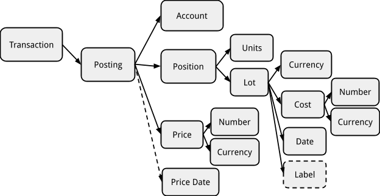

Beancount Query Language
==========================================

Martin Blais, January 2015

[http://furius.ca/beancount/doc/query](http://furius.ca/beancount/doc/query)

Introduction
-------------------------------------

The purpose of Beancount is to allow the user to create an accurate and error-free representation of financial transactions, typically those occurring in a user or in an institution’s associated set of accounts, to then extract various reports from this list of transactions. Beancount provides a few tools to extract reports from the corpus of transactions: custom reports (using the Beancount bean-report tool), a web interface (using the bean-web tool) and the ability for the user to write their own scripts to output anything they want.

The repository of financial transactions is always read from the text file input, but once parsed and loaded in memory, extracting information from Beancount could be carried out much like you would another database, that is, instead of using custom code to generate output from the data structures, a query language could be compiled and run over the relatively regular list of transactions.

In practice, you could flatten out the list of postings to an external SQL database and make queries using that database’s own tools, but the results of this approach are quite disappointing, mainly due to the lack of operations on inventories which is the basis of balancing rules in Beancount. By providing a slightly specialized query engine that takes advantage of the structure of the double-entry transactions we can easily generate custom reports specific to accounting purposes.

This document describes our specialized SQL-like query client. It assumes you have at least a passing knowledge of [SQL](http://en.wikipedia.org/wiki/SQL) syntax. If not, you may want to first read [something](http://www.amazon.com/Practical-SQL-Handbook-Using-Variants/dp/0201703092/) [about](http://www.w3schools.com/sql/) it.

Motivation
---------------------------------

So one might ask: Why create another SQL client? Why not output the data to a SQLite database and allow the user to use that SQL client?

Well, we have done that (see the [bean-sql](https://bitbucket.org/blais/beancount/src/tip/src/python/beancount/scripts/sql.py) script which converts your Beancount ledger into a SQLite database) and the results are not great. Writing queries is painful and carrying out operations on lots that are held at cost is difficult. By taking advantage of a few aspects of our in-memory data structures, we can do better. So Beancount comes with its own SQL-like query client called “[bean-query](https://bitbucket.org/blais/beancount/src/tip/src/python/beancount/scripts/query.py)”.

The clients implements the following “extras” that are essential to Beancount:

-   It allows to easily filter at two levels simultaneously: You can filter whole transactions, which has the benefit of respecting the accounting equation, and then, usually for presentation purposes, you can also filter at the postings level.

-   The client supports the semantics of inventory booking implemented in Beancount. It also supports aggregation functions on inventory objects and rendering functions (e.g., COST() to render the cost of an inventory instead of its contents).

-   The client allows you to flatten multiple lots into separate postings to produce lists of holdings each with their associated cost basis.

-   Transactions can be summarized in a manner useful to produce balance sheets and income statements. For example, our SQL variant explicitly supports a “close” operation with an effect similar to closing the year, which inserts transactions to clear income statement accounts to equity and removes past history.

See [this post](https://groups.google.com/d/msg/beancount/ZYsPCXt_fQo/NdCdgjbhEgAJ) as well for a similar answer.

Warning & Caveat
-------------------------------------------

Approximately 70% of the features desired in the [original design doc](http://furius.ca/beancount/doc/proposal-query) were implemented in the query language in late 2014. More work will be needed to cover the full feature set, but the current iteration supports most of the use cases covered by Ledger, and I suspect by Beancount users. More feedback is desired on the current version before moving on, and I would like to move forward improving some of the more fundamental aspects of Beancount (namely, inventory booking) before spending more time on the query language. It is functional as it is, but a second revision will be made later on, informed by user feedback and prolonged use.

Therefore, a first release of the query language has been merged in the default stable branch. This document presents this first iteration on the Beancount query language.

Making Queries
-----------------------------------------

The custom query client that we provide is called bean-query. Run it on your ledger file, like this:

    $ bean-query myfile.beancount
    Input file: "My Ledger’s Title"
    Ready with 13996 directives (21112 postings in 8833 transactions).
    beancount> _

This launches the query tool in interactive mode, where you can enter multiple commands on the dataset loaded in memory. bean-query parses the input file, spits out a few basic statistics about your ledger, and provides a command prompt for you to enter query commands. You can type “help” here to view the list of available commands.

If any errors in your ledger are incurred, they are printed before the prompt. To suppress error printing, run the tool with the “no-errors” option:

    $ bean-query -q myfile.beancount

### Batch Mode Queries

If you’d like to run queries directly from the command-line, without an interactive prompt, you can provide the query directly following your filename:

    $ bean-query myfile.beancount 'balances from year = 2014'
                         account                       balance
    ----------------------------------------------------------------------
    … <balances follow> … 

### All the interactive commands are supported.

### Shell Variables

The interactive shell has a few “set” variables that you can customize to change some of the behavior of the shell. These are like environment variables. Type the “set” command to see the list of available variables and their current value.

The variables are:

-   format (string): The output format. Currently, only “text” is supported.

-   boxed (boolean): Whether we should draw a box around the output table.

-   spaced (boolean): Whether to insert an empty line between every result row. This is only relevant because postings with multiple lots may require multiple lines to be rendered, and inserting an empty line helps delineate those as separate.

-   pager (string): The name of the pager program to pipe multi-page output to when the output is larger than the screen. The initial value is copied from the PAGER environment variable.

-   expand (boolean): If true, expand columns that render to lists on multiple rows.

Transactions and Postings
---------------------------------------------------------------

The structure of transactions and entries can be explained by the following simplified diagram:

---------------------------------------------------------------------------------------------------------------------------------------------------------

The contents of a ledger is parsed into a list of directives, most of which are “Transaction” objects which contain two or more “Posting” objects. Postings are always linked only to a single transaction (they are never shared between transactions). Each posting refers to its parent transaction but has a unique account name, amount and associated lot (possibly with a cost), a price and some other attributes. The parent transaction itself contains a few useful attributes as well, such as a date, the name of a payee, a narration string, a flag, links, tags, etc.

If we ignore the list of directives other than transactions, you can view the dataset as a single table of all postings joined with their parent transaction. It is mainly on this joined table of postings that we want to perform filtering and aggregation operations.

However, because of the double-entry bookkeeping constraint, that is, the sum of amounts on postings attached to a transaction is zero, it is also quite useful to perform filtering operations at the transaction level. Because any isolated transaction has a total impact of zero on the global balance, any subset of transactions will also respect the accounting equation (Assets + Liabilities + Equity + Income + Expenses = 0), and producing balance sheets and income statements on subset of transactions provides meaningful views, for example, “all asset changes and expenses incurred during a trip to the Bahamas” which could be selected by a tag.

For this reason, we modify the SQL SELECT syntax to provide a two-level filtering syntax: since we have a single table of data, we replace the table name in FROM by a filtering expression which applies over transactions, and the WHERE clause applies to data pulled from the resulting list of postings:

    SELECT <target1>, <target2>, …
    FROM <entry-filter-expression>
    WHERE <posting-filter-expression>;

Both filtering expressions are optional. If no filtering expressions are provided, all postings will be enumerated over. Note that since the transactions are always filtered in date order, the results will be processed and returned in this order by default.

### Posting Data Columns

The list of targets refers to attributes of postings or of their parent transaction. The same list of “columns” is made available in the *&lt;posting-filter-expression&gt;*, to filter by posting attributes. For example, you could write the following query:

    SELECT date, narration, account, position 
    WHERE account ~ “.*:Vacation” AND year >= 2014;

Here, the “date”, “year” and “narration” columns refer to attributes of the parent transaction, the “account” and “position” columns refer to attributes of the posting itself.

You may name targets explicitly with the familiar AS operator:

    SELECT last(date) as last_date, cost(sum(position)) as cost;

The full list of posting columns and functions available on them is best viewed by querying your actual client using “help targets“ or “help where”, which prints out the list and data type of each available data column. You may also refer to the following diagram of the structure of a Posting object for the correspondence between the columns and the data structure attributes.

### Entry Data Columns

A different list of column names is available on the *&lt;entry-filter-expression&gt;* of the FROM clause. These columns refer to attributes of the Transaction objects. This clause is intended to filter whole transactions (i.e., all their postings or none at all). Available attributes include the date, transaction flag, the optional payee, narration, set of tags and links. Use the “help from” command to find the complete list of columns and functions available in this clause.

A Beancount input file consists of many different types of entries, not just transactions. Some of these other types of entries (such as Open, Close, Balance, etc.) may also provide attributes that can be access from the FROM clause. This is embryonic at this point. (It’s unclear yet how these will be used in the future, but I suspect we will find some interesting applications for them eventually. The FROM clause provides access to the type of the data entry via column “type”. It’s still an exploration how much we can make pragmatic use of the SQL language for other types of directives.)

**The “id” Column**

A special column exists that identifies each transaction uniquely: “id”. It is a unique hash automatically computed from the transaction and should be stable between runs.

    SELECT DISTINCT id;

This hash is derived from the contents of the transaction object itself (if you change something about the transaction, e.g. you edit the narration, the id will change).

You can print and select using this column. It can be used for debugging, e.g.

    PRINT FROM id = '8e7c47250d040ae2b85de580dd4f5c2a';

**The “balance” Column**

One common desired output is a journal of entries over time (also called a “register” in Ledger):

    SELECT date, account, position WHERE account ~ "Chase:Slate";

For this type of report, it is convenient to also render a column of the cumulative balance of the selected postings rows. Access to the previous row is not a standard SQL feature, so we get a little creative and provide a special column called “balance” which is automatically calculated based on the previous selected rows:

    SELECT date, account, position, balance WHERE account ~ "Chase:Slate";

This provides the ability to render typical account statements such as those mailed to you by a bank. Output might look like this:

    $ bean-query $T "select date, account, position, balance where account ~ 'Expenses:Food:Restaurant';"
       date            account          position   balance  
    ---------- ------------------------ --------- ----------
    2012-01-02 Expenses:Food:Restaurant 31.02 USD  31.02 USD
    2012-01-04 Expenses:Food:Restaurant 25.33 USD  56.35 USD
    2012-01-08 Expenses:Food:Restaurant 67.88 USD 124.23 USD
    2012-01-09 Expenses:Food:Restaurant 35.28 USD 159.51 USD
    2012-01-14 Expenses:Food:Restaurant 25.84 USD 185.35 USD
    2012-01-17 Expenses:Food:Restaurant 36.73 USD 222.08 USD
    2012-01-21 Expenses:Food:Restaurant 28.11 USD 250.19 USD
    2012-01-22 Expenses:Food:Restaurant 21.12 USD 271.31 USD

### Wildcard Targets

Using a wildcard as the target list (“\*”) select a good default list of columns:

    SELECT * FROM year = 2014;

To view the actual list of columns selected, you can use the EXPLAIN prefix:

    EXPLAIN SELECT * FROM year = 2014;

Data Types
---------------------------------

The data attributes extracted from the postings or transactions have particular types. Most of the data types are regular types as provided by the underlying Python implementation language, types such as

-   String (Python str)

-   Date (a datetime.date instance). You can parse a date with the \#"..." syntax; this uses Python’s dateutil module and is pretty liberal in the formats it accepts.

-   Integer (Python int)

-   Boolean (Python bool object), as TRUE, FALSE

-   Number (a decimal.Decimal object)

-   Set of Strings (a Python set of str objects)

-   Null objects (NULL)

### Positions and Inventories

However, one reason that our SQL-like client exists in the first place is for its ability to carry out aggregation operations on inventories of positions, the data structures at the core of Beancount, that implements its balancing semantics. Internally, Beancount defines [Position](https://bitbucket.org/blais/beancount/src/tip/src/python/beancount/core/position.py) and [Inventory](https://bitbucket.org/blais/beancount/src/tip/src/python/beancount/core/inventory.py) objects and is able to aggregate them together in an instance of Inventory. On each Posting, the “position” column extracts an object of type Position, which when summed over produces an instance of Inventory.

The shell is able to display those appropriately. More specifically, Inventory objects can contain multiple different lots of holdings, and each of these will get rendered on a separate line.

### Quantities of Positions and Inventories

Objects of type Position are rendered in their full detail by default, including not just their number and currency, but the details of their lot. Inventories consist of a list of lots, and as such are rendered similarly, as a list of positions (one per line) each with their full detail by default. This is generally too much detail.

The shell provides functions that allow the user to summarize the positions into one of the various derived quantities. The types of derived quantities are:

-   “raw”: render the position in its full detail, including cost and lot date

-   “units”: render just the number and currency of the position

-   “cost”: render the total cost of the position, that is the number of units x the per-unit cost

-   “weight”: render the amount that is used to balance the postings of a transaction. The main distinction between cost and weight is for postings with a price conversion.

-   “value”: render the amount at the market value of the last entry rendered.

Functions with the same names are available to operate on position or inventory objects. For example, one could generate a table of final balances for each account like this:

    SELECT account, units(sum(position)), cost(sum(position)) GROUP BY 1;

Refer to the table below for explicit examples of each type of posting and how it would get converted and rendered.

<table><thead><tr class="header"><th><strong>posting</strong></th><th><strong>raw (full detail)</strong></th><th><strong>units</strong></th><th><strong>cost</strong></th><th><strong>weight</strong></th><th><strong>market</strong></th></tr></thead><tbody><tr class="odd"><td><strong>Simple</strong></td><td>50.00 USD</td><td>50.00 USD</td><td>50.00 USD</td><td>50.00 USD</td><td>50.00 USD</td></tr><tr class="even"><td><strong>With Price Conversion</strong></td><td>50.00 USD @ 1.35 CAD</td><td>50.00 USD</td><td>50.00 USD</td><td>67.50 CAD</td><td>50.00 USD</td></tr><tr class="odd"><td><strong>Held at Cost</strong></td><td>50 VEA {1.35 CAD}</td><td>50 VEA</td><td>67.50 CAD</td><td>67.50 CAD</td><td>67.50 CAD</td></tr><tr class="even"><td><strong>Held at Cost with Price</strong></td><td>50 VEA {1.35 CAD} @ 1.45 CAD</td><td>50 VEA</td><td>67.50 CAD</td><td>67.50 CAD</td><td>72.50 CAD</td></tr></tbody></table>

Operators
-------------------------------

Common comparison and logical operators are provided to operate on the available data columns:

-   = (equality), != (inequality)

-   < (less than), <= (less than or equal)

-   > (greater than), >= (greater than or equal)

-   AND (logical conjunction)

-   OR (logical disjunction)

-   NOT (logical negation)

-   IN (set membership)

We also provide a regular expression search operator into a string object:

-   ~ (search regexp)

At the moment, matching groups are ignored.

You can use string, number and integer constants with those operators, and parentheses to explicitly state precedence. You can use the \#”...” literal syntax to input dates (valid contents for the string are pretty liberal, it supports anything Python’s dateutil.parser supports).

Here is an example query that uses a few of these:

    SELECT date, payee 
    WHERE account ~ 'Expenses:Food:Restaurant' 
      AND 'trip-new-york' IN tags
      AND NOT payee = 'Uncle Boons'

Unlike SQL, bean-query does not implement [three-valued logic](https://www.postgresql.org/docs/9.6/static/functions-logical.html) for NULL. This means that e.g. the expression NULL = NULL yields TRUE instead of NULL, which simplifies things, but may come as a surprise to veteran SQL users.

Simple Functions
---------------------------------------------

The shell provides a list of simple function that operate on a single data column and return a new value. These functions operate on particular types. The shell implements rudimentary type verification and should be able to warn you on incompatible types.

Some example functions follow:

-   COST(Inventory), COST(Position): Return an Amount, the cost of the position or inventory.

<!-- -->

-   UNITS(Inventory), UNITS(Position): Return the units of the position or inventory.

-   DAY(date), MONTH(date), YEAR(date): Return an integer, the day, month or year of the posting or entry’s date.

-   LENGTH(list): Computes the length of a list or a set, e.g. on tags.

-   PARENT(account-string): Returns the name of the parent account.

These are just examples; for the complete list, see “help targets”, “help where”, “help from”.

Note that it is [exceedingly easy](https://bitbucket.org/blais/beancount/src/5ac80aea64bfd9ee1d7a23b9bf0d875559d91b62/src/python/beancount/query/query_env.py?at=shell) to add new functions to this list. As of December 2014, we are just beginning using the shell widely and we expect to be adding new functions as needed. If you need a function, please add a comment here or log a ticket and we will consider adding it to the list (we understand that the current list is limited). I intend to be liberal about adding new functions; as long as they have generic application, I don’t think it should be a problem. Otherwise, I may be able to provide a mechanism for user to register new functions as part of Python plugins that could live outside the Beancount codebase.

Aggregate Functions
---------------------------------------------------

Some functions operate on more than a single row. These functions aggregate and summarize the multiple values for the data column that they operate on. A prototypical usage of such a function is to sum the positions in an inventory:

    SELECT account, sum(position) WHERE account ~ 'Income' GROUP BY account;

If a query target has at least one aggregating function, the query becomes an aggregated query (see relevant section for details). Note that you cannot use aggregation functions in the FROM or WHERE clauses.

Examples of aggregate functions include:

-   COUNT(...): Computes the number of postings selected (an integer).

-   FIRST(...), LAST(...): Returns first or last value seen.

-   MIN(...), MAX(...): Computes the minimum or maximum value seen.

-   SUM(...): Sums up the values of each set. This works on amounts, positions, inventories, numbers, etc.

As for simple functions, this is just a starting list. We will be adding more as needed. Use “help targets” to access the full list of available aggregate functions.

Note: You cannot filter (using a WHERE clause) the results of aggregation functions; this requires the implementation offering a HAVING clause, and at the moment, [HAVING filtering is not yet implemented](https://bitbucket.org/blais/beancount/src/de8cf9a6a8).

Simple vs. Aggregated Queries
-----------------------------------------------------------------------

There are two types of queries:

-   **Simple queries**, which produce a row of results for each posting that matches the restricts in the WHERE clause.

-   **Aggregate queries**, which produce a row of results for each *group* of postings that match the restricts in the WHERE clause.

A query is “aggregate” if it has at least one aggregate function in its list of targets. In order to identify the aggregation keys, all the non-aggregate columns have to be flagged using the GROUP BY clause, like this:

    SELECT payee, account, COST(SUM(position)), LAST(date) 
    GROUP BY payee, account;

You may also use the positional order of the targets to declare the group key, like this:

    SELECT payee, account, COST(SUM(position)), LAST(date) 
    GROUP BY 1, 2;

Furthermore, if you name your targets, you can use the explicit target names:

    SELECT payee, account as acc, COST(SUM(position)), LAST(date) 
    GROUP BY 1, acc;

This should all feel familiar if you have preliminary knowledge of SQL.

Finally, because we implement a limited version of SQL, and that the simple columns must always be specified, omitting the GROUP BY clause should also eventually work and we should group by those columns implicitly, as a convenience.

### Distinct

There is a post-filtering phase that supports uniquifying result rows. You can trigger this unique filter with the DISTINCT flag after SELECT, as is common in SQL, e.g.

    SELECT DISTINCT account;

Controlling Results
---------------------------------------------------

### Order By

Analogous to the GROUP BY clause is an ORDER BY clause that controls the final ordering of the result rows:

    SELECT …
    GROUP BY account, payee
    ORDER BY payee, date;

The clause is optional. If you do not specify it, the default order of iteration of selected postings is used to output the results (that is, the order of transactions-sorted by date- and then their postings).

As in SQL, you may reverse the order of sorting by a DESC suffix (the default is the same as specifying ASC):

    SELECT …
    GROUP BY account, payee
    ORDER BY payee, date DESC;

### Limit

Our query language also supports a LIMIT clause to interrupt output row generation:

    SELECT … LIMIT 100;

This would output the first 100 result rows and then stop. While this is a common clause present in the SQL language, in the context of double-entry bookkeeping it is not very useful: we always have relatively small datasets to work from. Nevertheless, we provide it for completeness.

### Format

For SELECT, JOURNAL and BALANCES queries, the output format is a table of text by default. We support CSV output. (*We could easily add support for XLS or Google Sheets output.)*

However, for PRINT queries, the output format is Beancount input text format.

Statement Operators
---------------------------------------------------

The shell provides a few operators designed to facilitate the generation of balance sheets and income statements. The particular methodology used to define these operations should be described in detail in the “[introduction to double-entry bookkeeping](02_the_double_entry_counting_method.md)” document that accompanies Beancount and is mostly located in the source code in the [summarize](http://bitbucket.org/blais/beancount/src/tip/src/python/beancount/ops/summarize.py) module.

These special operators are provided on the FROM clause that is made available on the various forms of query commands in the shell. These further transform the set of entries selected by the FROM expression at the transaction levels (not postings).

Please note that these are not from standard SQL; these are extensions provided by this shell language only.

### Opening a Period

Opening an exercise period at a particular date replaces all entries before that date by summarization entries that book the expected balance against an Equity “opening balances” account and implicitly clears the income and expenses to zero by transferring their balances to an Equity “previous earnings” account (see beancount.ops.summarize.open() for implementation details).

It is invoked like this:

    SELECT … FROM <expression> OPEN ON <date> …

For example:

    SELECT * FROM has_account("Invest") OPEN ON 2014-01-01;

If you want, you can view just the inserted summarization entries like this:

    PRINT FROM flag = "S" AND account ~ "Invest" OPEN ON 2014-01-01;

### Closing a Period

Closing an exercise period involves mainly truncating all entries that come *after* the given date and ensuring that currency conversions are correctly corrected for (see beancount.ops.summarize.close() for implementation details).

It is invoked like this:

    SELECT … FROM <expression> CLOSE [ON <date>] …

For example:

    SELECT * FROM has_account("Invest") CLOSE ON 2015-04-01;

Note that the closing date should be one day after the last transaction you would like to include (this is in line with the convention we use everywhere in Beancount whereby starting dates are inclusive and ending dates exclusive).

The closing date is optional. If the date is not specified, the date one day beyond the date of the last entry is used.

Closing a period leaves the Income and Expenses accounts as they are, that is, their balances are not cleared to zero to Equity. This is because closing is also used to produce final balances for income statements. “Clearing”, as described in the next section, is only needed for balance sheets.

### Clearing Income & Expenses

In order to produce a balance sheet, we need to transfer final balances of the Income and Expenses to an Equity “current earnings” account (sometimes called “retained earnings” or “net income”; you can select the specific account name to use using options in the input file). The resulting balances of income statement accounts should be zero (see beancount.ops.summarize.clear() for implementation details).

You can clear like this:

    SELECT … FROM <expression> CLEAR …

For example:

    SELECT * FROM has_account("Invest") CLOSE ON 2015-04-01 CLEAR;

This is a statement suitable to produce a list of accounts to build a balance sheet. The “Equity:Earnings:Current” (by default) will contain the net income accumulated during the preceding period. No balances for the Income nor Expenses accounts should appear in the output.

### Example Statements

The statement operators of course may be combined. For instance, if you wanted to output data for an income statement for year 2013, you could issue the following statement:

    SELECT account, sum(position) 
    FROM OPEN ON 2013-01-01 CLOSE ON 2014-01-01
    WHERE account ~ "Income|Expenses"
    GROUP BY 1
    ORDER BY 1;

This would produce a list of balances for Income and Expenses accounts.

To generate a balance sheet, you would add the CLEAR option and select the other accounts:

    SELECT account, sum(position) 
    FROM OPEN ON 2013-01-01 CLOSE ON 2014-01-01 CLEAR
    WHERE not account ~ "Income|Expenses"
    GROUP BY 1
    ORDER BY 1;

Note that if you added the CLEAR operator to the statement of income statement accounts, all the balances would show at zero because of the inserted transactions that move those balances to the Equity net income account at the end of the period.

It is relevant to notice that the examples above do not filter the transactions any further. If you are selecting a subset of transactions you may want to leave the accounts unopened, unclosed and uncleared because applying only some of the transactions on top of the opening balances of Assets and Liabilities accounts will not produce correct balances for those accounts. It would be more useful to leave them all opened, and to interpret the balances of the balance sheet accounts as the *changes* in those accounts for the subset of transactions selected. For example, if you selected all transactions from a trip (using a tag), you would obtain a list of changes in Expenses (and possibly Income) tagged as being included in this trip, and the Assets and Liabilities accounts would show where the funds for those Expenses came from.

Consult the “introduction to double-entry method” document for a pictorial representation of this. (Granted, this is probably worth a dedicated document and I might produce one at some point.)

### Example Fetching Cost Basis

*“... is there currently an easy way to determine what my cost basis is for an account on a given date (other than manually adding up UNITS \* COST for every contribution, which is kind of a pain)? I'm trying to estimate the tax implications of potential stock sales.” \[Question from Matthew Harris\]*

For a detailed report of share movements:

    SELECT account, currency, position, COST(position) 
    WHERE year <= 2015 
      AND account ~ "Assets:US:Schwab"
      AND currency != "USD"

Or this for the sum total of the cost bases:

    SELECT sum(cost(position)) 
    WHERE year <= 2015 
      AND account ~ "Assets:US:Schwab" 
      AND currency != "USD"

High-Level Shortcuts
-----------------------------------------------------

There are two types of queries that are very common for accounting applications: journals and balances reports. While we have explicit implementations of such reports that can be produced using the bean-report tool, we are also able to synthesize good approximations of such reports using SELECT statements. This section describes a few additional selection commands that translate directly into SELECT statements and which are then run with the same query code. These are intended as convenient shortcuts.

### Selecting Journals

A common type of query is one that generates a linear journal of entries (Ledger calls this a “register”). This roughly corresponds to an account statement, but with our language, such a statement can be generated for any subset of postings.

You can generate a journal with the following syntax:

    JOURNAL <account-regexp> [AT <function>] [FROM …]

The regular expression *account-regexp* is used to select which subset of accounts to generate a journal for. The optional “AT *&lt;function&gt;*” clause is used to specify an aggregation function for the amounts rendered (typically UNITS or COST). The FROM clause follows the same rules as for the SELECT statement and is optional.

Here is an example journal-generating query:

    JOURNAL "Invest" AT COST FROM HAS_ACCOUNT("Assets:US");

### Selecting Balances

The other most common type of report is a table of the balances of various accounts at a particular date. This can be viewed as a SELECT query aggregating positions grouping by account.

You can generate a balances report with the following syntax:

    BALANCES [AT <function>] [FROM …]

The optional “AT *&lt;function&gt;*” clause is used to specify an aggregation function for the balances rendered (usually UNITS or COST). The FROM clause follows the same rules as for the SELECT statement and is optional.

To generate your balances at a particular date, close your set of entries using the “FROM… CLOSE ON” form described above.

Observe that typical balance sheets and income statements seen in an accounting context are subsets of tables of balances such as reported by this query. An income statement reports on just the transactions that appears during a period of time, and a balance sheet summarizes transactions before its reporting before and clears the income & expenses accumulated during the period to an equity account. Then some minor reformatting is carried out. Please consult the introduction document on double-entry bookkeeping for more details, and the section above that discusses the “open”, “close” and “clear” operations.

We will also be providing a separate text processing tool that can accept balance reports and reformat them in a two-column format similar to that you would see balance sheets and income statements.

### Print

It can be useful to generate output in Beancount format, so that subsets of transactions can be saved to files, for example. The shell provides that ability via the PRINT command:

    PRINT [FROM …]

The FROM clause obeys the usual semantics as described elsewhere in this document. The resulting filtered stream of Beancount entries is then printed out on the output in Beancount syntax.

In particular, just running the “PRINT” command will spit out the parsed and loaded contents of a Beancount file. You can use this for troubleshooting if needed, or to expand transactions generated from a plugin you may be in the process of developing.

Debugging / Explain
-------------------------------------------------

If you’re having trouble getting a particular statement to compile and run,. you can prefix any query statement with the EXPLAIN modifier, e.g.:

    EXPLAIN SELECT …

This will not run the statement, but rather print out the intermediate AST and compiled representation as well as the list of computed statements. This can be useful to report bugs on the mailing-list.

Also, this shows you the translated form of the JOURNAL and BALANCES statements.

Future Features
-------------------------------------------

The following list of features were planned for the first release but I’ve decided to make a first cut without them. I’ll be adding those during a revision.

### Flattening Inventories

If you provide the FLATTEN option after a query, it tells the query engine to flatten inventories with multiple lots into separate rows for each lot. For example, if you have an inventory balance with the following contents:

    3 AAPL {102.34 USD}
    4 AAPL {104.53 USD}
    5 AAPL {106.23 USD}

Using the following query:

    SELECT account, sum(position) GROUP BY account;

It should return a single row of results, rendered over three lines. However, adding the option:

    SELECT account, sum(position) GROUP BY account FLATTEN;

This should return three separate rows, with all the selected attributes, as if there were that many postings.

### Sub-Selects

The ability to select from the result of another SELECT is not currently supported, but the internals of the query code are prepared to do so.

### Pivot By

A special PIVOT BY clause can be used to convert the output from a one-dimensional list of results to a two-dimensional table. For example, the following query:

    SELECT
      account,
      YEAR(date) AS year,
      SUM(COST(position)) AS balance
    WHERE
       account ~ 'Expenses:Food' AND
       currency = 'USD' AND
       year >= 2012
    GROUP BY 1,2
    ORDER BY 1,2;

Might generate the following table of results:

            account          year   balance
    ------------------------ ---- -----------
    Expenses:Food:Alcohol    2012   57.91 USD
    Expenses:Food:Alcohol    2013   33.45 USD
    Expenses:Food:Coffee     2012   42.07 USD
    Expenses:Food:Coffee     2013  124.69 USD
    Expenses:Food:Coffee     2014   38.74 USD
    Expenses:Food:Groceries  2012 2172.97 USD
    Expenses:Food:Groceries  2013 2161.90 USD
    Expenses:Food:Groceries  2014 2072.36 USD
    Expenses:Food:Restaurant 2012 4310.60 USD
    Expenses:Food:Restaurant 2013 5053.61 USD
    Expenses:Food:Restaurant 2014 4209.06 USD

If you add a PIVOT clause to the query, like this:

    …
    PIVOT BY account, year;

You would get a table like this:

          account/year              2012        2013        2014                                                                                                                                                         
    ------------------------ ----------- ----------- -----------
    Expenses:Food:Alcohol      57.91 USD   33.45 USD
    Expenses:Food:Coffee       42.07 USD  124.69 USD   38.74 USD
    Expenses:Food:Groceries  2172.97 USD 2161.90 USD 2072.36 USD
    Expenses:Food:Restaurant 4310.60 USD 5053.61 USD 4209.06 USD

If your table has more than three columns, the non-pivoted column would get expanded horizontally, like this:

    SELECT
      account,
      YEAR(date),
      SUM(COST(position)) AS balance,
      LAST(date) AS updated
    WHERE
       account ~ 'Expenses:Food' AND
       currency = 'USD' AND
       year >= 2012
    GROUP BY 1,2
    ORDER BY 1, 2;

You would get a table like this:

            account          year   balance    updated
    ------------------------ ---- ----------- ----------
    Expenses:Food:Alcohol    2012   57.91 USD 2012-07-17
    Expenses:Food:Alcohol    2013   33.45 USD 2013-12-13
    Expenses:Food:Coffee     2012   42.07 USD 2012-07-19
    Expenses:Food:Coffee     2013  124.69 USD 2013-12-16
    Expenses:Food:Coffee     2014   38.74 USD 2014-09-21
    Expenses:Food:Groceries  2012 2172.97 USD 2012-12-30
    Expenses:Food:Groceries  2013 2161.90 USD 2013-12-31
    Expenses:Food:Groceries  2014 2072.36 USD 2014-11-20
    Expenses:Food:Restaurant 2012 4310.60 USD 2012-12-30
    Expenses:Food:Restaurant 2013 5053.61 USD 2013-12-29
    Expenses:Food:Restaurant 2014 4209.06 USD 2014-11-28

Pivoting, this would generate this table:

    account/balance,updated  2012/balanc 2012/updat 2013/balanc 2013/updat 2014/balanc 2014/updat
    ------------------------ ----------- ---------- ----------- ---------- ----------- ----------
    Expenses:Food:Alcohol      57.91 USD 2012-07-17   33.45 USD 2013-12-13
    Expenses:Food:Coffee       42.07 USD 2012-07-19  124.69 USD 2013-12-16   38.74 USD 2014-09-21
    Expenses:Food:Groceries  2172.97 USD 2012-12-30 2161.90 USD 2013-12-31 2072.36 USD 2014-11-20
    Expenses:Food:Restaurant 4310.60 USD 2012-12-30 5053.61 USD 2013-12-29 4209.06 USD 2014-11-28

More Information
---------------------------------------------

This document attempts to provide a good high-level summary of the features supported in our query language. However, should you find you need more information, you may take a look at the [original proposal](http://furius.ca/beancount/doc/proposal-query), or consult the source code under the [beancount.query](https://bitbucket.org/blais/beancount/src/tip/src/python/beancount/query) directory. In particular, the [parser](https://bitbucket.org/blais/beancount/src/tip/src/python/beancount/query/query_parser.py) will provide insight into the specifics of the syntax, and the [environments](https://bitbucket.org/blais/beancount/src/tip/src/python/beancount/query/query_env.py) will shed some light on the supported data columns and functions. Feel free to rummage in the source code and ask questions on the mailing-list.
