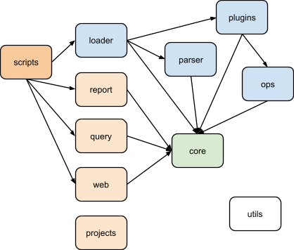
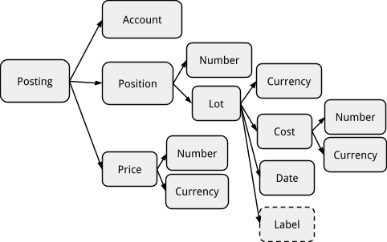
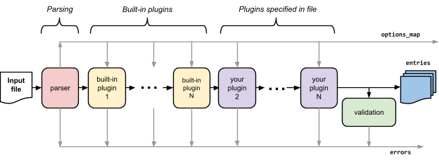
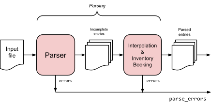

# Beancount Design Doc

Martin Blais ([<u>blais@furius.ca</u>](mailto:blais@furius.ca))

[<u>http://furius.ca/beancount/doc/design-doc</u>](http://furius.ca/beancount/doc/design-doc)

*A guide for developers to understand Beancount’s internals. I hope for this document to provide a map of the main objects used in the source code to make it easy to write scripts and plugins on top of Beancount or even extend it.*

> [<u>Introduction</u>](#introduction)
>
> [<u>Invariants</u>](#invariants)
>
> [<u>Isolation of Inputs</u>](#isolation-of-inputs)
>
> [<u>Order-Independence</u>](#order-independence)
>
> [<u>All Transactions Must Balance</u>](#all-transactions-must-balance)
>
> [<u>Account Have Types</u>](#accounts-have-types)
>
> [<u>Account Lifetimes & Open Directives</u>](#account-lifetimes-open-directives)
>
> [<u>Supports Dates Only (and No Time)</u>](#supports-dates-only-and-no-time)
>
> [<u>Metadata is for User Data</u>](#metadata-is-for-user-data)
>
> [<u>Overview of the Codebase</u>](#overview-of-the-codebase)
>
> [<u>Core Data Structures</u>](#core-data-structures)
>
> [<u>Number</u>](#number)
>
> [<u>Commodity</u>](#commodity)
>
> [<u>Amount</u>](#amount)
>
> [<u>Lot</u>](#_cb92j1m6vve0)
>
> [<u>Position</u>](#_i2pg9u5nyf3k)
>
> [<u>Inventory</u>](#inventory)
>
> [<u>Account</u>](#account)
>
> [<u>Flag</u>](#flag)
>
> [<u>Posting</u>](#posting)
>
> [<u>About Tuples & Mutability</u>](#about-tuples-mutability)
>
> [<u>Summary</u>](#summary)
>
> [<u>Directives</u>](#directives)
>
> [<u>Common Properties</u>](#common-properties)
>
> [<u>Transactions</u>](#transactions)
>
> [<u>Flag</u>](#flag-1)
>
> [<u>Payee & Narration</u>](#payee-narration)
>
> [<u>Tags</u>](#tags)
>
> [<u>Links</u>](#links)
>
> [<u>Postings</u>](#postings)
>
> [<u>Balancing Postings</u>](#balancing-postings)
>
> [<u>Elision of Amounts</u>](#elision-of-amounts)
>
> [<u>Stream Processing</u>](#stream-processing)
>
> [<u>Stream Invariants</u>](#stream-invariants)
>
> [<u>Loader & Processing Order</u>](#loader-processing-order)
>
> [<u>Loader Output</u>](#_tk1oeldrq7r2)
>
> [<u>Parser Implementation</u>](#parser-implementation)
>
> [<u>Two Stages of Parsing: Incomplete Entries</u>](#two-stages-of-parsing-incomplete-entries)
>
> [<u>The Printer</u>](#the-printer)
>
> [<u>Uniqueness & Hashing</u>](#uniqueness-hashing)
>
> [<u>Display Context</u>](#display-context)
>
> [<u>Realization</u>](#realization)
>
> [<u>The Web Interface</u>](#the-web-interface)
>
> [<u>Reports vs. Web</u>](#reports-vs.-web)
>
> [<u>Client-Side JavaScript</u>](#client-side-javascript)
>
> [<u>The Query Interface</u>](#the-query-interface)
>
> [<u>Design Principles</u>](#design-principles)
>
> [<u>Minimize Configurability</u>](#minimize-configurability)
>
> [<u>Favor Code over DSLs</u>](#favor-code-over-dsls)
>
> [<u>File Format or Input Language?</u>](#file-format-or-input-language)
>
> [<u>Grammar via Parser Generator</u>](#grammar-via-parser-generator)
>
> [<u>Future Work</u>](#future-work)
>
> [<u>Tagged Strings</u>](#tagged-strings)
>
> [<u>Errors Cleanup</u>](#errors-cleanup)
>
> [<u>Types</u>](#_tzhbghu736gs)
>
> [<u>Conclusion</u>](#conclusion)

## Introduction

This document describes the principles behind the design of Beancount and a high-level overview of its codebase, data structures, algorithms, implementation and methodology. This is not a user's manual; if you are interested in just using Beancount, see the associated [<u>User's Manual</u>](beancount_language_syntax.md) and all the other documents [<u>available here</u>](index.md).

However, if you just want to understand more deeply how Beancount works this document should be very helpful. This should also be of interest to developers. This is a place where I wrote about a lot of the ideas behind Beancount that did not find any other venue. Expect some random thoughts that aren’t important for users.

Normally one writes a design document before writing the software. I did not do that. But I figured it would still be worthwhile to spell out some of the ideas that led to this design here. I hope someone finds this useful.

## Invariants

### Isolation of Inputs

Beancount should accept input *only* from the text file you provide to its tools. In particular, it should not contact any external networked service or open any “global” files, even just a cache of historical prices or otherwise. This isolation is by design. Isolating the input to a single source makes it easier to debug, reproduce and isolate problems when they occur. This is a nice property for the tool.

In addition, fetching and converting external data is very messy. External data formats can be notoriously bad, and they are too numerous to handle all of them (handling just the most common subset would beg the question of where to include the implementation of new converters). Most importantly, the problems of representing the data vs. that of fetching and converting it segment from each other very well naturally: Beancount provides a core which allows you to ingest all the transactional data and derive reports from it, and its syntax is the hinge that connects it to these external repositories of transactions or prices. It isolates itself from the ugly details of external sources of data in this way.

### Order-Independence

Beancount offers a guarantee that the ordering of its *directives* in an input file is irrelevant to the outcome of its computations. You should be able to organize your input text and reorder any declaration as is most convenient for you, without having to worry about how the software will make its calculations. This also makes it trivial to implement inclusions of multiple files: you can just concatenate the files if you want, and you can process them in any order.

Not even directives that declare accounts or commodities are required to appear before these accounts get used in the file. All directives are parsed and then basically *sorted* before any calculation or validation occurs (a minor detail is that the line number is used as a secondary key in the sorting, so that the re-ordering is stable).

Correspondingly, all the non-directive grammar that is in the language is limited to either setting values with global impact (“`option`”, “`plugin`”) or syntax-related conveniences (“`pushtag`”, “`poptag`”).

There is an exception:

-   Options may have effects during the processing of the file and should appear at the beginning. At the moment, Beancount does not enforce this, e.g., by performing multiple passes of parsing, but it probably should.

-   What’s more, options in included files are currently ignored. You should put all your options in the top-level ledger file.

### All Transactions Must Balance

All transactions must balance by “weight.” There is no exception. Beancount transactions are required to have balanced, period.

In particular, there is no allowance for exceptions such as the “virtual postings” that can be seen in Ledger. The first implementation of Beancount allowed such postings. As a result, I often used them to “resolve” issues that I did not know how to model well otherwise. When I rewrote Beancount, I set out to convert my entire input file to avoid using these, and over time I succeeded in doing this and learned a lot of new things in the process. I have since become convinced that virtual postings are wholly unnecessary, and that making them available only provides a *crutch* upon which a lot of users will latch instead of learning to model transfers using balanced transactions. I have yet to come across a sufficiently convincing case for them[^1].

This provides the property that any subsets of transactions will sum up to zero. This is a nice property to have, it means we can generate balance sheets at any point in time. Even when we eventually [<u>support settlement dates or per-posting dates</u>](settlement_dates_in_beancount.md), we will split up transactions in a way that does not break this invariant.

### Accounts Have Types

Beancount accounts should be constrained to be of one of five types: Assets, Liabilities, Income, Expenses and Equity. The rationale behind this is to realize that all matters of counting can be characterized by being either permanent (Assets, Liabilities) or transitory (Income, Expenses), and that the great majority of accounts have a usual balance sign: positive (Assets, Expenses) or negative (Liabilities, Income). Given a quantity to accumulate, we can always select one of these four types of labels for it.

Enforcing this makes it possible to implement reports of accumulated values for permanent accounts (balance sheet) and reports of changes of periods of time (income statement). Although it is technically possible to explicitly book postings against Equity accounts the usual purpose of items in that category is to account for past changes on the balance sheet (net/retained income or opening balances).

These concepts of time and sign generalize beyond that of traditional accounting. Not having them raises difficult and unnecessary questions about how to handle calculating these types of reports. We simply require that you label your accounts into this model. I’ll admit that this requires a bit of practice and forethought, but the end result is a structure that easily allows us to build commonly expected outputs.

### Account Lifetimes & Open Directives

Accounts have lifetimes; an account opens at a particular date and optionally closes at another. This is directed by the Open and Close directives.

All accounts are required to have a corresponding Open directive in the stream. By default, this is enforced by spitting out an error when posting to an account whose Open directive hasn’t been seen in the stream. You can automate the generation of these directives by using the “auto\_accounts” plugin, but in any case, the stream of entries will always contain the Open directives. This is an assumption that one should be able to rely upon when writing scripts.

(Eventually a similar constraint will be applied for Commodity directives so that the stream always includes one before it is used; and they should be auto-generated as well. This is not the case right now \[June 2015\].)

### Supports Dates Only (and No Time)

Beancount does not represent time, only dates. The minimal time interval is one day. This is for simplicity’s sake. The situations where time would be necessary to disambiguate account balances exist, but in practice they are rare enough that their presence does not justify the added complexity of handling time values and providing syntax to deal with it.

If you have a use case whereby times are required, you may use metadata to add it in, or more likely, you should probably write custom software for it. This is outside the scope of Beancount by choice.

### Metadata is for User Data

By default, Beancount will not make assumptions about metadata fields and values. Metadata is reserved for private usage by the user and for plugins. The Beancount core does not read metadata and change its processing based on it. However, plugins may define special metadata values that affect what they produce.

That being said, there are a few special metadata fields *produced* by the Beancount processing:

-   filename: A string, the name of the file the transaction was read from (or the plugin that created it)

-   lineno: An integer, the line number from the file where the transaction was read from.

-   __tolerances__: A dict of currency to Decimal, the tolerance values used in balancing the transaction.

-   __residual__ (on postings): A boolean, true if the posting has been added to automatically absorb rounding error.

There may be a few more produced in the future but in any case, the core should not read any metadata and affect its behavior as a consequence. (I should probably create a central registry or location where all the special values can be found in one place.)

## Overview of the Codebase

All source code lives under a “[<u>beancount</u>](https://github.com/beancount/beancount/tree/master/beancount/)” Python package. It consists of several packages with well-defined roles, the dependencies between which are enforced strictly.

*Beancount source code packages and approximate dependencies between them.*

At the bottom, we have a [<u>beancount.core</u>](https://github.com/beancount/beancount/tree/master/beancount/core) package which contains the data structures used to represent transactions and other directives in memory. This contains code for accounts, amounts, lots, positions, and inventories. It also contains commonly used routines for processing streams of directives.

One level up, the [<u>beancount.parser</u>](https://github.com/beancount/beancount/tree/master/beancount/parser) package contains code to parse the Beancount language and a printer that can produce the corresponding text given a stream of directives. It should be possible to convert between text and data structure and round-trip this process without loss.

At the root of the main package is a [<u>beancount.loader</u>](https://github.com/beancount/beancount/tree/master/beancount/loader.py) module that coordinates everything that has to be done to load a file in memory. This is the main entry point for anyone writing a script for Beancount, it always starts with loading a stream of entries. This calls the parser, runs some processing code, imports the plugins and runs them in order to produce the final stream of directives which is used to produce reports.

The [<u>beancount.plugins</u>](https://github.com/beancount/beancount/tree/master/beancount/plugins) package contains implementations of various plugins. Each of these plugin modules are independent from each other. Consult the docstrings in the source code to figure out what each of these does. Some of these are prototypes of ideas.

There is a [<u>beancount.ops</u>](https://github.com/beancount/beancount/tree/master/beancount/) package which contains some high-level processing code and some of the default code that always runs by default that is implemented as plugins as well (like padding using the Pad directive). This package needs to be shuffled a bit in order to clarify its role.

On top of this, reporting code calls modules from those packages. There are four packages which contain reporting code, corresponding to the Beancount reporting tools:

-   [<u>beancount.reports</u>](https://github.com/beancount/beancount/tree/v2/beancount/reports/): This package contains code specialized to produce different kinds of outputs (invoked by bean-report). In general I’d like to avoid defining custom routines to produce desired outputs and use the SQL query tool to express grouping & aggregation instead, but I think there will always be a need for at least some of these. The reports are defined in a class hierarchy with a common interface and you should be able to extend them. Each report supports some subset of a number of output formats.

-   [<u>beancount.query</u>](https://github.com/beancount/beancount/tree/v2/beancount/query/): This package contains the implementation of a query language and interactive shell (invoked by bean-query) that allows you to group and aggregate positions using an SQL-like DSL. This essentially implements processing over an in-memory table of Posting objects, with functions defined over Amount, Position and Inventory objects.

-   [<u>beancount.web</u>](https://github.com/beancount/beancount/tree/v2/beancount/): This package contains all the source code for the default web interface (invoked by bean-web). This is a simple [<u>Bottle</u>](http://bottlepy.org/) application that serves many of the reports from beancount.report to HTML format, running on your machine locally. The web interface provides simple views and access to your data. (It stands to be improved greatly, it’s in no way perfect.)

-   [<u>beancount.projects</u>](https://github.com/beancount/beancount/tree/v2/projects/): This package contains various custom scripts for particular applications that I’ve wanted to share and distribute. Wherever possible, I aim to fold these into reports. There are no scripts to invoke these; you should use “`python3 -m beancount.projects.<name>`” to run them.

There is a [<u>beancount.scripts</u>](https://github.com/beancount/beancount/tree/v2/beancount/scripts/) package that contains the “main” programs for all the scripts under the [<u>bin directory</u>](https://github.com/beancount/beancount/tree/v2/bin). Those scripts are simple launchers that import the corresponding file under beancount.scripts. This allows us to keep all the source code under a single directory and that makes it easier to run linters and other code health checkers on the code—it’s all in one place.

Finally, there is a [<u>beancount.utils</u>](https://github.com/beancount/beancount/tree/master/beancount/utils) package which is there to contain generic reusable random bits of utility code. And there is a relatively unimportant [<u>beancount.docs</u>](https://github.com/beancount/beancount/tree/master/docs/) package that contains code used by the author just to produce and maintain this documentation (code that connects to Google Drive).

Enforcing the dependency relationships between those packages is done by a [<u>custom script</u>](https://github.com/beancount/beancount/tree/master/tools/dependency_constraints.py).

## Core Data Structures

This section describes the basic data structures that are used as building blocks to represent directives. Where possible I will describe the data structure in conceptual terms.

*(Note for Ledger users*: This section introduces some terminology for Beancount; look [<u>here</u>](http://ledger-cli.org/3.0/doc/ledger3.html#Ledger-for-Developers) if you’re interested to contrast it with concepts and terminology found in Ledger.)

### Number

**Numbers** are represented using [<u>decimal</u>](https://en.wikipedia.org/wiki/Decimal_data_type) objects, which are perfectly suited for this. The great majority of numbers entered in accounting systems are naturally decimal numbers and binary representations involve representational errors which cause many problems for display and in precision. Rational numbers avoid this problem, but they do not carry the limited amount of precision that the user intended in the input. We must deal with [<u>tolerances</u>](precision_tolerances.md) explicitly.

Therefore, all numbers should use Python’s “`decimal.Decimal`” objects. Conveniently, Python v3.x supports a C implementation of decimal types natively (in its standard library; this used to be an external “cdecimal” package to install but it has been integrated in the C/Python interpreter).

The default constructor for decimal objects does not support some of the input syntax we want to allow, such as commas in the integer part of numbers (e.g., “278**,**401.35 USD”) or initialization from an empty string. These are important cases to handle. So I provide a special constructor to accommodate these inputs: `beancount.core.number.D()`. This is the only method that should be used to create decimal objects:

    from beancount.core.number import D
    …
    number = D("2,402.21")

I like to import the “`D`” symbol by itself (and not use `number.D`). All the number-related code is located under [<u>beancount.core.number</u>](https://github.com/beancount/beancount/tree/master/beancount/core/number.py).

Some number constants have been defined as well: `ZERO`, `ONE`, and `HALF`. Use those instead of explicitly constructed numbers (such as `D("1")`) as it makes it easier to grep for such initializations.

### Commodity

A **commodity**, or **currency** (I use both names interchangeably in the code and documentation) is a string that represents a kind of “thing” that can be stored in accounts. In the implementation, it is represented as a Python `str` object (there is no module with currency manipulation code). These strings may only contain capital letters and numbers and some special characters (see the lexer code).

Beancount does not predefine any currency names or categories—all currencies are created equal. Really. It genuinely does not know anything special about dollars or euros or yen or anything else. The only place in the source code where there is a reference to those is in the tests. There is no support for syntax using “$” or other currency symbols; I understand that some users may want this syntax, but in the name of keeping the parser very simple and consistent I choose not to provide that option.

Moreover, Beancount does not make a distinction between commodities which represent "money" and others that do not (such as shares, hours, etc.). These are treated the same throughout the system. It also does not have the concept of a "home" currency[^2]; it's a genuinely multi-currency system.

Currencies need *not* be defined explicitly in the input file format; you can just start using them in the file and they will be recognized as such by their unique syntax (the lexer recognizes and emits currency tokens). However, you *may* declare some using a Commodity directive. This is only provided so that a per-commodity entity exists upon which the user can attach some metadata, and some reports and plugins are able to find and use that metadata.

### Account

An account is basically just the name of a bucket associated with a posting and is represented as a simple string (a Python `str` object). Accounts are detected and tokenized by the lexer and have names with at least two words separated by a colon (":").

Accounts don’t have a corresponding object type; we just refer to them by their unique name string (like filenames in Python). When per-account attributes are needed, we can extract the Open directives from the stream of entries and find the one corresponding to the particular account we’re looking for.

Similar to Python’s os.path module, there are some routines to manipulate account names in [<u>beancount.core.account</u>](https://github.com/beancount/beancount/tree/master/beancount/core/account.py) and the functions are named similarly to those of the [<u>os.path</u>](https://docs.python.org/3.3/library/os.path.html) module.

The first component of an account’s name is limited to one of five types:

-   Assets

-   Liabilities

-   Equity

-   Income

-   Expenses

The names of the account types as read in the input syntax may be customized with some "option" directives, so that you can change those names to another language, or even just rename "Income" to "Revenue" if you prefer that. The [<u>beancount.core.account\_types</u>](https://github.com/beancount/beancount/tree/master/beancount/core/account_types.pybeancount/) module contains some helpers to deal with these.

Note that the set of account names forms an implicit hierarchy. For example, the names:

    Assets:US:TDBank:Checking
    Assets:US:TDBank:Savings

implicitly defines a tree of nodes with parent nodes "Assets", "US", "TDBank" with two leaf nodes "Checking" and "Savings". This implicit tree is never realized during processing, but there is a Python module that allows one to do this easily (see [<u>beancount.core.realization</u>](https://github.com/beancount/beancount/tree/master/beancount/core/realization.py)) and create linearized renderings of the tree.

### Flag

A “flag” is a single-character string that may be associated with Transactions and Postings to indicate whether they are assumed to be correct ("reconciled") or flagged as suspicious. The typical value used on transaction instances is the character “\*”. On Postings, it is usually left absent (and set to a None).

### Amount

An **Amount** is the combination of a number and an associated currency, conceptually:

    Amount = (Number, Currency)

Amount instances are used to represent a quantity of a particular currency (the “units”) and the price on a posting.

A class is defined in [<u>beancount.core.amount</u>](https://github.com/beancount/beancount/tree/master/beancount/core/amount.py) as a simple tuple-like object. Functions exist to perform simple math operations directly on instances of Amount. You can also create Amount instance using `amount.from_string()`, for example:

    value = amount.from_string("201.32 USD")

### Cost

A Cost object represents the cost basis for a particular lot of a commodity. Conceptually, it is

    Cost = (Number, Currency, Date, Label)

The number and currency is that of the cost itself, not of the commodity. For example, if you bought 40 shares of AAPL stock at 56.78 USD, the *Number* is a “56.78” decimal and the *Currency* is “USD.” For example:

    Cost(Decimal("56.78"), "USD", date(2012, 3, 5), "lot15")

The *Date* is the acquisition date of the corresponding lot (a `datetime.date` object). This is automatically attached to the Cost object when a posting augments an inventory—the Transaction’s date is automatically attached to the Cost object—or if the input syntax provides an explicit date override.

The *Label* can be any string. It is provided as a convenience for a user to refer to a particular lot or disambiguate similar lots.

On a Cost object, the number, currency and date attributes are always set. If the label is unset, it has a value of “None.”

#### CostSpec

In the input syntax, we allow users to provide as little information as necessary in order to disambiguate between the lots contained in the inventory prior to posting. The data provided filters the set of matching lots to an unambiguous choice, or to a subset from which an automated booking algorithm will apply (e.g., “FIFO”).

In addition, we allow the user to provide either the per-unit cost and/or the total-cost. This convenience is useful to let Beancount automatically compute the per-unit cost from a total of proceeds.

    CostSpec = (Number-per-unit, Number-total, Currency, Date, Label, Merge)

Since any of the input elements may be omitted, any of the attributes of a CostSpec may be left to None. If a number is missing and necessary to be filled in, the special value “MISSING” will be set on it.

The *Merge* attribute it used to record a user request to merge all the input lots before applying the transaction and to merge them after. This is the method used for all transactions posted to an account with the “AVERAGE” booking method.

### Position

A position represents some units of a particular commodity held at cost. It consists simply in

    Position = (Units, Cost)

*Units* is an instance of *Amount*, and *Cost* is an instance of *Cost*, or a null value if the commodity is not held at cost. Inventories contain lists of *Position* instances. See its definition in [<u>beancount.core.position</u>](http://github.com/beancount/beancount/tree/v2/beancount/core/position.py)`.`

### Posting

Each Transaction directive is composed of multiple Postings (I often informally refer to these in the code and on the mailing-list as the “legs” of a transaction). Each of these postings is associated with an account, a position and an optional price and flag:

    Posting = (Account, Units, Cost-or-CostSpec, Price, Flag, Metadata)

As you can see, a *Posting* embeds its *Position* instance[^3]. The *Units* is an *Amount*, and the ‘cost’ attribute refers to either a *Cost* or a *CostSpec* instance (the parser outputs *Posting* instances with an *CostSpec* attribute which is resolved to a *Cost* instance by the booking process; see [<u>How Inventories Work</u>](how_inventories_work.md) for details).

The *Price* is an instance of *Amount* or a null value. It is used to declare a currency conversion for balancing the transaction, or the current price of a position held at cost. It is the Amount that appears next to a “@” in the input.

Flags on postings are relatively rare; users will normally find it sufficient to flag an entire transaction instead of a specific posting. The flag is usually left to None; if set, it is a single-character string.

The Posting type is defined in [<u>beancount.core.data</u>](https://github.com/beancount/beancount/tree/master/beancount/core/data.py), along with all the directive types.

### Inventory

An Inventory is a container for an account’s balance in various lots of commodities. It is essentially a list of *Position* instances with suitable operations defined on it. Conceptually you may think of it as a mapping with unique keys:

    Inventory = [Position1, Position2, Position3, … , PositionN]

Generally, the combination of a position’s (*Units.Currency, Cost)* is kept unique in the list, like the key of a mapping. Positions for equal values of currency and cost are merged together by summing up their *Units.Number* and keeping a single position for it. And simple positions are mixed in the list with positions held at cost.

The *Inventory* is one of the most important and oft-used object in Beancount’s implementation, because it is used to sum the balance of one or more accounts over time. It is also the place where the inventory reduction algorithms get applied to, and traces of that mechanism can be found there. The “[<u>How Inventories Work</u>](how_inventories_work.md)” document provides the full detail of that process.

For testing, you can create initialized instances of Inventory using `inventory.from_string()`. All the inventory code is written in [<u>beancount.core.inventory</u>](https://github.com/beancount/beancount/tree/master/beancount/core/inventory.py).

### About Tuples & Mutability

Despite the program being written in a language which does not make mutability “difficult by default”, I designed the software to avoid mutability in most places. Python provides a “`collections.namedtuple`” factory that makes up new record types whose attributes cannot be overridden. Well… this is only partially true: mutable attributes of immutable tuples can be modified. Python does not provide very strong mechanisms to enforce this property.

Regardless, functional programming is not so much an attribute of the language used to implement our programs than of the guarantees we build into its structure. A language that supports strong guarantees helps to enforce this. But if, even by just using a set of conventions, we manage to *mostly* avoid mutability, we have a *mostly* functional program that avoids *most* of the pitfalls that occur from unpredictable mutations and our code is that much easier to maintain. Programs with no particular regard for where mutation occurs are most difficult to maintain. By avoiding most of the mutation in a functional approach, we avoid most of those problems.

-   Most of the data structures used in Beancount are [<u>namedtuples</u>](https://docs.python.org/3/library/collections.html#collections.namedtuple), which make the modification of their attributes inconvenient on purpose.

-   Most of the code will attempt to avoid mutation, except for local state (within a function) or in a narrow scope that we can easily wrap our head around. Where mutation is possible, by convention I try to avoid it by default. When we do mutation, I try to document the effects.

-   I avoid the creation of classes which mutate their internal state, except for a few cases (e.g. the web application). I prefer functions to objects and where I define classes I mostly avoid inheritance.

These properties are especially true for all the small objects: Amount, Lot, Position, Posting objects, and all the directives types from [<u>beancount.core.data</u>](https://github.com/beancount/beancount/tree/master/beancount/core/data.py).

On the other hand, the Inventory object is nearly always used as an accumulator and *does* allow the modification of its internal state (it would require a special, persistent data structure to avoid this). You have to be careful how you share access to Inventory objects… and modify them, if you ever do.

Finally, the loader produces lists of directives which are all simple `namedtuple` objects. These lists form the main application state. I’ve avoided placing these inside some special container and instead pass them around explicitly, on purpose. Instead of having some sort of big “application” object, I’ve trimmed down all the fat and all your state is represented in two things: A dated and sorted list of directives which can be the subject of stream processing and a list of constant read-only option values. I think this is simpler.

*I credit my ability to make wide-ranging changes to a mid-size Python codebase to the adoption of these principles. I would love to have **types** in order to safeguard against another class of potential errors, and I plan to experiment with [<u>Python 3.5’s upcoming typing module</u>](https://www.python.org/dev/peps/pep-0484/).*

### Summary

The following diagram explains how these objects relate to each other, starting from a Posting.

For example, to access the number of units of a postings you could use

    posting.units.number

For the cost currency:

    posting.cost.currency

You can print out the tuples in Python to figure out their structure.

#### Previous Design 

For the sake of preservation, if you go back in time in the repository, the structure of postings was deeper and more complex. The new design reflects a flatter and simpler version of it. Here is what the old design used to look like:

## Directives

The main production from loading a Beancount input file is a list of **directives**. I also call these **entries** interchangeably in the codebase and in the documents. There are directives of various types:

-   Transaction

-   Balance & Pad

-   Open & Close

-   Commodity

-   Note

-   Event

-   Price

-   Document

In a typical Beancount input file, the great majority of entries will be Transactions and some Balance assertions. There will also be Open & perhaps some Close entries. Everything else is optional.

Since these combined with a map of option values form the entire application state, you should be able to feed those entries to functions that will produce reports. The system is built around this idea of processing a stream of directives to extract all contents and produce reports, which are essentially different flavors of filtering and aggregations of values attached to this stream of directives.

### Common Properties

Some properties are in common to *all* the directives:

-   **Date.** A datetime.date object. This is useful and consistent. For a Transaction, that’s the date at which it occurs. For an Open or Close directive, that’s the date at which the account was opened or closed. For a Pad directive, that’s the date at which to insert a transaction. For a Note or Document, it is the date at which to insert the note in the stream of postings of that account. For an Event, it is the date at which it occurs. For a Commodity directive which essentially provides a per-commodity hanging point for commodity-related metadata, the date isn’t as meaningful; I choose to date those on the day the commodity was created.

<!-- -->

-   **Meta**. All the directives have metadata attribute (a Python dict object). The purpose of metadata is to allow the user to hang any kind of ancillary data they want and then use this in scripts or queries. Posting instances also have a metadata attribute.

### Transactions

The Transaction directive is the subject of Beancount and is by far the most common directive found in input files and is worth of special attention. The function of a bookkeeping system is to organize the Postings attached to Transactions in various ways. All the other types of entries occupy supporting roles in our system.

A Transaction has the following additional fields.

#### Flag

The single-character flag is usually there to replace the “txn” keyword (Transaction is the only directive which allows being entered without entering its keyword). I’ve been considering changing the syntax definition somewhat to allow not entering the flag nor the keyword, because I’d like to eventually support that. Right now, either the flag or keyword is required. The flag attribute may be set to None.

#### Payee & Narration

The narration field is a user-provided description of the transaction, such as "Dinner with Mary-Ann." You can put any information in this string. It shows up in the journal report. Oftentimes it is used to enrich the transaction with context that cannot be imported automatically, such as "transfer from savings account to pay for car repairs."

The payee name is optional, and exists to describe the entity with which the transaction is conducted, such as "Whole Foods Market" or "Shell."

Note that I want to be able to produce reports for all transactions associated with a particular payee, so it would be nice to enter consistent payee names. The problem with this is that the effort to do this right is sometimes too great. Either better tools or looser matching over names is required in order to make this work.

The input syntax also allows only a single string to be provided. By default this becomes the narration, but I’ve found that in practice it can be useful to have just the payee. It’s just a matter of convenience. At the moment, if you want to enter just the payee string you need to append an empty narration string. This should be revisited at some point.

#### Tags

Tags are sets of strings that can be used to group sets of transactions (or set to None if there are no tags). A view of this subset of transactions can then be generated, including all the usual reports (balance sheet, income statement, journals, etc.). You can tag transactions for a variety of purposes; here are some examples:

-   All transactions during a particular travel might be tagged to later summarize your trip expenses. Those transactions will usually occur around the same date and therefore there is convenient syntax used to automatically tag many transactions that are declared together in a file.

-   Transactions related to a particular project to be accomplished. I took some classes in an online program once, and tagged all related expenses to it. I use this to track all my immigration-related expenses for a particular stage (e.g. green card).

-   Declaring a group of expenses to be paid back by an employer (or your own company) later on.

-   Expenses related to moving between locations.

Typical tag names that I use for tags look like `#trip-israel-2012`, `#conference-siggraph`, and `#course-cfa`.

In general, tags are useful where adding a sub-accounts won't do. This is often the case where a group of related expenses are of differing types, and so they would not belong to a single account.

Given the right support from the query tools, they could eventually be subsumed by metadata—I have been considering converting tags into metadata keys with a boolean value of True, in order to remove unnecessary complexity.

#### Links

Links are a unique set of strings or `None`, and in practice will be usually empty for most transactions. They differ from tags only in purpose.

Links are there to chain together a list of related transactions and there are tools used to list, navigate and balance a subset of transactions linked together. They are a way for a transaction to refer to other transactions. They are not meant to be used for summarizing.

Examples include: transaction-ids from trading accounts (these often provide an id to a "related" or "other" transaction); account entries associated with related corrections, for example a reversed fee following a phone call could be linked to the original invalid fee from several weeks before; the purchase and sale of a home, and related acquisition expenses.

In contrast to tags, their strings are most often unique numbers produced by the importers. No views are produced for links; only a journal of a particular links transactions can be produced and a rendered transaction should be accompanied by an actual "link" icon you can click on to view all the other related transactions.

#### Postings

A list of Postings are attached to the Transaction object. Technically this list object is mutable but in practice we try not to modify it. A Posting can ever only be part of a single Transaction.

Sometimes different postings of the same transaction will settle at different dates in their respective accounts, so eventually we may allow a posting to have its own date to override the transaction's date, to be used as documentation; in the simplest version, we enforce all transactions to occur punctually, which is simple to understand and was not found to be a significant problem in practice. Eventually we might implement this by implicitly converting Transactions with multiple dates into multiple Transactions and using some sort of transfer account to hold the pending balance in-between dates. See the [<u>associated proposal</u>](settlement_dates_in_beancount.md) for details.

#### Balancing Postings

The fundamental principle of double-entry book-keeping is enforced in each of the Transaction entries: the sum of all postings must be zero. This section describes the specific way in which we do this, and is the **key piece of logic** that allow the entire system to balance nicely. This is also one of the few places in this system where calculations go beyond simple filtering and aggregation.

As we saw earlier, postings are associated with

-   A position, which is a number of units of a lot (which itself may or may not have a cost)

-   An optional conversion price

Given this, how do we balance a transaction?

Some terminology is in order: for this example posting:

    Assets:Investment:HOOL    -50 HOOL {700 USD} @ 920 USD 

**Units.** The number of units is the number of the position, or “50”.

**Currency.** The commodity of the lot, that is, “HOOL”.

**Cost.** The cost of this position is the number of units times the per-unit cost in the cost currency, that is 50 x 700 = 35000 USD.

**(Total) Price.** The price of a unit is the attached price amount, 920 USD. The total price of a position is its number of units times the conversion price, in this example 50 x 920 = 46000 USD.

**Weight.** The amount used to balance each posting in the transaction:

1.  If the posting has an associated cost, we calculate the cost of the position (regardless of whether a price is present or not);

2.  If the posting has no associated cost but has a conversion price, we convert the position into its total price;

3.  Finally, if the posting has no associated cost nor conversion price, the number of units of the lot are used directly.

Balancing is really simple: each of the Posting's positions are first converted into their weight. These amounts are then grouped together by currency, and the final sum for each currency is asserted to be close to zero, that is, within a small amount of tolerance (as [<u>inferred by a combination of by the numbers in the input and the options</u>](precision_tolerances.md)).

The following example is one of case (2), with a price conversion and a regular leg with neither a cost nor a price (case 3):

    2013-07-22 * "Wired money to foreign account"
      Assets:Investment:HOOL     -35350 CAD @ 1.01 USD        ;; -35000 USD (2)
      Assets:Investment:Cash      35000 USD                   ;;  35000 USD (3)
                                                              ;;------------------
                                                              ;;      0 USD

In the next example, the posting for the first leg has a cost, the second posting has neither:

    2013-07-22 * "Bought some investment"
      Assets:Investment:HOOL     50 HOOL {700 USD}            ;;  35000 USD (1)
      Assets:Investment:Cash    -35000 USD                    ;; -35000 USD (3)
                                                              ;;------------------
                                                              ;;      0 USD

Here's a more complex example with both a price and a cost; the price here is ignored for the purpose of balance and is used only to enter a data-point in the internal price database:

    2013-07-22 * "Sold some investment"
      Assets:Investment:HOOL    -50 HOOL {700 USD} @ 920 USD  ;; -35000 USD (1)
      Assets:Investment:Cash     46000 USD                    ;;  46000 USD (3)
      Income:CapitalGains       -11000 USD                    ;; -11000 USD (3)
                                                              ;;------------------
                                                              ;;      0 USD

Finally, here's an example with multiple commodities:

         2013-07-05 * "COMPANY INC PAYROLL"
           Assets:US:TD:Checking                            4585.38 USD
           Income:US:Company:GroupTermLife                   -25.38 USD
           Income:US:Company:Salary                        -5000.00 USD
           Assets:US:Vanguard:Cash                           540.00 USD
           Assets:US:Federal:IRAContrib                     -540.00 IRAUSD
           Expenses:Taxes:US:Federal:IRAContrib              540.00 IRAUSD
           Assets:US:Company:Vacation                          4.62 VACHR
           Income:US:Company:Vacation                         -4.62 VACHR

Here there are three groups of weights to balance:

-   USD: (4485.38) + (-25.38) + (-5000) + (540) ~= 0 USD

-   IRAUSD: (540.00) + (-540.00) ~= 0 IRAUSD

-   VACHR: (4.62) + (-4.62) ~= 0 VACHR

##### Elision of Amounts

Transactions allow for at most one posting to be elided and automatically set; if an amount was elided, the final balance of all the other postings is attributed to the balance.

With the [<u>inventory booking proposal</u>](a_proposal_for_an_improvement_on_inventory_booking.md), it should be extended to be able to handle more cases of elision. An interesting idea would be to allow the elided postings to at least specify the currency they're using. This would allow the user to elide multiple postings, like this:

         2013-07-05 * "COMPANY INC PAYROLL"
           Assets:US:TD:Checking                                    USD
           Income:US:Company:GroupTermLife                   -25.38 USD
           Income:US:Company:Salary                        -5000.00 USD
           Assets:US:Vanguard:Cash                           540.00 USD
           Assets:US:Federal:IRAContrib                     -540.00 IRAUSD
           Expenses:Taxes:US:Federal:IRAContrib                     IRAUSD
           Assets:US:Company:Vacation                          4.62 VACHR
           Income:US:Company:Vacation                               VACHR

### Stream Processing

An important by-product of representing all state using a single stream of directives is that most of the operations in Beancount can be implemented by simple functions that accept the list of directives as input and output a modified list of directives.

For example,

-   The “Pad” directive is implemented by processing the stream of transactions, accumulating balances, inserting a new padding transaction after the Pad directive when a balance assertion fails.

-   [<u>Summarization</u>](https://github.com/beancount/beancount/tree/master/beancount/ops/summarize.py) operations (open books, close books, clear net income to equity) are all implemented this way, as functional operators on the list of streams. For example, opening the books at a particular date is implemented by summing all balances before a certain date and replacing those transactions by new transactions that pull the final balance from an Equity account. Closing the books only involves moving the balances of income statement account to Equity and truncation the list of transactions to that date. This is very elegant—the reporting code can be oblivious to the fact that summarization has occurred.

-   Prices on postings held with a cost are normally ignored. The “implicit prices” option is implemented using a plugin which works its magic by processing the stream of operations and inserting otherwise banal Price directives automatically when such a posting is found.

-   Many types of verifications are also implemented this way; the [<u>sellgains</u>](https://github.com/beancount/beancount/tree/master/beancount/plugins/sellgains.py) plugin verifies that non-income balances check against the converted price of postings disregarding the cost. This one does not insert any new directives, but may generate new errors.

These are just some examples. I’m aiming to make most operations work this way. This design has proved to be elegant, but also surprisingly flexible and it has given birth to the plugins system available in Beancount; you might be surprised to learn that I had not originally thought to provide a plugins system... it just emerged over time teasing abstractions and trying to avoid state in my program.

*I am considering experimenting with weaving the errors within the stream of directives by providing a new “Error” directive that could be inserted by stream processing functions. I’m not sure whether this would make anything simpler yet, it’s just an idea at this point \[July 2015\].*

### Stream Invariants

The stream of directives comes with a few guarantees you can rest upon:

-   All the directives are ordered by date. Because many dates have multiple directives, in order to have a stable sorting order the line number in the file is used as a secondary sort key.

-   All uses of an account is preceded in the stream by a corresponding Open entry. If the input did not provide one, an Open directive is automatically synthesized.

-   All Balance directives precede any other directive on a particular day. This is enforced in order to make the processing of balance assertions straightforward and to emphasize that their semantics is to occur at the beginning of the day.

## Loader & Processing Order

The process of **loading** a list of entries from an input file is the heart of the project. It is important to understand it in order to understand how Beancount works. Refer to the diagram below.

It consists of

1.  A **parsing** step that reads in all the input files and produces a stream of potentially incomplete directives.

2.  The processing of this stream of entries by built-in and user-specified plugins. This step potentially produces new error objects.

3.  A final validation step that ensures the invariants have not been broken by the plugins.

The [<u>beancount.loader</u>](https://github.com/beancount/beancount/tree/master/beancount/loader.py) module orchestrates this processing. **In the code and documents, I’m careful to distinguish between the terms “parsing” and “loading” carefully.** These two concepts are distinct. “Parsing” is only a part of “loading.”

The user-specified plugins are run in the order they are provided in the input files.

**Raw mode.** Some users have expressed a desire for more control over which built-in plugins are run and in which order they are to be run, and so enabling the “raw” option disables the automatic loading of all built-in plugins (you have to replace those with explicit “plugin” directives if you want to do that). I’m not sure if this is going to be useful yet, but it allows for tighter control over the loading process for experimentation.

### Loader Output

The parser and the loader produce three lists:

-   entries: A list of directive tuples from beancount.core.data. This is the stream of data which should consists mostly of Transaction and Balance instances. As much as possible, all data transformations are performed by inserting or removing entries from this list. Throughout the code and documents, I refer to these as entries or directives interchangeably.

-   errors: A list of error objects. In Beancount I don’t use exceptions to report errors; rather, all the functions produce error objects and they are displayed at the most appropriate time. (These deserve a base common type but for now the convention they respect is that they all provide a source (filename, line-no), message and entry attributes.)

-   options_map: A dict of the options provided in the file and derived during parsing. Though this is a mutable object, we never modify it once produced by the parser.

## Parser Implementation

The Beancount parser is a mix of C and Python 3 code. This is the reason you need to compile anything in the first place. The parser is implemented in C using a [<u>flex</u>](http://flex.sourceforge.net/) tokenizer and a [<u>Bison</u>](http://www.gnu.org/software/bison/) parser generator, mainly for performance reasons.

I chose the C language and these crufty old [<u>GNU</u>](https://www.gnu.org/) tools because they are portable and will work everywhere. There are better parser generators out there, but they would either require my users to install more compiler tools or exotic languages. The C language is a great common denominator. I want Beancount to work everywhere and to be easy to install. I want this to make it easy on others, but I also want this for myself, because at some point I’ll be working on other projects and the less dependencies I have the lighter it will be to maintain aging software. Just looking ahead. (That’s also why I chose to use Python instead of some of the other languages I’m more naturally attracted to these days (Clojure, Go, ML); I need Beancount to work... when I’m counting the beans I don’t have time to debug problems. Python is careful about its changes and it will be around for a long long time as is.)

There is a lexer file lexer.l written in flex and a Bison grammar in grammar.y. These tools are used to generate the corresponding C source code (lexer.h/.c and grammar.h/.c). These, along with some hand-written C code that defines some interface functions for the module (parser.h/.c), are compiled into an extension module (\_parser.so).

Eventually we could consider creating a small dependency rule in setup.py to invoke flex and Bison automatically but at the moment, in order to minimize the installation burden, I check the generated source code in the repository (lexer.h/c and grammar.h/c).

The interaction between the Python and C code works like this:

-   You import beancount.parser.parser and invoke either parse\_file() or parse\_string(). This uses code in grammar.py to create a Builder object which essentially provides callbacks in Python to process grammar rules.

-   parser.py calls a C function in the extension module with the Builder object. That C code sets up flex to be able to read the input file or string then hands over control to the parser by calling the generated C function “yyparse()”.

-   yyparse() is the parser and will fetch input tokens from the lexer C code using successive calls to “yylex()” and attempt to reduce rules.

-   When a rule or token is successfully reduced, the C code invokes callback methods on the Builder object you provided. The parser’s rules communicate between each other by passing around “PyObject\*” instances, so that code has to be a little careful about correctly handling reference counting. This allows me to run Python code on rule reduction, which makes it really easy to customize parser behaviour yet maintain the performance of the grammar rule processing in C.

Note that the grammar.py Builder derives from a similar Builder class defined in lexer.py, so that lexer tokens recognized calls methods defined in the lexer.py file to create them and parser rule correspondingly calls methods from grammar.py’s Builder. This isolation is not only clean, it also makes it possible to just use the lexer to tokenize a file from Python (without parsing) for testing the tokenizer; see the tests where this is used if you’re curious how this works.

I just came up with this; I haven’t seen this done anywhere else. I tried it and the faster parser made a huge difference compared to using PLY so I stuck with that. I quite like the pattern, it’s a good compromise that offers the flexibility of a parser generator yet allows me to handle the rules using Python. Eventually I’d like to move just some of the most important callbacks to C code in order to make this a great deal faster (I haven’t done any real performance optimizations yet).

This has worked well so far but for one thing: There are several limitations inherent in the flex tokenizer that have proved problematic. In particular, in order to recognize transaction postings using indent I have had to tokenize the whitespace that occurs at the beginning of a line. Also, single-characters in the input should be parsed as flags and at the moment this is limited to a small subset of characters. I’d like to eventually write a custom lexer with some lookahead capabilities to better deal with these problems (this is easy to do).

### Two Stages of Parsing: Incomplete Entries

At the moment, the parser produces transactions which may or may not balance. The validation stage which runs after the plugins carries out the balance assertions. This degree of freedom is allowed to provide the opportunity for users to enter incomplete lists of postings and for corresponding plugins to automate some data entry and insert completing postings.

However, the postings on the transactions are always complete objects, with all their expected attributes set. For example, a posting which has its amount elided in the input syntax will have a filled in position by the time it comes out of the parser.

We will have to loosen this property when we implement the [<u>inventory booking proposal</u>](a_proposal_for_an_improvement_on_inventory_booking.md), because we want to support the elision of numbers whose values depend on the accumulated state of previous transactions. Here is an obvious example. A posting like this

    2015-04-03 * "Sell stock"
      Assets:Investments:AAPL     -10 AAPL {}
      ...

should succeed if at the beginning of April 3rd the account contains exactly 10 units of AAPL, in either a single or multiple lots. There is no ambiguity: “sell all the AAPL,” this says. However, the fact of its unambiguity assumes that we’ve computed the inventory balance of that account up until April 3rd…

So the parser will need to be split into two phases:

1.  A simple parsing step that produces potentially incomplete entries with missing amounts

2.  A separate step for the interpolation which will have available the inventory balances of each account as inputs. This second step is where the booking algorithms (e.g., FIFO) will be invoked from.

See the diagram above for reference. Once implemented, everything else should be the same.

### The Printer

In the same package as the parser lives a printer. This isolates all the functionality that deals with the Beancount “language” in the `beancount.parser` package: the parser converts from input syntax to data structure and the printer does the reverse. No code outside this package should concern itself with the Beancount syntax.

At some point I decided to make sure that the printer was able to round-trip through the parser, that is, given a stream of entries produced by the loader, you should be able to convert those to text input and parse them back in and the resulting set of entries should be the same (outputting the re-read input back to text should produce the same text), e.g.,

Note that the reverse isn’t necessarily true: reading an input file and processing it through the loader potentially synthesizes a lot of entries (thanks to the plugins), so printing it back may not produce the same input file (even ignoring reordering and white space concerns).

This is a nice property to have. Among other things, it allows us to use the parser to easily create tests with expected outputs. While there is a test that attempts to protect this property, some of the recent changes break it partially:

-   Metadata round-tripping hasn’t been tested super well. In particular, some of the metadata fields need to be ignored (e.g., filename and lineno).

-   Some directives contain derived data, e.g. the Balance directive has a “diff\_amount” field that contains the difference when there is a failure in asserting a balance. This is used to report errors more easily. I probably need to remove these [<u>exceptions</u>](https://github.com/beancount/beancount/tree/master/beancount/core/compare.py) at some point because it is the only one of its kind (I could replace it with an inserted “Error” directive).

This probably needs to get refined a bit at some point with a more complete test (it’s not far as it is).

### Uniqueness & Hashing

In order to make it possible to compare directives quickly, we support unique hashing of all directives, that is, from each directive we should be able to produce a short and unique id. We can then use these ids to [<u>perform set inclusion/exclusion/comparison tests</u>](https://github.com/beancount/beancount/tree/master/beancount/core/compare.py) for our unit tests. We provide a [<u>base test case class with assertion methods that use this capability</u>](https://github.com/beancount/beancount/tree/master/beancount/parser/cmptest.py). This feature is used liberally throughout our test suites.

This is also used to detect and remove duplicates. This feature is optional and enabled by the `beancount.plugins.noduplicates` plugin.

Note that the hashing of directives currently [<u>does not include user meta-data</u>](https://github.com/beancount/beancount/tree/master/beancount/core/compare.py).

### Display Context

Number are input with different numbers of fractional digits:

    500    -> 0 fractional digits
    520.23 -> 2 fractional digits
    1.2357 -> 4 fractional digits
    31.462 -> 3 fractional digits

Often, a number used for the same currency is input with a different number of digits. Given this variation in the input, a question that arises is *how to render the numbers consistently* in reports?

Consider that:

-   We would like that the user not to have to specify the number of fractional digits to use for rendering by default.

-   Rendering numbers may differ depending on the context: most of the time we want to render numbers using their most commonly seen number of digits, rounding if necessary, but when we are rendering conversion rates we would like to render numbers using the maximum number of digits ever seen.

<!-- -->

-   The number of digits used tends to vary with the commodity they represent. For example, US dollars will usually render with two digits of precision; the number of units of a mutual fund such as RGAGX might be recorded by your broker with 3 digits of precision. Japanese Yen will usually be specified in integer units.

-   We want to render text report which need to align numbers with varying number of fractional digits together, aligning them by their period or rightmost digits, and possibly rendering a currency thereafter.

In order to deal with this thorny problem, I built a kind of accumulator which is used to record all numbers seen from some input and tally statistics about the precisions witnessed for each currency. I call this a [<u>DisplayContext</u>](https://github.com/beancount/beancount/tree/master/beancount/core/display_context.py). From this object one can request to build a DisplayFormatter object which can be used to render numbers in a particular way.

I refer to those objects using the variable names `dcontext` and `dformat` throughout the code. The parser automatically creates a DisplayContext object and feeds it all the numbers it sees during parsing. The object is available in the options\_map produced by the loader.

## Realization

It occurs often that one needs to compute the final balances of a list of filtered transactions, and to report on them in a hierarchical account structure. See diagram below.

## 

For the purpose of creating hierarchical renderings, I provide a process called a “[<u>realization</u>](https://github.com/beancount/beancount/tree/master/beancount/core/realization.py).” A realization is a tree of nodes, each of which contains

-   An account name,

-   A list of postings and other entries to that account, and

-   The final balance for that account,

-   A mapping of sub-account names to child nodes.

The nodes are of type “RealAccount,” which is also a dict of its children. All variables of type RealAccount in the codebase are by convention prefixed by “real\_\*”. The [<u>realization</u>](https://github.com/beancount/beancount/tree/master/beancount/core/realization.py) module provides functions to iterate and produce hierarchical reports on these trees of balances, and the reporting routines all use these.

For example, here is a bit of code that will dump a tree of balances of your accounts to the console:

    import sys
    from beancount import loader
    from beancount.core import realization

    entries, errors, options_map = loader.load_file("filename.beancount")
    real_root = realization.realize(entries)
    realization.dump_balances(real_root, file=sys.stdout)

## The Web Interface

Before the appearance of the SQL syntax to filter and aggregate postings, the only report produced by Beancount was the web interface provided by bean-web. As such, bean-web evolved to be good enough for most usage and general reports.

### Reports vs. Web

One of the important characteristics of bean-web is that it should just be a thin dispatching shell that serves reports generated from the [<u>beancount.reports</u>](https://github.com/beancount/beancount/tree/v2/beancount/reports/) layer. It used to contain the report rendering code itself, but at some point I began to factor out all the reporting code to a separate package in order to produce reports to other formats, such as text reports and output to CSV. This is mostly finished, but at this time \[July 2015\] some reports remain that only support HTML output. This is why.

### Client-Side JavaScript

I would like to eventually include a lot more client-side scripting in the web interface. However, I don’t think I’ll be able to work on this for a while, at least not until all the proposals for changes to the core are complete (e.g., inventory booking improvements, settlement splitting and merging, etc.).

If you’d like to contribute to Beancount, improving bean-web or creating your own visualizations would be a great venue.

## The Query Interface

The current query interface is the result of a *prototype*. It has not yet been subjected to the amount of testing and refinement as the rest of the codebase. I’ve been experimenting with it and have a lot of ideas for improving the SQL language and the kinds of outputs that can be produced from it. I think of it as “70% done”.

However, it works, and though some of the reports can be a little clunky to specify, it produces useful results.

It will be the subject of a complete rewrite at some point and when I do, I will keep the current implementation for a little while so that existing scripts don’t just break; I’ll implement a v2 of the shell.

## Design Principles

### Minimize Configurability

First, Beancount should have as few options as possible. Second, command-line programs should have no options that pertain to the processing and semantic of the input file (options that affect the output or that pertain to the script itself are fine).

The goal is to avoid feature creep. Just a few options opens the possibility of them interacting in complex ways and raises a lot of questions. In this project, instead of providing options to customize every possible thing, I choose to bias the design towards providing the best behavior by default, even if that means less behavior. This is the Apple approach to design. I don’t usually favor this approach for my projects, but I chose it for this particular one. What I’ve learned in the process is how far you can get and still provide much of the functionality you originally set out for.

Too many command-line options makes a program difficult to use. I think Ledger suffers from this, for instance. I can never remember options that I don’t use regularly, so I prefer to just design without them. Options that affect semantics should live in the file itself (and should be minimized as well). Options provided when running a process should be only to affect this process.

Having less options also makes the software much easier to refactor. The main obstacle to evolving a library of software is the number of complex interactions between the codes. Guaranteeing a well-defined set of invariants makes it much easier to later on split up functionality or group it differently.

So.. by default I will resist making changes that aren't generic or that would not work for most users. On the other hand, large-scale changes that would generalize well and that require little configurability are more likely to see implementation.

### Favor Code over DSLs

Beancount provides a simple syntax, a parser and printer for it, and a library of very simple data record types to allow a user to easily write their scripts to process their data, taking advantage of the multitude of libraries available from the Python environment. Should the built-in querying tools fail to suffice, I want it to be trivially easy for someone to build what they need on top of Beancount.

This also means that the tools provided by Beancount don’t have to support *all* the features everyone might ever possibly want. Beancount’s strength should be representational coherence and simplicity rather than the richness of its reporting features. Creating new kinds of reports should be easy; changing the internals should be hard. (That said, it does provide an evolving palette of querying utilities that should be sufficient for most users.)

In contrast, the implementation of the Ledger system provides high-level operations that are invoked as "expressions" defined in a domain-specific language, expressions which are either provided on the command-line or in the input file itself. For the user, this expression language is yet another thing to learn, and it’s yet another thing that might involve limitations requiring expansion and work… I prefer to avoid DSLs if possible and use Python’s well understood semantics instead, though this is not always sensible.

### File Format or Input Language?

One may wonder whether Beancount’s input syntax should be a computer language or just a data format. The problem we're trying to solve is essentially that of making it easy for a human being to create a transactions-to-postings-to-accounts-&-positions data structure.

What is the difference between a data file format and a simple declarative computer language?

One distinction is the intended writer of the file. Is it a human? Or is it a computer? The input files are meant to be manicured by a human, at the very least briefly eyeballed. While we are trying to automate as much of this process as possible via importing code—well, the unpleasant bits, anyway—we do want to ensure that we review all the new transactions that we're adding to the ledger in order to ensure correctness. If the intended writer is a human one could file the input under the computer language rubric (most data formats are designed to be written by computers).

We can also judge it by the power of its semantics. Beancount’s language is not one designed to be used to perform computation, that is, you cannot define new “Beancount functions” in it. But it has data types. In this regard, it is more like a file format.

Just something to think about, especially in the context of adding new semantics.

### Grammar via Parser Generator

The grammar of its language should be compatible with the use of commonly used parser generator tools. It should be possible to parse the language with a simple lexer and some grammar input file.

Beancount’s original syntax was modeled after the syntax of Ledger. However, in its attempt to make the amount of markup minimal, that syntax is difficult to parse with regular tools. By making simple changes to the grammar, e.g. adding tokens for strings and accounts and commodities, the Beancount v2 reimplementation made it possible to use a flex/bison parser generator.

This has important advantages:

-   It makes it really easy to make incremental changes to the grammar. Using a custom parser without a well-defined grammar can make it quite difficult to prototype syntax changes.

-   It makes it much easier to implement a parser in another computer language. I’d like to eventually be able to parse Beancount input files in other languages. The data structures are simple enough that it should be easy to reimplement the core in a different language.

-   It’s just a lot less code to write and maintain.

(Eventually I’d like to create a file format to generate parsers in multiple languages from a single input. That will be done later, once all the major features are implemented.)

## Future Work

### Tagged Strings

At the moment, account names, tags, links and commodities are represented as simple Python strings. I’ve tried to keep things simple. At some point I’d like to refine this a bit and create a specialization of strings for each of these types. I’d need to assess the performance impact of doing that beforehand. I’m not entirely sure how it could benefit functionality yet.

### Errors Cleanup

I’ve been thinking about removing the separate “errors” list and integrating it into the stream of entries as automatically produced “Error” entries. This has the advantage that the errors could be rendered as part of the rest of the stream, but it means we have to process the whole list of entries any time we need to print and find errors (probably not a big deal, given how rarely we output errors).

## Conclusion

This document is bound to evolve. If you have questions about the internals, please post them to the [<u>mailing-list</u>](http://furius.ca/beancount/doc/mailing-list).

## References

Nothing in Beancount is inspired from the following docs, but you may find them interesting as well:

-   [<u>Accounting for Computer Scientists</u>](http://martin.kleppmann.com/2011/03/07/accounting-for-computer-scientists.html)

[^1]: I have been considering the addition of a very constrained form of non-balancing postings that would preserve the property of transactions otherwise being balanced, whereby the extra postings would not be able to interact (or sum with) regular balancing postings.

[^2]: There is an option called operating\_currency but it is only used to provide good defaults for building reports, never in the processing of transactions. It is used to tell the reporting code which commodities should be broken out to have their own columns of balances, for example.

[^3]: In previous version of Beancount this was not true, the Posting used to have a ‘position’ attribute and composed it. I prefer the flattened design, as many of the functions apply to either a Position or a Posting. Think of a Posting as *deriving* from a Position, though, technically it does not.
