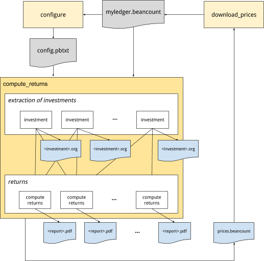

Calculating Portfolio Returns
===============================================

[Martin Blais](http://plus.google.com/+MartinBlais), Sept 2020

[http://furius.ca/beancount/doc/returns](http://furius.ca/beancount/doc/returns)

*This document describes how to compute portfolio returns from a Beancount ledger.*

Motivation
---------------------------------

You will be surprised to find that discount brokers typically do not provide accurate and complete returns calculations for your investments based on your specific cash flows. They tend to report other measures of performance:

-   **Change in value.** The simplest they provide is a snapshot of the account value at the beginning and end of the period (or year). The problem with this method is that it does not reflect your infusions or removal of cash as such, nor your changes in positions. For example, if you had an account with $50,000 at the beginning of the year and you've added in $30,000 in August, reporting a difference of $37,000 at the end of December is just not useful (you'd have to mentally discount for new invested cash during the year, and what if you want to break it down and compare the returns from different instruments in the account?).

-   **Underlying performance.** They might report the growth of the underlying asset in isolation, disregarding your specific positions. It's not very useful to say "HDV grew by 8.2% over the last year" if you invested only (or even mostly) in the second half of the year. What I'd like is to know how much my specific investments grew, given my specific changes in positions and timings. In other words, how did *I* do?

-   **No dividends.** Another issue is that performance is typically only reporting capital appreciation due to the change in price of the investment. Ideally one would like to break down the performance between capital appreciation and dividends and returns for each of those components, as well as overall performance, so you can compare returns from stocks and bonds to each other. You can sometimes find out that information from the Yield field in the summary, but for uneven distributions, this won't help me find out what my actual returns from dividends were, over any period.

-   **Commissions and management expenses.** Some brokers charge management expenses on a monthly basis, based on the value of the account. I would like to know what my portfolio return is net of those expenses.

**I want accurate returns reporting, based on my actual cash flows and changes of positions over time.**

If I maintain your investment information in a Beancount ledger, in theory it contains all the data I need in order to compute your true returns, based on the specific timings of my own savings (cash infusions) and which positions I held at which time. It's just not in the simplest format required to do it— Beancount transactions are much more flexible than one might want and a simpler series of cash flows needs to be extracted from it. **This document explains how I finally did this from my own Ledger.** And how we might generalize this to yours, based on some simple rules. Most of this text is dedicated to the pedestrian details of extracting the right data.

The source code can be found [here](https://github.com/beancount/beanlabs/tree/master/beanlabs/returns/compute_returns.py).

In addition, a fair and honest comparison to other investments scenarios should be possible, based on those same cash flows. For instance, you should be able to produce data that looks like "My investments in ZZZ have returned 8.2%, 1.1% of which were from dividends, and if I'd invested in a 60/40 portfolio of broad stocks and bonds it would have returned 7.2% instead." In other words, I want to assess my performance *relative* to a number of common alternatives.

(Finally, note that if all you need is a snapshot of your current positions, that's already handled by the [export script](https://github.com/beancount/beancount/blob/v2/beancount/projects/export.py).)

### History

In 2014, I made [a brief attempt](https://github.com/beancount/beancount/blob/2.3.1/experiments/returns/returns.py) to break down information from my ledger to do this. At the time I got bogged down in details when some of the time-series I was extracting weren't producing what looked like sensible results (some with outliers). I got too detailed too fast. Sometimes it's better to just get the whole job done and come back for the details. I hadn't logged enough debugging information and I didn't have enough confidence in its output to use it. I never actually finished the work at the time, and eventually moved the scripts to experiments and shrugged. "Later."

In August 2020, I sat down to do this again, this time with a less ambitious goal of just getting a good approximation and producing lots of debug output, boiling down extraction to pull out just the cash flows and to get the job complete over all my accounts, even if it meant making some adjustments to my input file. It turned out to be the right decision: I managed to complete the task, and this document presents my journey, the method, its assumptions, quirks, and some results.

Overview of Method
-------------------------------------------------

The method I'll use is to extract cash flow information for each investment. What I call "**an investment**" in this context is a kind of **financial instrument**, e.g., shares of "VTI" for the Vanguard Total Stock Market ETF, **invested in a particular account**, e.g. a Vanguard 401k. A list of cash flows is a dated list of positive or negative currency being invested or withdrawn as proceeds to/from that investment. So I have a list of cash flows per account, and each account records only one financial instrument.

For reporting I'll **group** those per-account series in logical units of "**reports**", for example lumping together ones for the same instrument bought in different accounts / brokers, or different instruments that represent the same underlying by merging their cash flows. Or even to group them by "strategy". Basically, by merging the cash flows of multiple accounts, I have a generic way to group any subsets of accounts and compute their returns.

Using the cash flows, I will then run a **simple root finding routine to calculate the average annual rate** those flows would have to grow in order to result in their final market value. This provides me with overall returns. This is similar to calculating the [Internal Rate of Return](https://en.wikipedia.org/wiki/Internal_rate_of_return). I will do that for the entire time series, but also for sub-intervals within the time series to compute, e.g. calendar returns (i.e., each year or quarter) or cumulative returns for trailing periods. Since cash flows are flagged as dividends or not, I can separate the returns from appreciation from the returns from dividends. Reports with plots are produced for each of the groups.

Here's a diagram that shows how the "configure", "compute\_returns" and "download\_prices" scripts work together:

These will be further detailed below.

Configuration
---------------------------------------

First, a [configuration](https://github.com/beancount/beancount/blob/v2/experiments/returns/config.proto) needs to be created to define a list of investments, and groups of those, for which reports will be produced. This configuration is provided as a text-formatted [protocol buffer](https://developers.google.com/protocol-buffers) message.

-   **Investment.** An investment corresponds to a particular instrument stored in a particular account. It also involves other transactions that don't directly involve that particular account. We want to provide a few set of account names:

    -   **Asset account.** The name of the account holding the commodities for that investment.

    -   **Matching accounts.** A list of additional accounts which will select transactions with postings to them.

    -   **Cash accounts.** A list of accounts external to the investment, which will be used to flag inflows and outflows to and from the investment.

-   **Report.** While we can compute returns for each investment, the more general and useful case is to compute returns on groups of them. A report is simply a list of investment names. A PDF file will be produced for each report.

Here's an example of 6 investments and 3 reports:

    investments {
      # Accounts at BTrade.                                           
      investment {
        currency: "GLD"
        asset_account: "Assets:US:BTrade:GLD"
        cash_accounts: "Assets:US:BTrade:Cash"
      }
      investment {
        currency: "AMZN"
        asset_account: "Assets:US:BTrade:AMZN"
        cash_accounts: "Assets:US:BTrade:Cash"
      }
      investment {
        currency: "QQQ"
        asset_account: "Assets:US:BTrade:QQQ"
        dividend_accounts: "Income:US:BTrade:QQQ:Dividend"
        cash_accounts: "Assets:US:BTrade:Cash"
      }

      # Accounts at IBKR.                                             
      investment {
        currency: "IAU"
        asset_account: "Assets:US:IBKR:IAU"
        cash_accounts: "Assets:US:IBKR:Cash"
      }
      investment {
        currency: "SLV"
        asset_account: "Assets:US:IBKR:SLV"
        cash_accounts: "Assets:US:IBKR:Cash"
      }

      # Accounts at Schwab.                                           
      investment {
        currency: "GOOG"
        asset_account: "Assets:US:Schwab:GOOG"
        cash_accounts: "Assets:US:Schwab:Cash"
        cash_accounts: "Assets:AccountsReceivable"
        cash_accounts: "Assets:US:GoogleInc:GSURefund"
      }
    }

    groups {
      group {
        name: "strategy.gold"
        investment: "Assets:US:BTrade:GLD"
        investment: "Assets:US:IBKR:IAU"
      }
      group {
        name: "strategy.tech"
        investment: "Assets:US:BTrade:QQQ"
        investment: "Assets:US:BTrade:FB"
        investment: "Assets:US:Schwab:GOOG"
      }
      group {
        name: "all"
        investment: "Assets:US:*"
        currency: "USD"
      }
      group {
        name: "accounts.BTrade"
        investment: "Assets:US:BTrade:*"
        currency: "USD"
      }
    }

Different reports can include the same investment. References to accounts and investment names support simple UNIX-style globbing patterns in the configuration. These are expanded to full account names at runtime and stored in the output.

A "[configure.py](https://github.com/beancount/beancount/blob/v2/experiments/returns/configure.py)" script can automatically infer a working basic configuration from an existing Beancount ledger. A report will be generated for each unique instrument and the same metadata fields honored by the "export" script ("assetcls", "strategy") will also generate reports. I recommend you run this on your ledger and then custom tailor the configuration manually.

### Finding Accounts

This script needs to figure out the list of available investments to report on. By convention I keep pairs of dedicated leaf accounts for each commodity type in my ledger, one to contain the actual positions (assets) and one to receive dividends, e.g., for "VTI" held in broker "BTrade", accounts like

    2012-03-01 open Assets:US:BTrade:VTI              VTI
    2012-03-01 open Income:US:BTrade:VTI:Dividend     USD

This has two consequences: (a) it makes it easy to find the list of accounts that contain investments (any account with a leaf account name that is also one of the commodities found in the ledger), and (b) it nicely isolates all the activity related to each of those investments by finding all the transactions with a posting to that account**. I recommend you follow the same convention in your chart of accounts.** The result is a list of accounts like "Assets:US:BTrade:VTI", specific to each (instrument, institution).

I further filter down this list to the subset of accounts which were still open up to 15 years ago (I close my accounts—using Beancount's Close directive—when they're done). In my particular case, I didn't have much savings back then, and there's no point in bothering to do the work to normalize those crumbs in my investing history for that far back.

Extracting Cash Flow Data
---------------------------------------------------------------

This section describes the various steps I took to extract relevant data from my ledger.

### Extracting Relevant Transactions

For each of the identified asset accounts, we want to pull out from the ledger's transactions the list of transactions affecting that account. We simply run through the entire ledger's transactions keeping transactions with at least one posting to the investment's asset account, dividend income accounts, or to any of the other "match accounts" defined for it.

For instance, transactions for cash dividend payments will not show an asset posting so if dividends are paid; a typical dividend payment would contain only the dividend income posting and a cash posting (for the deposit):

    2019-11-27 * "Dividend"
      Income:US:BTrade:VTI:Dividend   -123.45 USD
      Assets:US:BTrade:Cash            123.45 USD

So it is necessary to include the dividend account in the configuration to include those transactions, because they typically do not involve the asset account.

### Account Categorization

The next step is to generalize transactions to *templates*: we record the full set of accounts involved in the extracted transactions of each investment, and assign them to general categories based on their role in the transaction. For example, if I inspect my "VTI" trades, I will encounter the following accounts:

     Assets:US:BTrade:Cash
     Assets:US:BTrade:VTI
     Expenses:Financial:Commissions
     Income:US:BTrade:VTI:Dividend

I map each account to one of several generic categories (I could probably simplify this now):

    ASSET      # The account holding the commodity.
    CASH       # Cash accounts, employer matches, contributions.
    DIVIDEND   # Dividend income account.
    EXPENSES   # Commissions, fees and other expenses.
    INCOME     # Non-dividend income, P/L, gains, or other.
    OTHERASSET # Other assets than the primary asset for this investment.
    OTHER      # Any other account.

Like this:

     'Assets:US:BTrade:Cash': CASH
     'Assets:US:BTrade:VTI': ASSET
     'Expenses:Financial:Commissions': EXPENSES
     'Income:US:BTrade:VTI:Dividend': DIVIDEND

In this way, I can compare similar transactions to each other across instruments and extract information from them with the same code. For example, a transaction that involves a dividend account and a cash account is a cash dividend payment, and I can write a generic handler to extract the cash flows for this. The categorization was originally prototyped with a set of ad-hoc rules, but the configuration now serves to provide the categorization.

    Note: In the process of doing this, I noticed many irregularities in how I named my accounts. For example, I used ":Dividend" and ":Dividends" sometimes. I went through my ledger and had to make some changes to name accounts coherently, and iterated until all my accounts were categorized correctly. You may have to review some of your data entry as well.

### Handling Transactions using the Signature

Using the account-category mappings from the previous section, I was able to derive a unique "signature" for each transaction. For example, a transaction like this:

    2020-03-12 * "(DOI) ORDINARY DIVIDEND"
      Income:US:BTrade:VTI:Dividend  -1312.31 USD                                                                                                                                                                                                                                                                                                                                                                                  
      Assets:US:BTrade:Cash           1312.31 USD                                                                                                                                                                                                                                                                                                                                                                                  

would have a signature of

    CASH_DIVIDEND

which is hopefully always a dividend payment. Beancount has a pretty flexible syntax and does not enforce that your transactions follow particular templates like this, so it wasn't clear to me when I started this project what patterns I would find in my ledger of 12 years of ad-hoc data entry… I wasn't certain that this categorization and these signatures would be sufficient to correctly handle a correct conversion to cash flows. So I had my script produce two sets of files for debugging:

1.  **Investment details.** A file *for each investment*, rendering a list of all the transactions that were extracted for it, decorated with metadata showing the categorizations inferred on each posting, as well as a categorization map of all the accounts encountered. I inspected these files visually to ensure that the account/patterns from the configuration were extracting the full and correct set of transactions involved in that investment.

2.  **Signature transactions.** A file *for each unique signature*, with the full list of transactions matching that signature across all investments. By inspecting these files, I made sure that all the transactions matching the same signature were indeed playing the same role, so that a single handler per signature is sufficient.

At this point, I had a limited list of unique signatures, each with clear unique roles:

    ASSET_CASH                 : Purchase or sale
    ASSET_CASH_EXPENSES        : Purchase or sale with commission
    ASSET_CASH_INCOME          : Purchase or sale with profit
    ASSET_CASH_INCOME_EXPENSES : Purchase or sale with commission and profit
    ASSET_EXPENSES             : Fee paid from liquidation
    ASSET_INCOME               : Cost basis adjustment (with P/L)
    ASSET_INCOME_EXPENSES      : Fee from liquidation (with P/L)
    ASSET                      : Stock splits 
    ASSET_DIVIDEND             : Dividend reinvested
    CASH_DIVIDEND              : Dividend payment
    CASH_INCOME_DIVIDEND       : Dividend payment and gains distribution
    ASSET_OTHERASSET           : Exchange of stock/symbol
    … 

Note that the specific list really depends on the particular contents of your ledger and you should inspect the files produced for correctness.

I then wrote specific handlers to produce the *cash flows* corresponding to each of those transaction signatures, reasoning about each of those cases in isolation. This allowed me to correctly produce a full list of cash flows per investment.

> ***Note:** In practice I encountered 3 or 4 more signatures types that were a bit exotic and by fixing up my ledger I managed to either correct or break apart these transactions to equivalent but simpler ones. In particular, one of my importers was lumping together trades occurring on the same day, and I went back and fixed it and those transactions manually. The ASSET\_OTHERASSET signature, in particular, is an exchange of stock (Google -&gt; GOOG,GOOGL). Doing something like this brings up idiosyncrasies in your bookkeeping technique. Being consistent and using fewer templates is helpful.*
>
> *It would be a valuable idea for an accompanying plugin to restrict the possible set of templates to a select few, so that data entry is constrained to work well with this returns production code.*

### Generalizing Production of Cash Flows

After inspecting each of my signature handlers, I tried to generalize them to a single unified handler that would work across all transactions. It turns out that, at least with my existing ledger's transactions, it's possible.

Essentially, recording inflows or outflows to cash accounts or other assets is sufficient. In a transaction like this:

    2013-09-18 * "Buy shares of HOOL"
      Assets:US:BTrade:Cash            -818.55 USD
        flow: CASH
      Assets:US:BTrade:HOOL                  8 HOOL {101.20 USD}
        flow: ASSET
      Expenses:Financial:Commissions      8.95 USD
        flow: EXPENSES

The "CASH" posting is a sufficient incoming cash flow, so we record -818.55 USD. In a cash dividend payment:

    2013-12-17 * "Cash Dividend payment"
      Assets:US:BTrade:Cash              38.50 USD
        flow: CASH
      Income:US:BTrade:HOOL:Dividends   -38.50 USD
        flow: DIVIDEND

Similarly the 38.50 is a sufficient outgoing cash flow, so we record +38.50 USD. On the other hand a reinvested asset dividend, as you would find in some mutual funds, does not generate any cash flow; it simply remains in the investment and increases its total value:

    2013-12-30 * "Reinvested dividend"
      Assets:US:BTrade:HOOL              0.356 {103.41} USD
        flow: ASSET
      Income:US:BTrade:HOOL:Dividends   -36.81 USD
        flow: DIVIDEND

This rule seems sufficient to handle all the contents of my ledger correctly.

In the end, I implemented both methods: I use the general rule to produce the list of cash flows, but I also call out to the explicit handlers and cross-check that the extracted cash flows are identical, just to be sure. This is enabled by a flag in compute\_returns.py (`--check-explicit-flows`). This forces me to ensure that I've analyzed all the possible transaction templates.

    Note: If in using this script you find cases from your ledger that aren't handled by using a series of cash accounts, please let me know (on the mailing-list).

### Cash Flows

The handlers described in the previous section each produced a list of cash flows per transaction, and together for the account, they are essentially a list of:

    (Date, Amount, IsDividend)

Now, this is a simpler model to work from. For each account, we now have a sorted series of dated cash flows. Note that *Amount* includes its cost currency (I have both USD and CAD), *IsDividend* is a flag identifying the cash flow as being a dividend payment or not (to compute returns without the dividends). These series of cash flows can be easily merged between accounts, and truncated over time by inserting initial or final cash flows corresponding to the market value at those dates. Rendered, they might look like this (because of the scale, rendering the log brings up detail that is otherwise difficult to see; dividends are rendered in green):

Note that since many transactions do not generate cash flows, the list of cash flows of an investment is insufficient by itself to compute the value of the investment over time. When truncating for a time interval, the market value of the investment is derived using the list of transactions.

Finally, the list of cash flows for each group of investments reported can be trivially merged by concatenating them.

Computing Returns
-----------------------------------------------

### Calculating the Average Growth Rate

For each series of cash flows, the cash flows are merged together. I use [scipy.optimize.fsolve](https://docs.scipy.org/doc/scipy/reference/generated/scipy.optimize.fsolve.html) to calculate the rate that satisfies net present value:

*c**f**i*/(1 + *r*)*t**i*= 0

where *cfi* are the signed cash flow amounts and *ti* are the times from today for each cash flow (in years). We solve for *r*. To compute the returns without dividends, we just exclude cash flows returned from dividends. The difference tells us how much of our returns was due solely to dividend income.

It's important to note that if the corresponding positions are still invested, you have to insert a final negative cash flow for the market value at the latest date to zero it out. You're essentially simulating a sale. If significant transaction costs are going to be involved, you might want to simulate those as well (e.g. if you're doing this for a home, in particular).

Here's the beauty in this: **nowhere was the underlying price used**, except for marking the current position value to market value. We did not read any external measure of returns. These returns are computed *from cash going in and coming out*. These are *actual* realized returns. They do not lie.

**Intervals.** To compute calendar returns, e.g., returns for years 2016, 2017, 2018, 2019, 2020, I truncate the cash flows to keep only those inside the interval, e.g. 2018-01-01 to 2018-12-31 for year 2018, and if there was an existing position at the beginning of the interval, insert a negative cash flow at the start of the series equivalent to the market value at those dates. I do the same thing at the end of the interval, with a positive cash flow, as described previously.

Ideally I'd like to look at different sets of intervals:

-   **Lifetime of investment.** Total returns over the entire lifetime of the positions, to boil it all down to a single number.

-   **Calendar.** Annual or quarterly returns over the last 10 or 15 years, to witness variation in returns over time.

-   **Cumulative.** Cumulative returns over the last 10 or 15 years, aligned on calendar periods, to get a sense of whether things are improving or worsening, and how well my strategies are doing in more recent periods (e.g. last 3 years).

-   **High frequency cumulative.** Cumulative returns over the last 12 months, aligned with monthly or weekly dates, to assess the impact of decisions in the short-term.

These can be rendered in tables, and investments can be compared to each other in that way.

### Filling in Missing Price Points

The calculations of returns over various intervals require marking positions to market value at the beginning and end of the interval dates. Beancount being designed hermetically, i.e., it does not fetch any price externally, only uses what's in the ledger, its price database lookup will automatically produce the last available price point and its recording date before the requested date. Depending on your recording discipline, some of those prices might be out-of-date and introduce inaccuracies. This is especially important since the amounts converted at the end of periods (i.e. to estimate the value of current positions) can be large and meaningfully influence even the lifetime returns number.

So it's important to have relatively fresh price points in the ledger's price database. Now the question is, **given a changing set of positions over time, for a given set of interval dates, which price entries are required to produce accurate results?**

Because this depends heavily on the particular inputs of the returns script, in order to solve this problem I simply wrapped the price database with a facade that collects all the (instrument, date) pairs for requested conversions during the production of the reports, and filter those down by some age threshold (e.g., price not older than 3 days). These are essentially the price points missing from the file.

At the end of the script, I output these to a file with Price directives, and another program (download\_prices.py) can read that file and fetch historical rates for those. It produces updated rates which you can paste to your ledger file as a one-off adjustment and then recompute more accurate returns. Pulling data from Yahoo! Finance worked for 90% of my positions, but some of my older instruments were quite old or even retired, or not available (e.g., some retirement funds), so I had to find them by browsing and manually entering some of these price points (I had something like 30… no big deal).

**Rolling windows.** One important point is that going forward, it will be easier to align reporting intervals to some calendar-based interval (e.g., monthly), so that I don't have to regenerate price data every time I produce my returns. Aligning to months is probably good enough for my time horizon.

**Stock Splits.** Beancount does not explicitly make adjustments of prices for stocks that split, so your price source should return the pre-split price of the stock at the time if you are recording it as such. You should be able to check your price time series for errors using Fava.

### Currency Conversion

Another important detail is that each investment has its own quote currency. I used to live in Canada, and some of my older investments are denominated in CAD. So the question arises: do I compute the returns in local (CAD) currency, or in terms of my reference currency (USD)?

It's convenient that Beancount's Inventory object has functions that can easily perform those conversions where needed. And since the cash flows I extracted are stored using Beancount's Amount object, I already have the quote currencies correctly in my extracted dataset. In any group, if all the instruments have the same quote currency, I report returns in that currency. If the group includes a mix of quote currencies, I further convert everything to USD (so I get USD returns).

Reporting
-------------------------------

### Grouping Accounts

Returns are calculated jointly for each group of accounts in each "report", as defined in the configuration. Here are some example groupings that are sensible to define:

-   **Same instrument in different accounts.** If you buy the same stock in different accounts, it makes sense to report on the returns for that stock jointly, across all your accounts.

-   **Same underlying.** Some instruments represent the same stock, e.g. GOOG and GOOGL (different share class, same company). Also, IAU and GLD (Gold) are different ETFs whose values are both derived from physical gold reserves (located in bank basements in London).

-   **Same asset class.** Instruments from the same asset class, e.g. "metals", which would include IAU, GLD, SLV, COPX, etc., or "REITs", which would include VNQ, VGSLX, etc. Or "all stocks" vs. "all bonds".

-   **By Strategy.** In my portfolio investment method, I have a multi-headed approach where I define specific broad strategies and then select a list of instruments to implement it.

    -   For instance, I have a "tech sector" strategy, which includes FAANG companies.

    -   Or a "growth stock" strategy, which might include different indexes like VUG, IWO and RGAGX. I can report how well those strategies are doing, across brokers.

    -   Or geographically, "developed APAC", including EWY, EWT, EWS, EWA.

-   **By Broker.** I can report returns by broker or broker account. In particular, this can be an easy way to separate realized profits by tax treatment (e.g., 401k is tax-deferred).

-   **Asset type.** Comparing all index funds to all managed funds (e.g. mutual funds).

Note that different reports can include the same investments. Groupings aren't exclusive. You define what makes most sense for your situation. For reference, I use more than 20 reporting groups.

### Running the Code

Simply call

    ./experiments/returns/compute_returns.py <file.beancount> <config.pbtxt> <output-dir>

to generate all reports and debugging files, where *&lt;config.pbtxt&gt;* is in the format shown in “Configuration” . It's a little slow — some performance improvements are possible — but if you supply a list of report names after the final argument, only those investments and reports will be processed, so you can iterate faster that way. See flags with `--help` for details, and `config.proto` for the configuration input documentation.

### Results Rendered

For each reporting group, I currently produce:

-   A plot of the **cash flows over time**, and a smaller plot of *log*(cash flows). Dividend payments are typically dwarfed by cash flows for the principal, so the log chart allows me to see timings. This is mainly used to get an overview of activity over time, and for debugging.

-   A plot of cumulative value, where I render two curves:

    -   **Cumulative cash flows**, with a growth curve matching that returns I regressed over. The result should be a plot with gentle slope between cash flows (corresponding to the total returns growth), with a final drop to zero.

    -   **Market value over time**: A curve of the mark-to-market value of the portfolio over time. This allows me to make some sense of calendar returns, by witnessing how the asset value moves based on price.

-   A table of **total returns**, returns without dividends, and returns from dividends only.

-   A table of **calendar returns** for each year, also broken down by total, ex-dividends, dividends-only. (I'll probably render this as a plot in the future.)

-   A table of trailing **cumulative returns**.

This is going to get refined and augmented as I'm actively working on this code \[September 2020\].

### Example

Here's an example report, for a subset of accounts with a "growth" focus, held at different brokers. I produce one of these for each reporting group. (I greyed out parts for privacy.)

### Interpretation Gotchas

A few notes are in order:

**All rates are *annualized*.** This makes it easy to compare numbers to each other, but it also means that positions held for a short amount of time will produce numbers that are unrealistic for long term extrapolation. In particular, new positions entered only a few months ago may be subject to high growth or a big drop, both of which when extrapolated to an entire year may show eye-popping percentages. Do keep this in mind, especially when looking at recent positions added to your portfolio.

**Taxes aren't factored in.** Returns from taxable accounts and tax-deferred accounts should be evaluated differently and if the difference in tax is large, they can't be compared so readily. Do keep in mind that in most countries gains are only taxed on realization (sale) so in effect, long held investments behave more or less like tax-deferred ones. Just don't sell so much. This is a great advantage in holding broadly diversified ETFs (and usually unquantified, as people's attention is still overly focused on those benefits from registered accounts, e.g., 401k plan).

**Cost basis.** Note that nowhere in our calculations was the cost basis used or factored in, so don't confuse it with market value. The cost basis is only useful for tax-related effects.

Other Instruments Types
-----------------------------------------------------------

Note that computing returns in this manner isn't limited to only stocks and bonds. Using the same methodology, we can include other types of instruments:

### **P2P Lending**

I've used LendingClub before all the hedge funds got involved to pick up the low-hanging fruit, and eventually let all the bonds I'd invested in expire. It was easy to apply the same methodology to compute returns from those investments. Originally, I had the discipline to record this investment from monthly PDF statements using transactions like this:

    2016-10-31 * "2016-10-31.Monthly_Statement.pdf"
      Assets:US:LendingClub:FundsLent     -451.52 LENCLUB {1 USD}
      Assets:US:LendingClub:Cash           451.52 USD
      Income:US:LendingClub:LoanInterest   -21.68 USD
      Income:US:LendingClub:Recoveries      -5.92 USD
      Expenses:Financial:Fees                1.08 USD ;; Recovery fees                                                                                                                                                                                                                                                                                                                                                                      
      Expenses:Financial:Fees                4.71 USD ;; Service fees                                                                                                                                                                                                                                                                                                                                                                       
      Expenses:Financial:Fees                0.45 USD ;; Collection fees                                                                                                                                                                                                                                                                                                                                                                    
      Assets:US:LendingClub:Cash
      Assets:US:LendingClub:FundsLent      -23.05 LENCLUB {1 USD}
      Income:US:LendingClub:ChargedOff      23.05 USD

And later on, after the principal bonds expired, transactions like this:

    2018-11-30 * "2018-11-30.Monthly_Statement.pdf"
      Income:US:LendingClub:Recoveries  -2.73 USD
      Expenses:Financial:Fees            0.49 USD ;; Recovery fees                                                                                                                                                                                                                                                                                                                                                                          
      Assets:US:LendingClub:Cash

All it took to compute returns is this configuration for the investment:

      investment {
        currency: "LENCLUB"
        asset_account: "Assets:US:LendingClub:FundsLent"
        match_accounts: "Income:US:LendingClub:Recoveries"
        cash_accounts: "Assets:US:LendingClub:Cash"
      }

Note that the match account configuration was necessary to pick up crumbs from later transactions with only recoveries (and no posting to the asset account). For what it's worth, I was able to generate a 6.75% return over this investment. Meh.

### Real Estate

Cash flows can be extracted from all transactions for a home, so you can compute the returns for all the money poured into your home, as if it was done purely for investment purposes.

Usually buying a home is done for other reasons — stability for children, the ability to make your own improvements, the forced savings involved in regular principal payments, and oftentimes just a sense of "having a home" — but in the vast majority of the cases, home ownership is more of a cost center and returns would have been better invested elsewhere (see [this book](https://www.amazon.in/Wealthy-Renter-Choose-Housing-That-ebook/dp/B01B2DK68E) for a great exposé of the pros & cons). Personally, I have better things to do than fix toilets and worry about leaky windows in the winter so I went back to renting, but I went through the experience once and it was quite worthwhile, as a learning experience but also to experience the "joy" of having my own place. Through the exercise is useful to calculate how much having your own home is actually costing you, and how much you might have made by putting the very same cash flows into the market instead.

It's a little more involved, because,

-   You will have to have discipline to segregate expenses you wouldn't have had if you'd have rented to accounts specific for your home.

-   You will need to account for equivalent rent received that you didn't have to pay because you lived in the home.

-   If you still own the home, you will have to simulate a substantial agent fee and other closing costs (by inserting a transaction).

-   Most places have a large tax break when selling a property (sometimes the full capital appreciation), so that *really* needs to be factored in. It's not always simple to calculate, especially if you rented your property for some of its ownership lifetime, in which case you might only be able to deduct a part of the capital gains.

-   For some, there is great value in the *optionality* of being able to move easily and at low cost (e..g, accepting a new job at the other side of the country) and that personal value will be difficult to estimate.

This will require me to do more categorization work, and it will be best documented as a separate project, though using the same code. I did manage to create a simple configuration and extract a 5%-ish number out of it, but I think I'll need a bit more work to declare victory. More to come.

### Options

I sometimes hedge some of my portfolio downrisk with long-dated OTM PUT positions. I've sold OTM PUTs and CALLs in the near term to finance it. The method I described for stocks in this document works equally well for options, that is, extracting cash flows from cash.

The main differences are that:

-   **Currency names.** Instrument names are specific to each contract—they include the expiration date and strike price—so I don't store the options to an account whose name includes the instrument name at the leaf. I just use a generic leaf account name, such as "Options" or "Hedging" which I select when I enter/exit positions.

-   **Prices for options.** Prices for options aren't as easily fetchable programmatically. I'm having to use a private API for this. Perhaps more importantly, declining theta, varying vol and non-linearity near the strike means I do need to have to have pretty recent price estimates in my ledger in order to compute returns on unrealized gains/losses. I think the effect is strong enough that I'd want to eventually have some code to always update the prices just before generating the reports.

Future Work
-----------------------------------

This section describes desired future improvements on the returns code, which I'm likely to implement, and the corresponding challenges.

    Note: As I'm writing this in September 2020, I'm actively working on this code and probably will continue over the next few months' weekends. It's possible this document falls slightly out-of-date and that some of the proposals below become implemented. Refer to the source code for the latest.

### Relative Size over Time

Another useful bit of data I could easily add to reports is a stack plot of market values over time, as well as relative fractions of each investment in a report group. This would be useful for monitoring growth of particular instruments in a group to help with rebalancing.

### Comparison Against a Benchmark

One of the important barometers of success in running your own portfolio is a comparison to an equivalent investment of capital in a simple portfolio of diversified stocks and bonds rebalanced regularly. After all, if my returns aren't beating that, in a normal environment, one could make the argument I shouldn't bother with a more complicated allocation.

Assuming that my access to capital is the same (which it is, because in this project I'm looking at savings from income), I could simply replace my cash flows by cash flows to this simulated portfolio, in other words, use the same timings to simulate buying other assets. I would have to exclude the dividend payments because those are specific to the particular instruments I used, and at the same time generate simulated dividends from similarly sized positions in the benchmark portfolio.

It should be possible to do this without modifying my ledger. One issue is that I will require a set of accurate prices for the benchmark, at the dates of my historical cash flows. Like my script already does for aging price points, this could easily be stored in a file for fetching.

Perhaps more complicated is the fact that Beancount does not currently support a database of per-share dividend distributions. This could be added without introducing new syntax by attaching and honoring metadata on Price directives, such as

    2020-09-01 price LQD   136.16 USD
      distribution: 0.295 USD

Overall, it wouldn't be too difficult to implement this.

### Including Uninvested Cash

One of the problems I'm facing in investing my own portfolio is the lack of discipline around timely investing of available cash, especially when times are uncertain and difficult decisions have to be made. In order to account for the drag on performance from that, I should include an "investment" that's purely reflecting the total amount of uninvested cash over time.

Because this varies a lot, a good approximation can be obtained by sampling total amount of investable cash every month and synthesizing cash flows from differences. If that cash flow series gets included as part of a portfolio, it'll suitably drag its returns by diluting them.

### After-Tax Value

At the moment I export all my holdings to a Google Sheets doc using the [export script](https://github.com/beancount/beancount/blob/master/beancount/projects/export.py), and from that, break it down between long-term and short-term positions vs. pre-tax, after-tax, Roth, and taxable buckets. From those 8 aggregates, I remove estimated taxes and report a single "estimated after-tax net worth" and corresponding tax liability. This is a rough estimate.

The returns report is however much more detailed, and I could simulate tax payments not only on liquidation, but also at the end of each year (from dividends and sales). I have all the lot dates on each position held so I can automatically figure out short-term vs. long-term lots.

### Inflation Adjustments

The market value amounts reported on the returns charts and calendar returns do not account for inflation. Over long periods of time, those can make an important difference in returns.

It would be useful to discount the returns over time using annual estimates for the CPI (or some other estimate of inflation; you could even make up your own, from the expenses in your ledger), so that we can look at a curve of *real* growth and not just nominal growth.

### Sales Commission

The configuration could easily be improved to let the user specify expected commissions on sales of investments, either in absolute or relative (%) amounts. This would be used to mark positions with more realistic liquidation values. This could make a difference on investments with either small amounts or large commissions (i.e., working through a regular broker, or on real estate).

### Risk Estimation & Beta

A perhaps more advanced topic would be to compute an estimate of the variance from the specific portfolio composition in order to calculate and report some measurement of risk, such as [Sharpe Ratio](https://en.wikipedia.org/wiki/Sharpe_ratio). This would require a sufficient number of regularly spaced price points. Variation of the measures over time could be fun too, as well as calculating the current portfolio's specific sensitivity to market as a whole (beta).

Conclusion
---------------------------------

I had expected it would be possible to produce a clear picture of returns from Beancount data, and having done it I'm more satisfied with the level of detail and clarity I was to produce from my ledger than I had expected. This goes well beyond plotting of net worth over time, this actually works really well, and I can use it to compare the performance of different investments fairly. I hope at least some Beancount users will be able to run it on their ledgers and I'm looking forward to hearing some feedback from those who set it up.

Perhaps most importantly, I was very surprised to see results on my own portfolio returns. I'm one of those people who would normally shrug and guess an underwhelming ballpark number if asked what I thought my returns were, such as "meh, 6% or something, not super happy." Doing this work was originally driven by not having the right answer to this question. It turns out, over the last 15 years, that I've generated an almost 12% average annual return, and 14% annual return in the last 5 years. I haven't yet made the benchmark comparison, and for sure these numbers should be put side-by-side with the market for a fair assessment. Nevertheless, going through the exercise has provided me with renewed confidence and hope about the future, and I hope the clarity it will bring to other Beancount users' own investments will be similarly enlightening.
