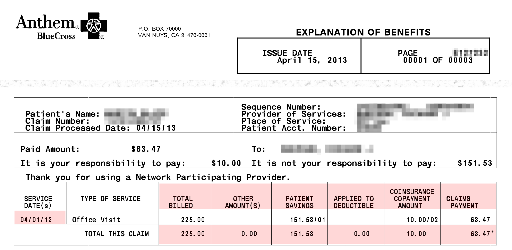

Health Care Expenses
======================================

[Martin Blais](mailto:blais@furius.ca), July 2014

*This is incomplete, work-in-progress, not released yet.*

Accounting for your health care expenses is a little different than regular expenses because of the various maximums imposed by your insurance plan. For the purpose of this section, we will assume a context of privatized health care system as is present in the USA, but the same principles may apply to other countries (if anything, it will be simpler).

### Accounting With No Insurance Plan - The Naive Way

So what’s so different about health care expenses? You might argue that they should be treated the same as other expenses. Say, we could define a few categories like these:

    1973-04-27 open Expenses:Health:Medical
    1973-04-27 open Expenses:Health:Dental
    1973-04-27 open Expenses:Health:Vision
    1973-04-27 open Expenses:Health:Drugs
    1973-04-27 open Expenses:Health:Acupuncture
    1973-04-27 open Expenses:Health:Massage-Therapy
    1973-04-27 open Expenses:Health:Physical-Therapy

And simply book outflows of moneys to them when you spend on one of these categories:

    2014-01-08 * "CityPT" "Copay for PT session w/ Rob on 12/28"
      Liabilities:US:BofA:Credit-Card     -25 USD
      Expenses:Health:Physical-Therapy     25 USD

In fact, this would be work just fine if you paid for all of your health care costs out-of-pocket. If that is your situation, this is what you should do. It’s straightforward.

The problem is that in practice, the great majority of people don’t pay for health care costs themselves. The great majority of your health-related costs are paid for by your insurance. This does not mean that there are no costs: your insurance usually only pays for a portion of the actual expenses, depending on the service. In particular, depending on your insurance plan, in any calendar year you pay for 100% of your health care costs up to a fixed amount (usually a few hundred dollars). This is called the *deductible* amount. Heretofore, you pay a percentage of the service (the *copayment* amounts*)*, and after a higher limit amount (the *out-of-pocket maximum* amount), you don’t pay anything anymore; plans with such limits guarantee that you will never pay more than this amount.

If you booked the amounts that you pay for your deductible, the scale of the expenses that would get reflected on your income statement would depend mostly on which type of service you *happened to use first* after January 1st. It would not accurately reflect the cost of each service that you use. It would not be that useful.

### Counting the Cash Payments - The Incorrect Way

So you might argue that you should instead book the same outflows of money to categories that reflect their true nature:

    1973-04-27 open Expenses:Health:Medical:Deductible
    1973-04-27 open Expenses:Health:Medical:Copayments
    1973-04-27 open Expenses:Health:Vision:Deductible
    1973-04-27 open Expenses:Health:Vision:Copayments
    1973-04-27 open Expenses:Health:Dental:Deductible
    1973-04-27 open Expenses:Health:Dental:Copayments

Then booking the payments to those categories:

    2014-01-08 * "CityPT" "Copay for PT session w/ Rob on 12/28"
      Liabilities:US:BofA:Credit-Card     -25 USD
      Expenses:Health:Medical:Copayments   25 USD

But this is largely unsatisfying, for a few reasons: while this tracks how much of was paid in total in deductible and copayments, it does not reflect anything about how much of a particular health provider services was used.

More importantly, it is incorrect, because deductible and copayment limits apply to each calendar year for dates when the service was provided, not when it was paid for. In other words, if you received the service on December 28th, 2013 but paid for it the year following on January 8th, 2014, the copayment accrual is going towards the wrong year. In order to do this correctly, you must accrue the deductible and copayment amounts on the *date of service*, which is always provided on the documents your insurance company provides (the *Explanation of Benefits*, more later about this). The date of service is the date you actually were seen by the provider.

Another solution would be to define accounts for each year, similarly to tax accounts (see chapter on Taxes):

    2012-01-01 open Expenses:Health:Medical:Y2012:Deductible
    2012-01-01 open Expenses:Health:Medical:Y2012:Copayments
    2013-01-01 open Expenses:Health:Medical:Y2013:Deductible
    2013-01-01 open Expenses:Health:Medical:Y2013:Copayments
    2014-01-01 open Expenses:Health:Medical:Y2014:Deductible
    2014-01-91 open Expenses:Health:Medical:Y2014:Copayments
    2014-01-01 open Expenses:Health:Dental:Y2012:Deductible
    2014-01-91 open Expenses:Health:Dental:Y2012:Copayments
    … 

Then when you book your expense, you could use the account corresponding to the year the service was received:

    2014-01-08 * "CityPT" "Copay for PT session w/ Rob on 12/28"
      Liabilities:US:BofA:Credit-Card          -25 USD
      Expenses:Health:Medical:Y2013:Copayments  25 USD

This is not a nice solution however, due to the proliferation of accounts that need to get created for each year, and it still does not tell us how much of each service we’ve consumed. We clearly need a better solution.

### How Health Care Insurance Payments Work

Let’s first review how insurance payments work, as it will be needed to have a basic understanding of claims payments to correctly account for these costs.

For each service, your insurance covers a portion of it and you normally pay the difference. The way that this works is that your doctor sends a bill to the insurance company and the insurance company either (a) responds to them directly with payment for the covered part of the service, or (b) the insurance company sends you a check and you are meant to sign it over to your doctor (usually after some annoying reminders for you to do so). Sometimes, but not always, your insurance company sends you a report of the doctor’s claim. This document is called an *explanation of benefits* or “EOB”, and it details the portion of the service that the insurance paid for, the portion that you’re responsible to pay for, and other amounts. Service providers that have no direct relationship with your insurance company will need this detail. This is a useful document for the purpose of accounting: make sure to keep a copy for yourself[^1].

Here is a sample from an EOB, with the important areas highlighted:

The example above exhibits the following amounts:

-   **Claims/Billed.** How much the doctor asked the insurance for the service.

-   **Patient Savings.** How much the service was reduced as a result of pre-established negotiations with the provider (for in-network providers).

-   **Applied to Deductible.** How much of this service you need to cover yourself as part of this calendar year’s deductible amount. You need to pay this.

-   **Copayments.** The portion of the service not covered by the insurance. You have to pay this.

-   **Claims Payments.** How much the insurance actually sent a check to the provider for.

The terminology used on the EOB provided by your insurance company may vary slightly, but you should be able to find corresponding amounts easily.

The doctor’s billing dept. then sends you a bill for the uncovered portion[^2] and you issue them a payment, by credit card, check or otherwise. Consider this a payable when the bill or EOB arrives at your door.

All in all, there are four dates relevant to a claim:

-   **Date of Service.** That is the date you visited the doctor’s office, the date you received the service. This is the date relevant for accounting for deductibles and copayments.

-   **Date of Issue.** The date that the claim was processed by the insurance. You may ignore this.

-   **Billing Date.** The date the provider receive payments for its claim and issue you a bill for the remaining portion. We don’t care much about this either.

-   **Date of Payment.** The date you made the payment. This will automatically appear on your credit card or checking account statement, or if you paid cash, you need to enter this manually (as you do all cash transactions you care about).

The most important date when you refer to any claim is the *date of service*. If you scan and file your EOBs to documents, it is wise to rename them to include this date in the filename.

### Provider Networks

In the USA, each medical professional (or “service provider”) decides whether to maintain an established arrangement with each insurance company, depending on their rates of payment and on how much of a pain they are about paying up bills. When they do, they are considered an “in-network provider” by the insurance company. Otherwise they are considered an “out-of-network provider” and the proportion of the services that the insurance covers is much smaller. That’s the only difference. The list of providers that an insurance has in their network—and how difficult they are about refusing to pay bills—is usually a major consideration in the selection of an insurance plan, for someone who has a choice.

But because most employers compete on compensation benefits by paying for their employees’ health care insurance costs, as well as the fact that they are usually able to negotiate better rates from insurance companies than an individual can because they represent a large pool of customers (the employees), the great majority of people with jobs end up choosing their employer’s plan and then try to go to in-network providers. This is not always possible, however: your family doctor may decide to stop accepting your insurance as in-network during the course of the year, and you might prefer to maintain an established relationship with your doctor rather than switch, so you end up having to pay a bit more. The bottom line is that in a typical year, you usually use some services of both in-network and out-of-network professionals and you have to account for both of these costs.

### Accruing on Service Date - The Correct Way

Ideally, we would like to obtain balances for the following amounts:

-   The amount of money that each service cost, regardless of who paid

-   The amount of deductible and copayments that are used in each calendar year

What we will do, is enter two entries:

1.  An entry for each EOB, at the date of service, for which we obtain a payable.

2.  An entry for each payments, that comes out of an *Asset* or *Liability* account.

#### In-Network Providers

For in-network providers a typical entry looks like this:

    2013-04-01 * "DR RAPPOPORT" "Office visit" ^anthem-claim-8765937424
      Expenses:Health:Medical:Claims            225.00 USD
      Expenses:Health:Medical:PatientSavings   -151.53 USD
      Liabilities:US:Accounts-Payable           -10.00 USD ; Copay
      Expenses:Health:Medical:ClaimsPayment     -63.47 USD

Once you’ve figured out which numbers to pull out of of these EOBs, it becomes simpler to enter others, because they are very regular and all look the same.

Note that an in-network EOB will include a “Patient Savings” number. This is meant to reflect how much lower you’re paying due to your insurance plan selection. (In practice, this is a bit of smoke and mirrors, because all the claims made by doctors are inflated to reflect the amount they actually get paid for, but I think the insurance likes to show these to you anyway.)

I like to immediately reflect the missing portion to an “accounts payable” liability, which tells me I have this registered as an upcoming payment:

    1973-04-27 open Liabilities:US:Accounts-Payable

You can then eliminate this payable as the payment entry comes in through your credit card import:

    2014-01-08 * "Rappoport Medical Office" ^anthem-claim-8765937424
      Liabilities:US:BofA:Credit-Card     -10.00 USD
      Liabilities:US:Accounts-Payable      10.00 USD

Note how I “link” both of the transactions to each other with “`^anthem-claim-8765937424`” so they can easily be found and verified later on.

For in-network doctors, because the payments from the insurance are generally predictable, the doctor’s office will sometimes require the copayment on the same day you visit. Just book this as a cash entry against the same liability account.

If you have a doctor that you visit regularly, you may create dedicated Liabilities accounts for them:

    2009-09-17 open Liabilities:US:Accounts-Payable:DrRappoport

#### Out-of-Network Providers

For out-of-network providers, the EOBs are slightly different:

What we noticed is that there is an “other amount” section, which is essentially what will be written off by the provider, and the Patient Savings section is empty.

A typical entry corresponding to this EOB would look like this:

    2014-02-13 * "ROB BOONAN" | "Physical Therapy" ^anthem-claim-17646398
      Expenses:Health:PhysicalTherapy:Claims           320.00 USD
      Expenses:Health:PhysicalTherapy:ClaimsPayment   -115.14 USD
      Expenses:Health:PhysicalTherapy:Uncovered       -155.52 USD                                                                                                                                                                                                                                                                  
      Liabilities:US:Accounts-Payable:CityPT           -49.34 USD

You will typically receive the check for your service provider’s payment (in the example, that is a check for $115.14) and have to send it over to them yourself. You can either deposit the check right away and make the full payment with your credit card, or send the check and just pay the difference (this is what most people do):

    2014-01-08 * "City PhysioTherapy" ^anthem-claim-17646398
      Liabilities:US:BofA:Credit-Card            -49.34 USD
      Liabilities:US:Accounts-Payable:CityPT      49.34 USD

One interesting twist is that many out-of-network providers will accept the lower amount that insurance companies pay for out-of-network services and write off the excess amount, or charge you nominal amount only. For example, the “deal” with my favorite physical therapy place is that they charge me 25$ per session. Once again, the claim is inflated, of course, and the apparent amount the insurance says you have to pay has to be largely written off. This is how you’d book such an entry’s EOB:

    2014-02-13 * "ROB BOONAN" | "Physical Therapy" ^anthem-claim-17646398
      Expenses:Health:PhysicalTherapy:Claims           320.00 USD
      Expenses:Health:PhysicalTherapy:ClaimsPayment   -115.14 USD
      Liabilities:US:Accounts-Payable:CityPT           -25.00 USD
      Expenses:Health:PhysicalTherapy:WriteOffs

The provider’s administrator does not charge me on every visit. She accrues the amounts and whenever decides to process her accounting, she makes a charge for the total, which clears the account to zero. This might look like this:

    2014-02-26 * "Payment for 3 Physical Therapy treatments"
      Liabilities:US:BofA:CreditCard             -75.00 USD
      Liabilities:US:Accounts-Payable:CityPT

### Tracking Deductible and Copayment Limits

As we’ve seen previously, there are limits on how much you end up paying for health care services. These limits are applied by calendar year, so they need to be applied at the date of service. For this reasons, we can attach corresponding entries to the EOB entries, and then filter transactions by year to calculate the balances for that year.

I like to keep tabs on these limits and ensure that they are applied properly. According to my insurance plan, the limits are defined like this:

-   **Deductible.** “The amount you pay out-of-pocket within a calendar year before your health insurance begins to pay for covered service.”

-   **Out-of-pocket maximum.** “The maximum amount of money you could pay out-of-pocket in a calendar year for covered health care services. There are exclusions, e.g. for prescription drugs and some services.”

-   **Co-payment.** “A fixed fee that you pay out-of-pocket for a service. This fee does not vary according to the actual cost of the service.”

It is not straightforward, however, because there are distinct limits for in-network and out-of-network providers, both for deductible amounts and copayment amounts:

-   Amounts paid for in-network deductibles count towards your limit for out-of-network deductibles.

-   Amounts paid for in-network copayments count towards your limit for out-of-network copayments.

-   Amounts paid for deductibles count towards your limit for copayments.

I carry this out using the “mirror accounting” technique I describe in another document. The idea is to use an alternative currency to count for these amounts.

***TODO: complete this***

### Insurance Premiums

Then you have to track how much you spend on your insurance premiums. These are the fixed semi-monthly payments you make—usually directly processed out of your paycheck—for getting the insurance policy itself. As for most people with jobs in the US, my employer offers a few health coverage plans and pays for most of it, but there is always a portion I have to pay myself:

    1973-04-27 open Expenses:Health:Insurance

A fixed premium is automatically deducted from my paycheck entries, as it appears on my pay stub:

    2014-02-08 * "Acme Corp - Salary"
      …
      Expenses:Health:Insurance        42.45 USD
      …

On your pay stub, be careful not to confuse this with the “Medicare tax,” which is a tax used to pay for the bit of socialized medicine costs the US has for older people. This is just a tax and has little to do with your own health care expenses.

### Drugs

Drugs are accounted for separately.

***TODO: complete this***

[^1]: You do not always receive these through the mail, but insurance companies are now finally coming up with websites where you can download all the claims that were made on your behalf (and account for them), even those which weren’t mailed to you.

[^2]: This is a tremendous annoyance because each doctor has a different billing department, they are typically antiquated and their online payment options are almost always broken (you end up having to call a phone number and convince a grumpy administrator to pay by credit card because they are still used to receiving *checks*), and all the different service providers that collaborate together to offer you a health service will bill you separately (with different billing departments as well). For example, if you undergo surgery, over the following 6 months you can expect to get different bills from your surgeon, his assistant, the anesthesiologist, the person who monitored your brain activity while asleep, the lab who did the blood work, the person who read an X-ray, and so on. And the bills may be sent more than 6 months after the operation took place, well into the following year. It’s completely Kafkaesque. You have to really wonder why the insurance company does not always pay the full service to the providers and then bill *you*, just once, for the deductibles. That would make the process a lot simpler and reduce the exhorbitant cost of administering health care.
