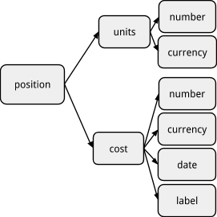

How Inventories Work
======================================

[Martin Blais](mailto:blais@furius.ca), December 2016

[http://furius.ca/beancount/doc/booking](http://furius.ca/beancount/doc/booking)

*This document explains how we accumulate commodities and  
match sales (reductions) against accumulated inventory contents.*

Introduction
-------------------------------------

Beyond the ability to track and list the postings made to each of the accounts (an operation that produces a *journal* of entries), one of the most common and useful operations of Beancount is to sum up the positions of arbitrary sets of postings. These aggregations are at the heart of how Beancount works, and are implemented in an object called “inventory.” This document explains how this aggregation process works. If you’re going to track investments, it’s necessary to understand what follows.

Matches & Booking Methods
-------------------------------------------------------------

In order to get the big picture, let’s walk through the various booking features by way of a simple examples. This should expose you to all the main ideas in one go.

### Simple Postings — No Cost

Consider a set of simple postings to an account, e.g.,

    2016-04-24 * "Deposit check"
      Assets:Bank:Checking      221.23 USD
      … 

    2016-04-29 * "ATM Withdrawal"
      Assets:Bank:Checking     -100.00 USD
      … 

    2016-04-29 * "Debit card payment"
      Assets:Bank:Checking      -45.67 USD
      … 

The inventory of the Checking account begins empty. After the first transaction, its contents are 221.23 USD. After the second, 121.23 USD. Finally, the third transaction brings this balance to 75.56 USD. This seems very natural; the numbers simply add to.

It might be obvious, but note also that the numbers are allowed to change the sign (go negative).

### Multiple Commodities

An inventory may contain more than one type of commodity. It is equivalent to a mapping from commodity to some number of units. For example,

    2016-07-24 * "Dinner before leaving NYC"
      Expenses:Restaurants     34.58 USD
      … 

    2016-07-26 * "Food with friends after landing"
      Expenses:Restaurants     62.11 CAD
      … 

After those two transactions, the Restaurants account contains 34.58 USD and 62.11 CAD. Its contents are said to be of mixed commodities. And naturally, postings are applied to just the currencies they affect. For instance, the following transaction

    2016-07-27 * "Brunch"
      Expenses:Restaurants     23.91 CAD
      … 

brings the balance of that account to 34.58 USD and 86.02 CAD. The number of units USD hasn’t changed.

Note that accounts may contain any number of commodities, and this is also true for commodities held at cost, which we’ll see shortly. While this is made possible, I recommend that you define enough accounts to keep a single commodity in each; this can be enforced with the “[onecommodity](https://bitbucket.org/blais/beancount/src/default/beancount/plugins/onecommodity.py)” plugin.

### Cost Basis

Things get a little more hairy when we consider the tracking of investments with a cost basis. Beancount allows you to associate a cost basis and an optional label with a particular lot acquired. Consider these two purchases to an investment account:

    2015-04-01 * "Buy some shares of Hooli in April"
      Assets:Invest            25 HOOL {23.00 USD, "first-lot"}
      … 

    2015-05-01 * "Buy some more shares of Hooli in May"
      Assets:Invest            35 HOOL {27.00 USD}
      … 

So now, the investment account’s inventory contains

              units ccy   cost  cost-ccy lot-date    label
                 25 HOOL {23.00 USD,     2015-04-01, "first-lot"}
                 35 HOOL {27.00 USD,     2015-05-01, None}

Those two lots were not merged, they are still two distinct positions in the inventory. Inventories merge lots together and adjust the units only if the commodity and *all* of its cost attributes exactly match. (In practice, it’s pretty rare that two augmentations will have the same cost and date attributes.)

Note how Beancount automatically associated the acquisition date to each lot; you can override it if desired, by adding the date similar to the optional label. this is useful for making cost basis adjustments).

Postings that *add* to the content of an inventory are called **augmentations**.

### Reductions

But how do we remove commodities from an inventory?

You could eat away at an existing lot by selling some of it. You do this by posting a **reduction** to the account, like this:

    2015-05-15 * "Sell some shares"
      Assets:Invest           -12 HOOL {23.00 USD}
      … 

Just to be clear, what makes this posting a **reduction** is the mere fact that the sign (-) is opposite that of the balance of the account (+25) for that commodity. This posting tells Beancount to find all lots with a cost basis of 23.00 USD and remove 12 units from it. The resulting inventory will be

              units ccy   cost  cost-ccy lot-date    label
                 13 HOOL {23.00 USD,     2015-04-01, "first-lot"}
                 35 HOOL {27.00 USD,     2015-05-01, None}

Note how the first posting was reduced by 12 units. We didn’t have to specify all of the lot’s attributes, just the cost. We could have equivalently used the date to specify which lot to reduce:

    2015-05-15 * "Sell some shares"
      Assets:Invest           -12 HOOL {2015-04-01}
      … 

Or the label:

    2015-05-15 * "Sell some shares"
      Assets:Invest           -12 HOOL {"first-lot"}
      … 

Or a combination of these. Any combination of attributes will be matched against the inventory contents to find which lot to reduce. In fact, if the inventory happened to have just a single lot in it, you could reduce it like this:

    2015-05-15 * "Sell some shares"
      Assets:Invest           -12 HOOL {}
      … 

### Ambiguous Matches

But what happens if multiple lots match the reduction? For example, with the previous inventory containing two lots, if you wrote your sale like this:

    2015-05-15 * "Sell some shares"
      Assets:Invest           -12 HOOL {}
      … 

Beancount wouldn’t be able to figure out which lot needs to get reduced. We have an ambiguous match.

Partially ambiguous matches are also possible. For example, if you have the following inventory to reduce from:

              units ccy   cost  cost-ccy lot-date    label
                 25 HOOL {23.00 USD,     2015-04-01, None}
                 30 HOOL {25.00 USD,     2015-04-01, None}
                 35 HOOL {27.00 USD,     2015-05-01, None}

And you attempted to reduce like this:

    2015-05-15 * "Sell some shares"
      Assets:Invest           -12 HOOL {2015-04-01}
      … 

The first two lots are selected as matches.

### Strict Booking

What does Beancount do with ambiguous matches? By default, it issues an error.

More precisely, what happens is that Beancount invokes the **booking method** and it handles the ambiguous match depending on what it is set. The default booking method is “**STRICT**” and it just gives up and spits out an error, telling you you need to refine your input in order to disambiguate your inventory reduction.

### FIFO and LIFO Booking

Other booking methods are available. They can be configured using options, like this:

    option "booking_method" "FIFO"

The “**FIFO**” method automatically selects the oldest of the matching lots up to the requested size of the reduction. For example, given our previous inventory:

              units ccy   cost  cost-ccy lot-date    label
                 25 HOOL {23.00 USD,     2015-04-01, "first-lot"}
                 35 HOOL {27.00 USD,     2015-05-01, None}

Attempting to reduce 28 shares like this:

    2015-05-15 * "Sell some shares"
      Assets:Invest           -28 HOOL {}
      … 

would match both lots, completely reduce the first one to zero units and remove the remaining 3 units from the second lot, to result in the following inventory:

              units ccy   cost  cost-ccy lot-date    label
                 32 HOOL {27.00 USD,     2015-05-01, None}

The “LIFO” method works similarly, but consumes the youngest (latest) lots first, working its way backward in time to remove the volume.

### Per-account Booking Method

You don’t have to make all accounts follow the same booking method; the option in the previous section sets the default method for all accounts. In order to override the booking method for a particular account, you can use an optional string option on the account’s Open directive, like this:

    2014-01-01 open Assets:Invest    "FIFO"

This allows you to treat different accounts with a different booking resolution.

### Total Matches

There is an exception to strict booking: if the entire inventory is being reduced by exactly the total number of units, it’s clear that all the matching lots are to be selected and this is considered unambiguous, even under “STRICT” booking. For example, under “STRICT” booking, this reduction would empty up the previous inventory without raising an error, because there are 25 + 35 shares matching:

    2015-05-15 * "Sell all my shares"
      Assets:Invest           -60 HOOL {}
      … 

### Average Booking

Retirement accounts created by government incentive programs (such as the 401k plan in the US or the RRSP in Canada) typically consist in pre-tax money. For these types of accounts, brokers usually disregard the calculation of cost basis because the taxation is to be made upon distributing money outside the account. These accounts are often managed to the extent that they are fully invested; therefore, fees are often taken as shares of the investment portfolio, priced on the day the fee is paid out. This makes it awkward to track the cost basis of individual lots.

The correct way to deal with this is to treat the number of units and the cost basis of each commodity’s entire set of lots separately. For example, the following two transactions:

    2016-07-28 * "Buy some shares of retirement fund"
      Assets:Invest       45.0045 VBMPX {11.11 USD}
      … 

    2016-10-12 * "Buy some shares of retirement fund"
      Assets:Invest       54.5951 VBMPX {10.99 USD}
      … 

Should result in a single lot with the total number of units and the averaged cost:

              units ccy    cost    cost-ccy lot-date    label
            99.5996 VBMPX {11.0442 USD,     2016-07-28, None}

A fee taken in this account might look like this:

    2016-12-30 * "Quarterly management fee"
      Assets:Invest       -1.4154 VBMPX {10.59 USD}
      Expenses:Fees

Even with negative units the number and cost get aggregated separately:

              units ccy    cost    cost-ccy lot-date    label
            98.1842 VBMPX {11.0508 USD,     2016-07-28, None}

<table><tbody><tr class="odd"><td><em>This feature isn’t yet supported in Beancount; it’s fairly tricky to implement, and will be the subject in a minor release in the future.</em></td></tr></tbody></table>

### No Booking

However, there is another way to deal with non-taxable accounts in the meantime: you can simply disable the booking. There is a booking method called “**NONE**” which implements a very liberal strategy which accepts any new lot.. New lots are always appended unconditionally to the inventory. Using this strategy on the transactions from the previous section would result in this inventory:

              units ccy    cost  cost-ccy lot-date    label
            45.0045 VBMPX {11.11 USD,     2016-07-28, None}
            54.5951 VBMPX {10.99 USD,     2016-10-12, None}
            -1.4154 VBMPX {10.59 USD,     2016-12-30, None}

Observe how the resulting inventory has a mix of signs; normally this is not allowed, but it is tolerated under this degenerate booking method. Note that under this method, the only meaningful values are the *total* number of units and the *total* or *average* cost amounts. The individual lots aren’t really lots, they only represent the list of all postings made to that account.

Note: If you are familiar with Ledger, this is the default and only booking method that it supports.

Summary
---------------------------

In summary, here’s what we presented in the walkthrough. *Augmentations* are never problematic; they always add a new position to an existing inventory. On the other hand, *reductions* may result in a few outcomes:

-   **Single match.** Only one position matches the reduction; it is reduced.

-   **Total match.** The total number of units requested matches the total number of units of the positions matched. These positions are reduced away.

-   **No match.** None of the positions matches the reducing posting. An error is raised.

<!-- -->

-   **Ambiguous matches.** More than one position in the inventory matches the reducing posting; *the booking method is invoked to handle this*.

There are a few booking methods available to handle the last case:

-   **STRICT.** An error is raised.

-   **FIFO.** Units from oldest (earliest) lots are selected until the reduction is complete.

-   **LIFO.** Units from youngest (latest) lots are selected until the reduction is complete.

-   **AVERAGE.** After every reduction, all the units of the affected commodity are merged and their new average cost is recalculated.

-   **NONE.** Booking is disabled; the reducing lots is simply added to the inventory. This results in an inventory with mixed signs and only the total number of units and total cost basis are sensible numbers.

Beancount has a default booking method for all accounts, which can be overridden with an option:

    option "booking_method" "FIFO"

The default value for the booking method is “STRICT”. I recommend that you leave it that way and override the booking method for specific accounts.

The method can be specified for each account by adding a string to its Open directive:

    2016-05-01 open Assets:Vanguard:RGAGX  "AVERAGE"

How Prices are Used
---------------------------------------------------

The short answer is that prices aren’t used nor affect the booking algorithm at all. However, it is relevant to discuss what they do in this context because users invariably get confused about their interpretation.

There are two use cases for prices: making conversions between commodities and tagging a reducing lot with its sale price in order to record it and optionally balance the proceeds.

### Commodity Conversions

Conversions are used to exchange one currency for another. They look like this:

    2016-04-24 * "Deposit check"
      Assets:Bank:Checking      220.00 USD @ 1.3 CAD
      Income:Payment           -286.00 CAD

For the purpose of booking it against the Checking account’s inventory, the posting with the price attached to it is treated just the same as if there was no price: the Checking account simply receives a deposit of 220.00 units of USD and will match against positions of commodity “USD”. The price is used only to verify that the transaction balances and ensure the double-entry accounting rule is respected (220.00 x 1.3 CAD + -286.00 CAD = 0.00). It is otherwise ignored for the purpose of modifying the inventory contents. In a sense, after the postings have been applied to the account inventories, the price is forgotten and the inventory balance retains no memory of the deposit having occurred from a conversion.

### Price vs. Cost Basis

One might wonder how the price is used if there is a cost basis specification, like this:

    2015-05-15 * "Sell some shares"
      Assets:Invest:HOOL           -12 HOOL {23.00 USD} @ 24.70 USD
      Assets:Invest:Cash        296.40 USD
      Income:Invest:Gains

The answer is often surprising to many users: the price is **not used** by the balancing algorithm if there is a cost basis; the cost basis is the number used to balance the postings. This is a useful property that allows us to compute capital gains automatically. In the previous example, the balance algorithm would sum up -12 x 23.00 + 296.40 = -20.40 USD, which is the capital gain, (24.70 - 23.00) \* 12. It would complete the last posting and assign it this value.

In general, the way that profits on sales are calculated is by weighing the proceedings, i.e., the cash deposits, against the cost basis of the sold lots, and this is sufficient to establish the gain difference. Also, if an *augmenting* posting happens to have a price annotation on it, it is also unused.

The price is an annotation for your records. It remains attached to the Posting objects and if you want to make use of it somehow, you can always do that by writing some Python code. There are already two plugins which make use of this annotation:

-   [**beancount.plugins.implicit\_prices**](https://bitbucket.org/blais/beancount/src/tip/src/python/beancount/plugins/implicit_prices.py): This plugin takes the prices attached to the postings and automatically creates and inserts Price directives for each of them, in order to feed the global price database.

-   [**beancount.plugins.sellgains**](https://bitbucket.org/blais/beancount/src/tip/src/python/beancount/plugins/sellgains.py): This plugin implements an additional balancing check: it uses the prices to compute the expected proceeds and weighs them against all the other postings of the transaction *excluding* any postings to Income accounts. In our example, it would check that (-12 x 24.70 + 296.40) = 0. This provides yet another means of verifying the correctness of your input.

See the [Trading with Beancount](trading_with_beancount.md) document for more details on this topic.

Trades
-------------------------

The combination of acquiring some asset and selling it back is what we call a “trade.” In Beancount we consider only assets with a cost basis to be the subject of trades. Since booking reductions against accumulated inventory contents happens during the booking process, this is where trades should be identified and recorded.

<table><tbody><tr class="odd"><td>
As of now [Dec 2016], trade recording has not been implemented.

Some prototypes for it have been tested previously and I believe it will be very easy to add in the near future. This will be documented here. Watch this space.
</td></tr></tbody></table>

The way trades will be implemented is by allowing the booking process to insert matching metadata with unique UUIDs on both the augmenting and reducing postings, in the stream of transactions. Functions and reports will be provided that are able to easily extract the pairs of postings for each reducing postings and filter those out in different ways. Ultimately, one should be able to extract a list of all trades to a table, with the acquisition and sale price, as well as other fees.

Debugging Booking Issues
-------------------------------------------------------------

If you’re experiencing difficulties in recording your sales due to the matching process, there are tools you can use to view an account’s detailed inventory contents before and after applying a Transaction to it. To do this, you can use the bean-doctor command. You invoke the program providing it with the file and line number close to the Transaction you want to select, like this:

    bean-doctor context <filename> <line-no>

The resulting output will show the list of inventory contents of all affected accounts prior to the transaction being applied, including cost basis, acquisition date, and optional label fully rendered. Note that some failures are typically handled by throwing away an invalid Transaction’s effects (but never quietly).

From Emacs or VI, placing the cursor near a transaction and invoking the corresponding command is the easiest way to invoke the command, as it inserts the line number automatically.

Appendix
-----------------------------

The rest of this document delves into more technical details. You should feel free to ignore this entirely, it’s not necessary reading to understand how Beancount works. Only bother if you’re interested in the details.

### Data Representation

It is useful to know how positions are represented in an inventory object. A *Position* is essentially some number of units of a commodity with some optional information about its acquisition:

-   **Cost.** Its per-unit acquisition cost (the “cost basis”).

-   **Date.** The date at which the units were acquired.

-   **Label.** Some user-specified label which can be used to refer to the lot).

We often refer to these position objects as “lots” or “legs.” Schematically, a position object looks like this:

The structure of a *Position* object.

There are two different types of positions, discussed in detail in the sections that follow:

-   **Simple positions.** These are positions with no cost basis. The “cost” attribute is set to a null value. (“`None`” in Python.)

-   **Positions held at cost.** These are positions with an associated cost basis and acquisition details.

An *Inventory* is simply an accumulation of such positions, represented as a list. We sometimes talk of the *ante-inventory* to refer to the contents of the inventory before a transaction’s postings have been applied to it, and the *ex-inventory* to the resulting inventory after they have been applied.

A *Posting* is an object which is a superset of a position: in addition to units and cost, it has an associated account and an optional price attributes. If present, the price has the same type as units. It represents one of the legs of a transaction in the input. Postings imply positions, and these positions are added to inventories. We can say that a position is *posted* to an account.

For more details on the internal data structures used in Beancount, please refer to the [Design Doc](beancount_design_doc.md) which expands on this topic further.

### Why Booking is Not Simple

The complexity of the reduction process shows itself when we consider how to keep track of the cost basis of various lots. To demonstrate how this works, let us consider a simple example that we shall reuse in the different sections below:

-   25 shares are bought on 4/1 at $23/share.

-   35 shares are bought on 5/1 at $27/share.

-   30 shares are sold on 5/15; at that time, the price is $26/share.

We’ll ignore commissions for now, they don’t introduce any additional complexity. In Beancount, this scenario would be recorded like this:

    2015-04-01 * "Buy some shares of Hooli in April"
      Assets:Invest:HOOL            25 HOOL {23.00 USD}
      Assets:Invest:Cash       -575.00 USD

    2015-05-01 * "Buy some more shares of Hooli in May"
      Assets:Invest:HOOL            35 HOOL {27.00 USD}
      Assets:Invest:Cash       -945.00 USD

    2015-05-15 * "Sell 30 shares"
      Assets:Invest:HOOL           -30 HOOL {...} @ 26.00 USD
      Assets:Invest:Cash        780.00 USD
      Income:Invest:HOOL:Gains

Now, the entire question revolves around *which* of the shares are selected to be sold. I’ve rendered this input as a red ellipsis (“…”). Whatever the user puts in that spot will be used to determine which lot we want to use.

Whichever lot(s) we elect to be the ones sold will determine the amount of gains, because that is a function of the cost basis of those shares. This is why this matters.

### Augmentations vs. Reductions

The most important observation is that there are two distinct kinds of lot specifications which look very similar in the input but which are processed very differently.

When we buy, as in the first transaction above, the {...} cost basis syntax provides Beancount with information about a *new* lot:

    2015-05-01 * "Buy some more shares of Hooli in May"
      Assets:Invest:HOOL            35 HOOL {27.00 USD}
      Assets:Invest:Cash       -945.00 USD

We call this an “augmentation” to the inventory, because it will simply add a new position to it. The **cost basis** that you provide is attached to this position and preserved through time, in the inventory. In addition, there are a few other pieces of data you can provide for an augmenting lot. Let’s have a look at all the data that can be provided in the cost spec:

-   **Cost basis.** This consists in per-unit and total cost numbers—which are combined into a single per-unit number—and a currency.

<!-- -->

-   **Acquisition date.** A lot has an acquisition date. By default, the date attached of its parent transaction will be set as its acquisition date automatically. You may override this date by providing one. This comes in handy to handle stock splits or wash sales and preserve the original acquisition date of the replacement shares, as we’ll see later.

-   **Label.** You can provide a unique label for it, so that you can more easily refer to it later on, when you sell some or all of it.

-   **Merge.** An indicator (a flag) that the lot should be merged (this will be useful for average cost booking which will be implemented later).

For an **augmenting postings**, these informations must be either provided or inferred automatically. They can be provided in any order:

    2015-05-01 * "Buy some more shares of Hooli in May"
      Assets:Invest:HOOL            35 HOOL {2015-04-25, 27.00 USD, "hooli-123"}
      Assets:Invest:Cash       -945.00 USD

If you omit the date, the date of the Transaction is attached to it. If you omit the cost, the rest of the postings must be filled in such that the cost amount can be inferred from them. Since the label is optional anyway, an unspecified label field is left as a null value.

You might wonder why it is allowed to override the date of an augmentation; it is useful when making cost basis adjustments to preserve the original acquisition date of a posting: You remove the posting, and then replace it with its original date and a new cost basis.

Now, when we sell those shares, we will refer to the posting as a **“reducing” posting**, a “**reduction**”. Note that the terms “augmenting” and “reducing” are just terminology I’m came up with in the context of designing how Beancount processes inventories; they’re not general accounting terms.

It’s a “reduction” because we’re removing shares from the inventory that has been accumulated up to the date of its transaction. For example, if we were to sell 30 shares from that lot of 35 shares, the input might look like this:

    2015-05-15 * "Sell 30 shares"
      Assets:Invest:HOOL           -30 HOOL {27.00 USD} @ 26.00 USD
      Assets:Invest:Cash        780.00 USD
      Income:Invest:HOOL:Gains

While the input looks the same as on the augmenting posting, Beancount handles this quite differently: it looks at the state of the account’s inventory before applying the transaction and finds all the positions that match the lot data you provided. It then uses the details of the matched lots as the cost basis information for the reducing posting.

In this example, it would simply match all the positions which have a cost basis of $27.00. This example’s inventory before the sale contains a single lot of 35 shares at $27.00, so there is a single position matching it and that lot is reduced by 30 shares and 5 shares remain. We’ll see later what happens in the case of multiple lots matching the specification.

Note that you could have provide other subsets of lot information to match against, like just providing the label, for example:

    2015-05-15 * "Sell 30 shares"
      Assets:Invest:HOOL           -30 HOOL {"hooli-123"} @ 26.00 USD
      Assets:Invest:Cash        780.00 USD
      Income:Invest:HOOL:Gains

This is also a valid way to identify the particular lot you wish to reduce. If you had provided a date here, it would also only be used to match against the inventory contents, to disambiguate between lots acquired at different dates, not to attach the date anywhere. And furthermore, if there was a single lot in the inventory you could have also just provided just an empty cost basis spec like this: “`{}`”. The Booking Methods section below will delve into the detail of what happens when the matches are ambiguous.

In summary:

-   When you’re adding something to an account’s inventory (augmenting), the information you provide is used to create a new lot and is attached to it.

-   When you’re removing from an account’s inventory (reducing), the information you provide is used to filter the inventory contents to select which of the lot(s) to reduce, and information from the selected lots is filled in.

### Homogeneous and Mixed Inventories

So far in the example and in the vast majority of the examples in the documentation, “augmenting” means adding a positive number of shares. But in Beancount many of the accounts normally have a negative balance, e.g., liabilities accounts. It’s fair to ask if it makes sense to hold a negative balance of commodities held at cost.

The answer is yes. These would correspond to “short” positions. Most people are unlikely to be selling short, but Beancount inventories support it. How we define “augmenting” is in relation to the existing balance of lots of a particular commodity. For example, if an account’s inventory contains the following positions:

                                    25 HOOL {23.00 USD, 2016-04-01}
                                    35 HOOL {27.00 USD, 2016-05-01}

Then “adding” means a positive number of shares. On the other hand, if the account contains only short positions, like this:

                                   -20 HOOL {23.00 USD, 2016-04-15}
                                   -10 HOOL {27.00 USD, 2016-05-15}

Then “adding” means a negative number of shares, and “reducing” would be carried out by matching a positive number of shares against it.

The two inventories portrayed above are homogeneous in units of HOOL, that is, all of the positions have the same sign. With of the most booking methods we will see further, Beancount makes it impossible to create a non-homogeneous, or “mixed,” inventory. But the “NONE” method allows it. A mixed inventory might have the following contents, for example:

                                    25 HOOL {23.00 USD, 2016-04-01}
                                   -20 HOOL {23.00 USD, 2016-04-15}

As you may intuit, the notion of “augmenting” or “reducing” only makes sense for homogeneous inventories.

### Original Proposal

If you’re interested in the design doc that led to this implementation, you can find the document [here](a_proposal_for_an_improvement_on_inventory_booking.md). I hope the resulting implementation is simple enough yet general.
