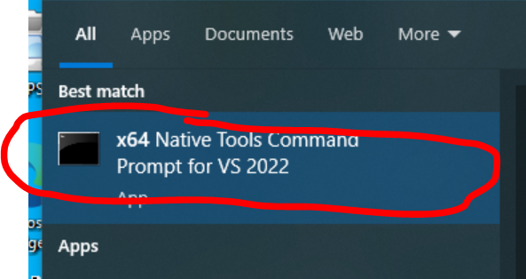

# Installing Beancount (C++ version)

[<u>Martin Blais</u>](mailto:blais@furius.ca) - July 2020

[<u>http://furius.ca/beancount/doc/v3-install</u>](http://furius.ca/beancount/doc/v3-install)

*Instructions for downloading and running Beancount v3 (in development) on your computer. For v2, see this document instead: [Beancount - Install (v2)](installing_beancount.md)*

<table><tbody><tr class="odd"><td><em><strong>This document is about Beancount v3, an experimental in-development version (as of July 2020); Instructions for building the stable version (Beancount v2) can be found in <a href="installing_beancount.md"><u>this other document</u></a>.</strong></em></td></tr></tbody></table>

## Setup Python

Python dependencies are still required to run programs.

    pip install –r requirements/dev.txt

## Building with Bazel

*Warning: This is an experimental development branch. Do not expect everything to be polished perfectly.*

### Bazel Dependencies

Beancount v3 uses the Bazel build system, which for the most part insulates you from local installs and dependencies from your computer.

The dependencies to install are:

-   **Bazel itself.** Follow instructions on [<u>https://bazel.build/</u>](https://bazel.build/)

-   **A C++ compiler.** Either g++ or clang works. I'm using clang-11.

-   **A Python runtime** (version 3.8 or above). Install from your distribution.

Bazel will download and compile all the libraries it requires itself (even the code generators, e.g., Bison), building them at their precise versions as specified in the build, so you will not have to worry about them.

### Building & Testing

Simply run the following command:

    bazel build //bin:all

There is currently no installation script, you have to run from source. You can run individual programs (e.g. bean-check) with this command:

    bazel run //bin:bean_check -- /path/to/ledger.beancount

Or if you don't care to automatically rebuild modified code, like this:

     ./bazel-bin/bin/bean_check /path/to/ledger.beancount

### Development

You can run all the unit tests like this:

    bazel test //...

Because Bazel has a detailed account of all dependencies, re-running this command after modifying code will result in only the touched targets being re-tested; this makes iterative development with testing a bit more fun.

Another advantage is that since all the libraries the build depends on are downloaded and built, while this can be slow on the first build, it allows us to use very recently released versions of the code we depend on.

Targets are defined in BUILD files local to their directories. All the build rules can be found under //third\_party.

### Ingestion

The ingestion code involves importing code that lives outside the repository. Bazel binaries are self-contained and will fail to import modules that haven't been declared as dependencies, so running the `//bin:bean_extract` target, for example, probably won't work.

This does not work yet (short of building your import configuration as a py\_binary() target that would explicitly link to Beancount). This is doable without writing much Bazel code by defining a suitable WORKSPACE file that fetches the rules from it. I haven't produced an example of this yet (TBD).

As a workaround, you can set your PYTHONPATH to import from the source location and create a symlink to the parser .so file beforehand. You can do it like this:

    make bazel-link

### TBD

A few build integration tasks remain to be done:

-   pytype is not supported yet.

-   pylint is not integrated in the build either.

## Installation for development with meson 

***Note**: this section is updated base on the following discussion: [<u>https://groups.google.com/g/beancount/c/7ppbyz\_5B5w</u>](https://groups.google.com/g/beancount/c/7ppbyz_5B5w)*

The Bazel build for Beancount v3 builds some experimental C++ code that is at the time of writing (9 March 2024) not yet used for anything else than a technology demonstration. In “production” v3 uses meson-python to build the extension modules and pack them up in a Python wheel. This is what is used by pip during installation.

This section describes installation processes for the purposes of development beancount v3 python code, rather than experimenting with C++ code.

### On Linux

Tested with python3.12 on Ubuntu

Related links

[<u>https://mesonbuild.com/meson-python/how-to-guides/editable-installs.html</u>](https://mesonbuild.com/meson-python/how-to-guides/editable-installs.html#build-dependencies)

    git clone https://github.com/beancount/beancount.git

Create and activate virtual environment

    python3.12 -m venv beancount/venv
    . beancount/venv/bin/activate
    cd beancount

Install required packages.

    python -m pip install meson-python meson ninja

Install beancount in editable mode with no build isolation

    python -m pip install --no-build-isolation --editable .

**Note:** There is an [<u>opinion</u>](https://groups.google.com/g/beancount/c/7ppbyz_5B5w/m/YlHiKhynFAAJ) that --no-build-isolation option is not needed, but it was also mentioned that the [<u>installation wasn’t working</u>](https://groups.google.com/g/beancount/c/7ppbyz_5B5w/m/nSxCzuutFAAJ) without this option. Also the [<u>documentation</u>](https://mesonbuild.com/meson-python/how-to-guides/editable-installs.html#editable-installs) suggests that this option is needed. This may depend on the type of Linux environment

Install pytest

    python -m pip install pytest

Run the tests and make sure everything is ok:

    pytest --import-mode=importlib beancount/

### On Windows

Tested on 64 bit Windows 10 Pro

**prerequisites**

Install Microsoft Visual Studio (tested on v 2022)

**Procedure**

    git clone https://github.com/beancount/beancount.git
    cd beancount

If running x64 bit Windows, start the "x64 Native Tools Command Prompt for VS 20XX". To do this press and release the Windows keys and type x64

Open this prompt

Go to the directory, where beancount is installed

    C:\Program Files\Microsoft Visual Studio\2022\Community>cd C:\_code\t\beancount
    C:\_code\t\beancount>

Activate the virtual environment

    C:\_code\t\beancount>venv\Scripts\Activate
    (venv) C:\_code\t\beancount>

Instal required packages

    (venv) C:\_code\t\beancount>py -m pip install meson-python meson ninja

Install beancount in editable mode. Unlike on Linux the **`--no-build-isolation`** on Windows from one side throws some errors from the other side does not seem to be needed

    (venv) C:\_code\t\beancount> py -m pip install --editable .

Install pytest

    (venv) C:\_code\t\beancount>py -m pip install pytest

Run tests

    (venv) C:\_code\t\beancount>pytest --import-mode=importlib beancount

Note: some of the tests on Windows fail, but this is due to general [<u>portability issue</u>](https://github.com/beancount/beancount/issues?q=is%3Aopen+is%3Aissue+label%3Aportability)

-   
