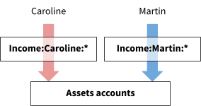
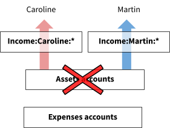
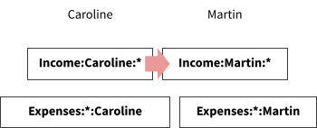

# Sharing Expenses in Beancount

[<u>Martin Blais</u>](mailto:blais@furius.ca), May 2015

[<u>http://furius.ca/beancount/doc/shared</u>](http://furius.ca/beancount/doc/shared)

## Introduction

This document presents a method for precisely and easily accounting for shared expenses in complicated group situations. For example, traveling with a group of friends where people pay for different things. We show it is possible to deal with expenses to be split evenly among the group as well as group expenses that should be allocated to specific persons.

The method uses the double-entry accounting system. The essence of the method consists in separating the accounting of expenses and their associated payments. This makes it much easier to deal with shared costs, because using this method it doesn’t matter who pays for what: we reconcile the precise amounts owed for each individual at the end and automatically compute final correcting transfers for each.

This article is structured around a simple trip with expenses shared equally by two people. However, the same method generalizes to any type of project with incomes and expenses to be shared among multiple participants, and splitting expenses evenly or not.

## A Travel Example

Martin (the author) and Caroline (his girlfriend) visited Mexico in March 2015. We visited the island of Cozumel for a SCUBA diving trip for three days and then headed to Tulum for two days to relax and dive in the [<u>cenotes</u>](http://en.wikipedia.org/wiki/Cenote).

Our assumptions are:

-   **Chaotic payments**. We lead very busy lives… both of us are going to make payments ahead of time and during the trip, without any forethought regarding who will pay for what, though we will carefully record every payment. Each of us just pays for whatever preparation costs as needed to arrange this trip. For example, Caroline selected and booked flights early while I paid for the resort and booked the rental and activities at the local dive shop one week before departure.

-   **Use of shared and individual assets.** Both of us are bringing cash, and are going to make payments during the trip from our respective wallets as well as from a shared pool of cash converted to local currency (Mexican pesos, for which I will use the “MXN” symbol), and we will use credit cards as necessary before and during the trip.

-   **Multiple currencies.** Some of our expenses will be denominated in US dollars and some in Mexican pesos. For example, flights were paid in US dollars, local meals and the accommodation were paid in pesos, but the local dive shop charged us dollars. Converted amounts will come from both cash and credit cards sources.

-   **Individual expenses in a shared pool.** While most of the expenses are to be shared equally, some of the expenses will apply to only one of us, and we want to account for those explicitly. For example, Caroline took a SCUBA certification course ([<u>PADI Open Water</u>](http://www.padi.com/scuba-diving/padi-courses/course-catalog/open-water-diver/)) and will pay for that on her own; similarly, she should not be paying for Martin’s expensive boat diving costs. To complicate matters, the dive shop issued us a single joint bill for everything at the end of our stay.

## A Note About Sharing

I feel that something should be said about the “sharing” aspect of our expenses, as this topic has come up on previous discussions on the mailing-lists involving sharing examples.

**We are nitpicking on purpose.** For the purpose of this exercise, we are accounting for every little penny spent in an incredibly detailed manner. The point of this document is specifically to show how a complex set of transactions well accounted for can be efficiently and simply disentangled to a precise accounting of expenses for each participant, regardless of who actually makes the payments. We are not cheapskates.

**We will assume that we’ve decided to split expenses evenly.** Our “generosity” to each other is not a topic relevant to this document. We’re both well compensated working professionals and you can assume that we’ve agreed to split the common costs for this trip evenly (50/50).

One of the attributes of the method we show here is that the decision of how we choose to split expenses can be made *separately* from the actual payment of costs. For example, we may decide in the end that I pay for ⅔rd of the trip, but that can be decided precisely rather than in an ad-hoc “oh, I think I remember I paid for this” manner. This is especially useful in a larger group of people because when expenses aren’t tracked accurately, usually *<u>everyone</u>* is left with a feeling that they paid more than the others. The sum of the *perceived* fractions of expenses paid in a group is always greater than 100%...

## Overview of the Method

In this section we present a brief illustrated overview of the method. A set of common Assets accounts that belong to the project, and book all our individual expenses and transfer for the trip as coming from external Income accounts:

During the trip, we use the common Assets to make expenses. Most of the expenses are attributed to both of us (and to be shared eventually), but some of the expenses are intended to be attributed to each of us individually:

After the trip, remaining Assets (like cash we walked home with) gets distributed back to ourselves to zero out the balances of the Assets accounts and we record this through contra postings to Income accounts:

Finally, the list of shared Expenses are split between each other—using a plugin that forks every posting that is intended to be a shared expense—and the final amount is used to make a final transfer between each other so that we’ve each paid for our respective expenses and we’re square:

Note that the final balance of expenses for each participant may differ, and these are due to particular expenses that were attributed separately, or if we decide to split the total unevenly.

## How to Track Expenses

In order to write down all expenses for this trip we will open a brand new Beancount input file. Despite the fact that the expenses will come from each person’s personal accounts, it is useful to think of the trip as a special project, as if it were a separate entity, e.g., a company that exists only for the duration of the trip. The example file we wrote for our trip [<u>can be found here</u>](https://raw.githubusercontent.com/beancount/beancount/v2/examples/sharing/cozumel2015.beancount) and should help you follow along this text.

### Accounts

The set of accounts in the input file should not have to match your personal Beancount file’s account names. The accounts we will use include accounts that correspond to Martin and Caroline’s personal accounts but with generic names (e.g., `Income:Martin:CreditCard` instead of `Liabilities:US:Chase`), and expense accounts may not match any regular expenses in my personal Beancount file—it’s not important.

As a convention, any account that pertains specifically to one of the travelers will **include that person’s name** in the account name. For example, Caroline’s credit card will be named “`Income:Caroline:CreditCard`”. This is important, as we will use this later on to split contributions and expenses.

Let’s examine the different types of accounts we will need to carry this out.

#### External Income Accounts

The “project” will receive income in the form of transfers from personal accounts of either traveler. These are accounts we will consider external to the project and so will define them as Income accounts:

    ;; External accounts for Martin.
    2015-02-01 open Income:Martin:Cash
    2015-02-01 open Income:Martin:Cash:Foreign
    2015-02-01 open Income:Martin:Wallet
    2015-02-01 open Income:Martin:CreditCard

    ;; External accounts for Caroline.
    2015-02-01 open Income:Caroline:Cash
    2015-02-01 open Income:Caroline:Wallet
    2015-02-01 open Income:Caroline:MetroCard
    2015-02-01 open Income:Caroline:CreditCard

Transactions carried out from these accounts must be copied from your personal Beancount file. Obviously, you must be careful to include all the transactions pertaining to the trip. I used a tag to do this in my personal file.

#### Assets & Liabilities Accounts

There will be a few Asset accounts that will be active and exist for the duration of the trip. These temporary accounts will be zero’ed out at the end of it. One example is a pool of petty cash in local currency:

    2015-02-01 open Assets:Cash:Pesos
      description: "A shared account to contain our pocket of pesos"

We also carried cash in each of our pockets while traveling, so I created two separate accounts for that:

    2015-02-01 open Assets:Cash:Martin
      description: "Cash for the trip held by Martin"

    2015-02-01 open Assets:Cash:Caroline
      description: "Cash for the trip held by Caroline"

Note however that despite their individual names, those accounts are considered as part of the project. It was just convenient to separately track balances for the cash we each held during the trip.

#### Expenses Accounts

We will define various accounts to book our Expenses to. For example, “`Expenses:Flights`” will contain our costs associated with flight travel. For convenience, and because there are many types of expenses in this file, we chose to leverage the “auto-accounts” plugin and let Beancount automatically open these accounts:

    plugin "beancount.ops.auto_accounts"

The great majority of these accounts are for shared expenses to be split between us. For example, shared SCUBA diving expenses will be booked to “`Expenses:Scuba`”.

However, for expenses that are intended to be covered by one of us only, we simply include the name of the traveler in the account name. For example, Martin’s extra costs for boat diving will be booked to the “`Expenses:Scuba:Martin`” account.

### Example Transactions

Let’s turn our attention to the different types of transactions present in the file. In this section I will walk you through some representative transactions (the names I give to these are arbitrary).

#### Contributing Transactions

Contributions to the project’s costs are usually done in the form of expenses paid from external accounts. For example, Caroline paying for flights with her credit card looks like this:

    2015-02-01 * "Flights to Cancun"
       Income:Caroline:CreditCard        -976.00 USD
       Expenses:Flights

Martin paying for the taxi to the airport looks like this:

    2015-02-25 * "Taxi to airport" ^433f66ea0e4e
      Expenses:Transport:Taxi                   62.80 USD
      Income:Martin:CreditCard

#### Bringing Cash

We both brought some cash on us, as we were warned it might be difficult to use credit cards in Mexico. In my personal Beancount file, the cash account is “`Assets:Cash`” but here it must get booked as an external contribution with my name on it:

    ;; Initial cash on us.
    2015-02-24 * "Getting cash for travel"
      Income:Martin:Cash                        -1200 USD
      Assets:Cash:Martin                         1200 USD

Caroline’s cash is similar:

    2015-02-24 * "Getting cash for travel"
      Income:Caroline:Cash                       -300 USD
      Assets:Cash:Caroline                        300 USD

Once again, note that the `Assets:Cash:Martin` and `Assets:Cash:Caroline` accounts are considered a part of the project, in this case it just refers to who is carrying it. (These accounts are cleared at the end, so it does not matter that our names are in them.)

#### Transfers

Before the trip, I was really busy. It looked like Caroline was going to make most of arrangements and upfront payments, so I made a transfer to her Google Wallet to help her cover for some expenses ahead of time:

    2015-02-01 * "Transfer Martin -> Caroline on Google Wallet"
      Income:Martin:Wallet                      -1000 USD
      Income:Caroline:Wallet                     1000 USD

#### Cash Conversions

Obtaining local currency was done by changing a small amount of cash at the airport (at a very bad rate):

    2015-02-25 * "Exchanged cash at XIC at CUN airport"
      Assets:Cash:Caroline                    -100.00 USD @ 12.00 MXN
      Assets:Cash:Pesos                          1200 MXN

The “`Assets:Cash:Pesos`” account tracks our common pool of local currency that we use for various small expenses.

#### Cash Expenses in US Dollars

Some local expenses will call for US money, which in this example I paid from my cash pocket:

    2015-03-01 * "Motmot Diving" | "Deposit for cenote diving"
      Expenses:Scuba                            50.00 USD
      Assets:Cash:Martin

#### Cash Expenses in Local Currency

Paying cash using pesos from our shared stash of pesos looks like this:

    2015-02-25 * "UltraMar Ferry across to Cozumel"
      Expenses:Transport:Bus                326 MXN
      Assets:Cash:Pesos

Sometimes we even had to pay with a mix of US dollars and pesos. In this example, we ran out of pesos, so we have to give them dollars and pesos (all the restaurants and hotels in the beach part of Tulum accept US currency):

    2015-03-01 * "Hartwood" | "Dinner - ran out of pesos"
      Expenses:Restaurant                  1880 MXN
      Assets:Cash:Pesos                   -1400 MXN
      Assets:Cash:Martin                 -40.00 USD @ 12.00 MXN

I used the unfavorable rate the restaurant was offering to accept dollars at (the market rate was 14.5 at the time).

#### Individual Expenses

Here is an example of booking individual expenses using shared money. In order for us to have access to the reef for diving, we had to pay a “marine park” fee of $2.50 per day to the island. This was a short trip where I dove only three days there and Caroline’s fee was included in her course except for one day:

      2015-02-25 * "Marine Park (3 days Martin, 1 day Caroline)"
        Expenses:Scuba:ParkFees:Martin             7.50 USD
        Expenses:Scuba:ParkFees:Caroline           2.50 USD
        Assets:Cash:Martin

All that needs to be done is to book these to expense accounts with our names in them, which will get separated out at the end.

Here is a more complicated example: the dive shop at Scuba Club Cozumel charged us a single bill at the end of our stay for all our rental gear and extra dives. All I did here was translate the itemized bill into a single transaction, booking to each other:

    2015-03-01 * "Scuba Club Cozumel" | "Dive shop bill" ^69b409189b37
      Income:Martin:CreditCard           -381.64 USD
      Expenses:Scuba:Martin                        27 USD ;; Regulator w/ Gauge
      Expenses:Scuba:Caroline                       9 USD ;; Regulator w/ Gauge
      Expenses:Scuba:Martin                        27 USD ;; BCD
      Expenses:Scuba:Caroline                       9 USD ;; BCD
      Expenses:Scuba:Martin                         6 USD ;; Fins
      Expenses:Scuba:Martin                        24 USD ;; Wetsuit
      Expenses:Scuba:Caroline                       8 USD ;; Wetsuit
      Expenses:Scuba:Caroline                       9 USD ;; Dive computer
      Expenses:Scuba:Martin                         5 USD ;; U/W Light
      Expenses:Scuba:Caroline                      70 USD ;; Dive trip (2 tank)
      Expenses:Scuba:Martin                        45 USD ;; Wreck Dive w/ Lite
      Expenses:Scuba:Martin                        45 USD ;; Afternoon dive
      Expenses:Scuba:Caroline                      45 USD ;; Afternoon dive
      Expenses:Scuba:Martin                     28.64 USD ;; Taxes
      Expenses:Scuba:Caroline                   24.00 USD ;; Taxes

#### Final Balances

Of course you can use balance assertions at any time during the trip. For example, just before leaving at the Cancun airport we knew we wouldn’t spend any more Mexican pesos for a while, so I counted what we had left after Caroline decided to splurge the remainder of them into overpriced chocolate sold at the airport shop:

    2015-03-04 balance Assets:Cash:Pesos               65 MXN

Ideally the bookkeeper should want to do this at a quiet moment at the end of every day or couple of days, which makes it easier to triangulate an expense you might have forgotten to enter (we are on vacation after all, in our relaxed state of mind we forget to write down stuff here and there).

#### Clearing Asset Accounts

At the end of the trip, you should clear the final balances of all Assets and Liabilities accounts by transferring the remaining funds out to the participants, i.e., to the Income accounts. This should leave all the balances of the trip at zero and ensures all the cash put forward for trip expenses has been moved out to travelers.

By the way, it doesn’t matter much who keeps this money, because at the end we will end up making a single correcting transfer that should account for the balance required to create an even split. You can transfer it to anyone; the end result will be the same.

Our clearing transaction looked like this:

    2015-03-06 * "Final transfer to clear internal balances to external ones"
      Assets:Cash:Pesos                               -65 MXN
      Income:Martin:Cash:Foreign                       60 MXN
      Income:Caroline:Cash                              5 MXN
      Assets:Cash:Martin                             -330 USD
      Income:Martin:Cash                              330 USD
      Assets:Cash:Caroline                           -140 USD
      Income:Caroline:Cash                            140 USD

    2015-03-07 balance Assets:Cash:Pesos                0 MXN
    2015-03-07 balance Assets:Cash:Pesos                0 USD
    2015-03-07 balance Assets:Cash:Martin               0 USD
    2015-03-07 balance Assets:Cash:Caroline             0 USD

We had three 20 peso bills, and I kept the bills for future travels. Caroline kept the 5 peso coin (forgot to hand it over as a tip). We transferred out the respective cash amounts we had been carrying together during the trip.

## How to Take Notes

During this trip I did not carry a laptop—this was vacation after all. I like to disconnect. I did not carry a notebook either. Instead, I just took notes at the end of the day on a few sheets of paper at the hotel. This process took about 5-10 minutes each night, just recalling from memory and writing things down.

These notes look like this:

I made a paper spreadsheet where each line had

-   The narration for the transaction (a description that would allow me to select an Expenses account later on)

-   Who paid (which Assets or Income account the money came from)

-   The amount (either in USD or MXN)

After our trip, I sat down at the computer and typed [<u>the corresponding Beancount file</u>](https://github.com/beancount/beancount/blob/master/examples/sharing/cozumel2015.beancount). If I had a computer during my vacation I probably would have typed it as we went along. Of course, I had to do a few adjustments here and there because of mistakes.

The bottom line is: if you’re organized well, the overhead of doing this is minimal.

## Reconciling Expenses

Running bean-web on the trip’s file:

    bean-web beancount/examples/sharing/cozumel2015.beancount

You can view the balances in the “All Transactions” view (click on “All Transactions”).

The Balance Sheet should show empty balances for Assets accounts:

The balances of the equity accounts should reflect the total amount of currency conversions made during the trip. You can verify this by calculating the amount-weight average rate like this: 7539.00 / 559.88 ~= 13.465 USD/MXN (which is about right).

### Reviewing Contributions

The Income Statement should show a summary of all expenses and contributions to the project:

The Income account balances show the total amounts of contributions for each person. Note that in creating the Income accounts, I went through the extra step of creating some specific accounts for each source of payment, like “Caroline’s Credit Card”, etc.

From this view, we can see that we contributed a total of 4254.28 USD (and were left with 65 MXN in hand) for this trip. The expenses side should match, considering the currency exchanges: 3694.40 + 7474 / 13.465 ~= 4249 USD which is approximately right (the small difference can be explained by the varying currency conversions).

If you want to view the list of contribution payments and the final balance, click on a particular traveler’s root account, e.g., “Income:Caroline” (click on “Caroline”) which should take you to the Journal for that root account:

This journal includes all the transactions in its sub-accounts. The final value at the bottom should show the total balance of those accounts, and thus, the amount of money Caroline contributed to this trip: 415 USD, and kept 5 MXN (in coin). We can do the same for Martin and find the final balance of 3839.28 USD and kept 60 MXN (in bills).

You can also get the same amounts by using bean-query to achieve the same thing:

    ~/p/.../examples/sharing$ bean-query cozumel2015.beancount 

    Input file: "Mexico Trip: Cozumel & Tulum SCUBA Diving"
    Ready with 105 directives (160 postings in 45 transactions).

    beancount> SELECT sum(position) WHERE account ~ '^Income:.*Caroline'

    sum_positio
    -----------
    -415.00 USD
       5    MXN

### Splitting Expenses

The expenses side of the Income Statement shows the breakdown of expenses. Note how some of the expense accounts are explicitly booked to each member separately by their account name, e.g., “`Expenses:Scuba:Martin`”. The other accounts, e.g. “`Expenses:Groceries`” are intended to be split.

How we’re going to carry this out is by adding a plugin that will transform all the transactions to *actually* split the postings which are intended to be shared, that is, postings without any member’s name as a component. For example, the following input transaction:

    2015-02-28 * "Scuba Club Cozumel" | "Room bill"
      Income:Martin:CreditCard         -1380.40 USD
      Expenses:Scuba:Martin              178.50 USD
      Expenses:Accommodation            1201.90 USD

Will be transformed by the plugin into one like this:

    2015-02-28 * "Scuba Club Cozumel" | "Room bill"
      Income:Martin:CreditCard         -1380.40 USD
      Expenses:Scuba:Martin              178.50 USD
      Expenses:Accommodation:Martin      600.95 USD
      Expenses:Accommodation:Caroline    600.95 USD

Note that:

-   Only Expenses accounts get split into multiple postings.

-   Accounts with the name of a member are assumed by convention to be already attributed to that person. In order to achieve this, the plugin has to be provided with the names of the members.

-   All the resulting Income and Expenses accounts include the name of a member.

The plugin is enabled like this:

    plugin "beancount.plugins.split_expenses" "Martin Caroline"

Reloading the web page after uncommenting this line from the input file and visiting the Income Statement page should show a long list of Expenses accounts split by person. Now, in order to generate the total amount of expenses incurred for each person, we have to produce the balance of all Expenses accounts with a member’s name in it, accounts like “`Expenses:.*Martin`”.

The web tool does not provide such a filtering capability at the moment[^1], but we can use the bean-query tool to produce the total of expenses for each person:

    beancount> SELECT sum(position) WHERE account ~ '^Expenses:.*Martin'

    sum_positio
    -----------
    2007.43 USD
    3837.0  MXN

    beancount> SELECT sum(position) WHERE account '^Expenses:.*Caroline'

    sum_positio
    -----------
    1686.97 USD
    3637.0  MXN

This says “Martin accrued expenses of 2007.43 USD and 3837.0 MXN.”

You can manually convert this to a dollar amount:

    yuzu:~$ dc -e '2007.43 3837.0 13.465 / +p'
    2291.43 

Or you can use the recently introduced “`CONVERT`” function of bean-query to do this:

    beancount> SELECT convert(sum(position), 'USD') WHERE account ~ '^Expenses:.*Martin'

         convert_sum_position_c_     
    ---------------------------------
    2288.528901098901098901098901 USD

    beancount> SELECT convert(sum(position), 'USD') WHERE account ~ '^Expenses:.*Caroline'

         convert_sum_position_c_     
    ---------------------------------
    1953.416886446886446886446886 USD

(The difference between the 2291.43 and 2288.53 amounts can be attributed to the usage of slightly different exchange rates used in the converting transactions.)

Similarly, you can generate the list of payments made by each person, e.g.:

    beancount> SELECT sum(position) WHERE account ~ '^Income:.*Caroline'

## Final Transfer

In order to figure out the total amount owed by each member, the process is similar: Simply sum up the balances of all the accounts attributed to that particular member:

    beancount> SELECT convert(sum(position), 'USD') WHERE account ~ 'Caroline'

         convert_sum_position_c_     
    ---------------------------------
    1538.783186813186813186813187 USD

    beancount> SELECT convert(sum(position), 'USD') WHERE account ~ 'Martin'

         convert_sum_position_c_      
    ----------------------------------
    -1546.355494505494505494505494 USD

Notice that this includes the Income and Expenses accounts for that person. It’s as if we had two separate ledgers merged into one. (Once again, the small differences can be attributed to differences in exchange rate over time.)

We can now make a final transfer amount in order to account for each of our expenses; we’ve agreed to round this to 1500 USD:

    2015-03-06 * "Final transfer from Caroline to Martin to pay for difference"
      Income:Caroline:Wallet                    -1500 USD
      Income:Martin:Wallet                       1500 USD

If you uncomment this transaction from the input file (near the end), you will find corrected balances:

    beancount> SELECT convert(sum(position), 'USD') WHERE account ~ 'Martin'

         convert_sum_position_c_     
    ---------------------------------
    -46.3554945054945054945054945 USD

    beancount> SELECT convert(sum(position), 'USD') WHERE account ~ 'Caroline'

        convert_sum_position_c_     
    --------------------------------
    38.7831868131868131868131868 USD

## Updating your Personal Ledger

So great! Now we’ve reconciled each other for the trip. But you still need to reflect these expenses in your personal ledger (if you have one). In this section, I will explain how you should reflect these transactions in that file.

### Account Names

First, let us take note that the accounts in your personal ledger do not have to match the account names used in the trip’s ledger file. I never process those files together. (A good argument for not attempting this is that each trip will include account names from other people and I prefer not to have those leak into my main ledger file.)

### Using a Tag

I like to use a tag to report on the entire set of transactions related to the trip. In this example, I used the tag `#trip-cozumel2015`.

### Booking Contributions

Your contributions into the project should be booked to a temporary holding account. I call mine “`Assets:Travel:Pending`”. For example, this transaction from the trip’s file:

    2015-02-25 * "Yellow Transfers" | "SuperShuttle to Playa del Carmen"
      Expenses:Transport:Bus                 656 MXN
      Income:Martin:CreditCard            -44.12 USD @ 14.86854 MXN

will eventually be imported in my personal file and categorized like this:

    2015-02-25 * "YELLOW TRANSFER MX  CO" #trip-cozumel2015
      Liabilities:US:BofA:CreditCard      -44.12 USD
      Assets:Travel:Pending                44.12 USD

You can conceptualize this as contributing money to a pending pool of cash which you will eventually receive expenses from.

The same goes for cash that I brought for the trip:

    2015-02-24 * "Taking cash with me on the trip"
      Assets:Cash                             -1200.00 USD
      Assets:Travel:Pending                    1200.00 USD

Note that absolutely **all** of the transactions related to the trip should be booked to that one account, including the inter-account transfers:

    2015-03-06 * "Final transfer from Mexico trip" #trip-cozumel2015
      Assets:Google:Wallet                       1500 USD
      Assets:Travel:Pending                      -1500 USD

### Booking Expenses

After the trip is concluded, we want to convert the balance in the pending account to a list of Expenses. To find the list of expenses for yourself, you can issue a query like this:

    beancount> SELECT account, sum(position) WHERE account ~ '^Expenses:.*:Martin' 
               GROUP BY 1 ORDER BY 1

                account             sum_positio
    ------------------------------- -----------
    Expenses:Accommodation:Martin    735.45 USD
    Expenses:Alcohol:Martin          483    MXN
    Expenses:Bicycles:Martin          69.5  MXN
    Expenses:Flights:Martin          488.00 USD
    Expenses:Groceries:Martin        197.0  MXN
    Expenses:Museum:Martin            64    MXN
    Expenses:Restaurant:Martin        22.28 USD
                                    1795.5  MXN
    Expenses:Scuba:Martin            506.14 USD
    Expenses:Scuba:ParkFees:Martin     7.50 USD
    Expenses:Tips:Martin             225    MXN
                                     189.16 USD
    Expenses:Transport:Bus:Martin    709    MXN
    Expenses:Transport:Taxi:Martin    53.90 USD
                                     294    MXN
    Expenses:Transport:Train:Martin    5.00 USD

I suppose you could script away this part to remove the member’s name from the account names and have the script spit output already formatted as a nicely formatted Transaction, but because the account names will not match the personal ledger file’s 1-to-1, you will have to perform a manual conversion anyway, so I did not bother automating this. Furthermore, you only have a single one of these to make after your trip, so it’s not worth spending too much time making this part easier[^2].

Here’s what the final transaction looks like; I have a section in my input file with this:

    2015-02-25 event "location" "Cozumel, Mexico"    ;; (1)
    pushtag #trip-mexico-cozumel-2015

    … other transactions related to the trip… 

    2015-03-01 event "location" "Tulum, Mexico"      ;; (1)

    2015-03-07 * "Final reconciliation - Booking pending expenses for trip"
      Expenses:Travel:Accommodation         735.45 USD
      Expenses:Food:Alcohol                  483.0 MXN
      Expenses:Sports:Velo                    69.5 MXN
      Expenses:Transportation:Flights       488.00 USD
      Expenses:Food:Grocery                  197.0 MXN
      Expenses:Fun:Museum                     64.0 MXN
      Expenses:Food:Restaurant               22.28 USD
      Expenses:Food:Restaurant              1795.5 MXN
      Expenses:Scuba:Dives                  506.14 USD
      Expenses:Scuba:Fees                     7.50 USD
      Expenses:Scuba:Tips                    225.0 MXN
      Expenses:Scuba:Tips                   189.16 USD
      Expenses:Transportation:Bus            709.0 MXN
      Expenses:Transportation:Taxi           53.90 USD
      Expenses:Transportation:Taxi           294.0 MXN
      Expenses:Transportation:Train           5.00 USD
      Assets:Cash:Foreign                     60.0 MXN                ;; (2)
      Assets:Cash                           330.00 USD                ;; (3)
      Assets:Travel:Pending               -2337.43 USD                ;; (4)
      Assets:Travel:Pending                -288.67 USD @@ 3897.0 MXN  ;; (5)

    2015-03-07 * "Writing off difference as gift to Caroline"     ;; (6)
      Assets:Travel:Pending                     -43.18 USD
      Expenses:Gifts

    2015-03-14 balance Assets:Travel:Pending     0 USD   ;; (7)
    2015-03-14 balance Assets:Travel:Pending     0 MXN

    poptag #trip-mexico-cozumel-2015

Observations:

1.  I used “event” directives in order to track my location. I’m doing this because I will eventually need it for immigration purposes (and just for fun, to track the days I spend in places).

2.  I moved the extra cash I kept to my “foreign cash pocket” account: `Assets:Cash:Foreign`

3.  I “moved” back the cash I had with me after I returned from the trip.

4.  This leg removes the USD expenses from the Pending account.

5.  The leg removes the MXN expenses from the Pending account. I calculated its amount manually (3897 / 13.5 ~= 288.67 USD) and use the full amount as the exchange rate.

6.  I want to completely zero out the Pending account after the trip, and so I write off the excess amount we agreed not to pay (the difference between the imbalance and 1500.00 USD).

7.  Finally, I assert that the Pending account is empty of USD and of MXN.

I found the missing amounts by running `bean-check` or using `bean-doctor context` on an incomplete transaction from Emacs.

## Generating Reports

If you want to automate the generation of reports for each of the participants in a trip, there is a script that generates text (and eventually CSV) reports for the queries mentioned in the previous sections. You can use this script to provide expenses status after or even during the trip or project, for each of the participants.

The script lives in the `split_expenses` plugin itself, and you invoke it like this:

    python3 -m beancount.plugins.split_expenses <beancount-filename> --text=<dir>

For each person, it will generate the following reports:

-   A detailed journal of expenses

-   A detailed journal of contributions

-   A breakdown of expenses for each category (account type)

Finally, it will also generate a final balance for each person, which you can use to send final reconciling transfers to each other. Try it now on one of the [<u>example files</u>](https://raw.githubusercontent.com/beancount/beancount/v2/examples/sharing/) provided with Beancount.

## Other Examples

There is another example file that shows how to share expenses between three participants in [<u>duxbury2015.beancount</u>](https://raw.githubusercontent.com/beancount/beancount/v2/examples/sharing/duxbury2015.beancount). Look to more example files to be introduced over time.

## Conclusion

There is more than just one way to carry out the task we describe here. However, the method we present extends nicely to a larger group of participants, allows us to account for situations where particular expenses are incurred for one individual as part of a group, and finally, allows for a non-even split between the participants. This is pretty general.

It’s also a short step to accounting for an ongoing project with a longer term. The ideas presented in this document provide a nice use case for the usage of the double-entry method in a simple setting. I hope that working through this use case will help people develop the intuitions necessary in using the double-entry method.

[^1]: As our SQL-like query language matures, bean-web will eventually allow the user to create views from a set of transactions filtered from an expression. This will be implemented eventually.

[^2]: Note that we could implement a special “beancount” supported format to the bean-query tool in order to write out balances in Transaction form. I’m not sure how useful that would be but it’s an idea worth considering for the future.
