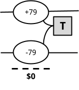
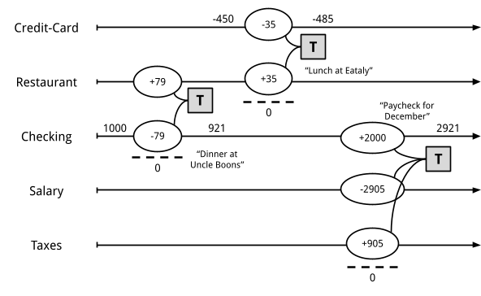
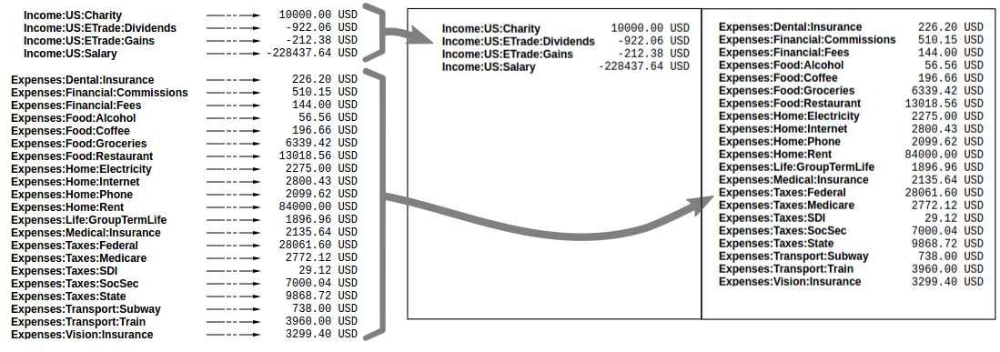
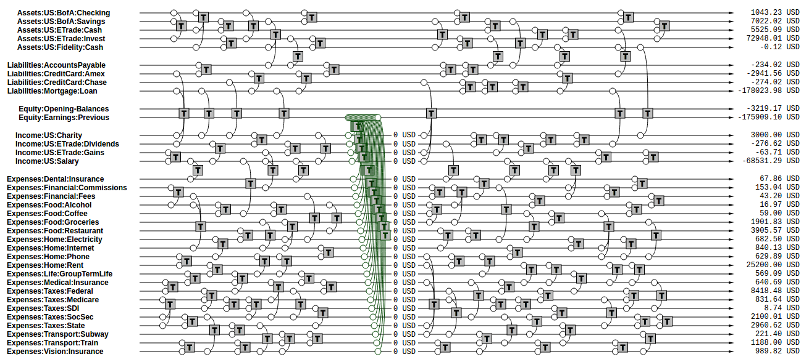
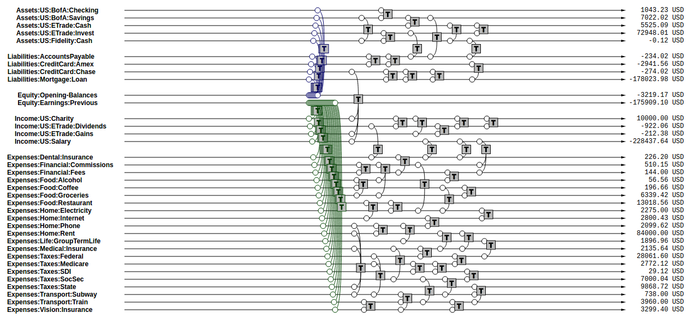

The Double-Entry Counting Method
==================================================

Martin Blais, December 2016

[http://furius.ca/beancount/doc/double-entry](http://furius.ca/beancount/doc/double-entry)

[Introduction](#introduction)

[Basics of Double-Entry Bookkeeping](#basics-of-double-entry-bookkeeping)

> [Statements](#statements)
>
> [Single-Entry Bookkeeping](#single-entry-bookkeeping)
>
> [Double-Entry Bookkeeping](#double-entry-bookkeeping)
>
> [Many Accounts](#many-accounts)
>
> [Multiple Postings](#multiple-postings)

[Types of Accounts](#types-of-accounts)

[Trial Balance](#trial-balance)

[Income Statement](#income-statement)

[Clearing Income](#clearing-income)

[Equity](#equity)

[Balance Sheet](#balance-sheet)

[Summarizing](#summarizing)

[Period Reporting](#period-reporting)

[Chart of Accounts](#chart-of-accounts)

> [Country-Institution Convention](#country-institution-convention)

[Credits & Debits](#credits-debits)

[Accounting Equations](#accounting-equations)

[Plain-Text Accounting](#plain-text-accounting)

[The Table Perspective](#the-table-perspective)

Introduction
-------------------------------------

This document is a gentle introduction to the double-entry counting method, as written from the perspective of a computer scientist. It is an attempt to explain basic bookkeeping using as simple an approach as possible, doing away with some of the idiosyncrasies normally involved in accounting. It is also representative of how [Beancount](http://furius.ca/beancount/) works, and it should be useful to all users of [plain-text accounting](http://plaintextaccounting.org/).

Note that I am not an accountant, and in the process of writing this document I may have used terminology that is slightly different or unusual to that which is taught in perhaps more traditional training in accounting. I granted myself license to create something new and perhaps even unusual in order to explain those ideas as simply and clearly as possible to someone unfamiliar with them.

I believe that the method of double-entry counting should be taught to everyone at the high school level everywhere as it is a tremendously useful organizational skill, and I hope that this text can help spread its knowledge beyond professional circles.

Basics of Double-Entry Bookkeeping
---------------------------------------------------------------------------------

The double-entry system is just a simple *method of counting*, with some simple rules.

Let’s begin by defining the notion of an **account**. An account is something that can contain things, like a bag. It is used to count things, to accumulate things. Let’s draw a horizontal arrow to visually represent the evolving contents of an account over time:

On the left, we have the past, and to the right, increasing time: the present, the future, etc.

For now, let’s assume that accounts can contain only one kind of thing, for example, *dollars*. All accounts begin with an empty content of zero dollars. We will call the number of units in the account the **balance** of an account. Note that it represents its contents at a particular point in time. I will draw the balance using a number above the account’s timeline:

The contents of accounts can change over time. In order to change the content of an account, we have to add something to it. We will call this addition a **posting** to an account, and I will draw this change as a circled number on the account’s timeline, for example, adding $100 to the account:

Now, we can draw the updated balance of the account after the posting with another little number right after it:

The account’s balance, after adding $100, is now $100.

We can also remove from the contents of an account. For example, we could remove $25, and the resulting account balance is now $75:

Account balances can also become *negative*, if we remove more dollars than there are in the account. For example, if we remove $200 from this account, the balance now becomes $-125:

It’s perfectly fine for accounts to contain a negative balance number. Remember that all we’re doing is counting things. As we will see shortly, some accounts will remain with a negative balance for most of their timeline.

### Statements

Something worthy of notice is how the timeline notation I’ve written in the previous section is analogous to paper account statements institutions maintain for each client and which you typically receive through the mail:

<table><thead><tr class="header"><th><em><strong>Date</strong></em></th><th><em><strong>Description</strong></em></th><th><em><strong>Amount</strong></em></th><th><em><strong>Balance</strong></em></th></tr></thead><tbody><tr class="odd"><td>2016-10-02</td><td>...</td><td>100.00</td><td>1100.00</td></tr><tr class="even"><td>2016-10-05</td><td>...</td><td>-25.00</td><td>1075.00</td></tr><tr class="odd"><td>2016-10-06</td><td>...</td><td>-200.00</td><td>875.00</td></tr><tr class="even"><td><em><strong>Final Balance</strong></em></td><td>875.00</td><td></td><td></td></tr></tbody></table>

Sometimes the amount column is split into two, one showing the positive amounts and the other the negative ones:

<table><thead><tr class="header"><th><em><strong>Date</strong></em></th><th><em><strong>Description</strong></em></th><th><em><strong>Debit</strong></em></th><th><em><strong>Credit</strong></em></th><th><em><strong>Balance</strong></em></th></tr></thead><tbody><tr class="odd"><td>2016-10-02</td><td>...</td><td></td><td>100.00</td><td>1100.00</td></tr><tr class="even"><td>2016-10-05</td><td>...</td><td>25.00</td><td></td><td>1075.00</td></tr><tr class="odd"><td>2016-10-06</td><td>...</td><td>200.00</td><td></td><td>875.00</td></tr><tr class="even"><td><em><strong>Final Balance</strong></em></td><td>875.00</td><td></td><td></td><td></td></tr></tbody></table>

Here, “debit” means “removed from your account” and “credit” means “deposited in your account.” Sometimes the words “withdrawals” and “deposits” will be used. It all depends on context: for checking and savings accounts it is usual to have both types of postings, but for a credit card account typically it shows only positive numbers and then the occasional monthly payment so the single column format is used.

In any case, the “balance” column always shows the resulting balance *after* the amount has been posted to the account. And sometimes the statements are rendered in decreasing order of time.

### Single-Entry Bookkeeping

In this story, this account belongs to someone. We’ll call this person the **owner** of the account. The account can be used to represent a real world account, for example, imagine that we use it to represent the content of the owner’s checking account at a bank. So we’re going to label the account by giving it a name, in this case “Checking”:

Imagine that at some point, this account has a balance of $1000, like I’ve drawn on the picture. Now, if the owner spends $79 of this account, we would represent it like this:

Furthermore, if the expense was for a meal at a restaurant, we could flag the posting with a **category** to indicate what the change was used for. Let’s say, “Restaurant”, like this:

Now, if we have a lot of these, we could write a computer program to accumulate all the changes for each category and calculate the sums for each of them. That would tell us how much we spent in restaurants in total, for example. This is called the **single-entry method** of accounting.

But we’re not going to do it this way; we have a better way. Bear with me for a few more sections.

### Double-Entry Bookkeeping

An owner may have multiple accounts. I will represent this by drawing many similar account timelines on the same graphic. As before, these are labeled with unique names. Let’s assume that the owner has the same “Checking” account as previously, but now also a **“**Restaurant**”** account as well, which can be used to accumulate all food expenses at restaurants. It looks like this:

Now, instead of *categorizing* the posting to a “restaurant category” as we did previously, we could create a matching posting on the “Restaurant” account to record how much we spent for food, with the amount spent ($79):

The “Restaurant” account, like all other accounts, also has an accumulated balance, so we can find out how much we spent in “Restaurant” in total. This is entirely symmetrical to counting changes in a checking account.

Now, we can associate the two postings together, by creating a kind of “parent” box that refers to both of them. We will call this object a **transaction**:

Notice here that we’ve also associated a description to this transaction: “Dinner at Uncle Boons”. A transaction also has a **date**, and all of its postings are recorded to occur on that date. We call this the transaction date.

We can now introduce the fundamental rule of double-entry bookkeeping system:

    The sum of all the postings of a transaction must equal zero.

Remember this, as this is the foundation of the double-entry method, and its most important characteristic. It has important consequences which I will discuss later in this document.

In our example, we remove $79 from the “Checking” account and “give it” to the “Restaurant” account. ($79) + ($-79) = $0. To emphasize this, I could draw a little summation line under the postings of the transaction, like this:

### Many Accounts

There may be many such transactions, over many different accounts. For example, if the owner of the accounts had a lunch the next day which she paid using a credit card, it could be represented by creating a “Credit Card” account dedicated to tracking the real world credit card balance, and with a corresponding transaction:

In this example, the owner spent $35 at a restaurant called “Eataly.” The previous balance of the owner’s credit card was $-450; after the expense, the new balance is $-485.

For each real world account, the owner can create a bookkeeping account like we did. Also, for each category of expenditure, the owner also creates a bookkeeping account. In this system, there are no limits to how many accounts can be created.

Note that the balance in the example is a negative number; this is not an error. Balances for credit card accounts are normally negative: they represent an amount *you owe*, that the bank is lending you *on credit*. When your credit card company keeps track of your expenses, they write out your statement from their perspective, as positive numbers. For you, those are amounts you need to eventually pay. But here, in our accounting system, we’re representing numbers from the owner’s point-of-view, and from her perspective, this is money she owes, not something she has. What we have is a meal sitting in our stomach (a positive number of $ of “Restaurant”).

### Multiple Postings

Finally, transactions may have more than two postings; in fact, they may have any number of postings. The only thing that matters is that the sum of their amounts is zero (from the rule of double-entry bookkeeping above).

For example, let’s look at what would happen if the owner gets her salary paid for December:

Her gross salary received in this example is recorded as $-2,905 (I’ll explain the sign in a moment). $905 is set aside for taxes. Her “net” salary of $2,000, the remainder, is deposited in her “Checking” account and the resulting balance of that account is $2,921 (the previous balance of $921 + $2,000 = $2,921). This transaction has three postings: (+2,000) + (-2,905) + (+905) = 0. The double-entry rule is respected.

Now, you may ask: Why is her salary recorded as a negative number? The reasoning here is similar to that of the credit card above, though perhaps a bit more subtle. These accounts exist to track all the amounts from the owner’s point-of-view. The owner gives out work, and receives money and taxes in exchange for it (positive amounts). The work given away is denominated in dollar units. It “leaves” the owner (imagine that the owner has *potential work* stored in her pocket and as she goes into work every day sprinkles that work potential giving it to the company). The owner *gave* $2,905’s worth of work away. We want to track how much work was given, and it’s done with the “Salary” account. That’s her gross salary.

Note also that we’ve simplified this paycheck transaction a bit, for the sake of keeping things simple. A more realistic recording of one’s pay stub would have many more accounts; we would separately account for state and federal tax amounts, as well as social security and medicare payments, deductions, insurance paid through work, and vacation time accrued during the period. But it wouldn’t be much more complicated: the owner would simply translate all the amounts available from her pay stub into a single transaction with more postings. The structure remains similar.

Types of Accounts
-----------------------------------------------

Let’s now turn our attention to the different types of accounts an owner can have.

**Balance or Delta.** First, the most important distinction between accounts is about whether we care about the balance **at a particular point** in time, or whether it only makes sense to care about differences **over a period** of time. For example, the balance of someone’s Checking or Savings accounts is a meaningful number that both the owner and its corresponding bank will care about. Similarly, the total amount owed on someone’s Credit Card account is also meaningful. The same goes with someone’s remaining Mortgage amount to pay on a house.

On the other hand, the total amount of Restaurant expenses since the beginning of somebody’s life on earth is not particularly interesting. What we might care about for this account is the amount of Restaurant expenses incurred *over a particular period of time*. For example, “how much did you spend in restaurants last month?” Or last quarter. Or last year. Similarly, the total amount of gross salary since the beginning of someone’s employment at a company a few years ago is not very important. But we would care about the total amount earned during a tax year, that is, for that time period, because it is used for reporting one’s income to the tax man.

-   Accounts whose balance at a point in time is meaningful are called **balance sheet accounts**. There are two types of such accounts: “**Assets**” and “**Liabilities**.”

-   The other accounts, that is, those whose balance is not particularly meaningful but for which we are interested in calculating changes over a period of time are called **income statement accounts**. Again, there are two kinds: “**Income**” and “**Expenses**.”

**Normal sign.** Secondly, we consider *the usual sign of an account’s balance*. The great majority of accounts in the double-entry system tend to have a balance with always a positive sign, or always a negative sign (though as we’ve seen previously, it is not impossible that an account’s balance could change signs). This is how we will distinguish between the pairs of accounts mentioned before:

-   For a balance sheet account, Assets normally have positive balances, and Liabilities normally have negative balances.

-   For income statement accounts, Expenses normally have a positive balance, and Income accounts normally have a negative balance.

This situation is summarized in the following table:

<table><thead><tr class="header"><th></th><th>Balance: Positive (+)</th><th>Balance: Negative (-)</th></tr></thead><tbody><tr class="odd"><td>
Balance matters 
<strong>at a point</strong> in time

(Balance Sheet)
</td><td><strong>Assets</strong></td><td><strong>Liabilities</strong></td></tr><tr class="even"><td>
<strong>Change</strong> in balance matters 
<strong>over a period</strong> of time

(Income Statement)
</td><td><strong>Expenses</strong></td><td><strong>Income</strong></td></tr></tbody></table>

Let’s discuss each type of account and provide some examples, so that it doesn’t remain too abstract.

-   **Assets. (+)** Asset accounts represent *something the owner has*. A canonical example is banking accounts. Another one is a “cash” account, which counts how much money is in your wallet. Investments are also assets (their units aren’t dollars in this case, but rather some number of shares of some mutual fund or stock). Finally, if you own a home, the home itself is considered an asset (and its market value fluctuates over time).

-   **Liabilities.** **(-)** A liability account represents *something the owner owes*. The most common example is a credit card. Again, the statement provided by your bank will show positive numbers, but from your own perspective, they are negative numbers. A loan is also a liability account. For example, if you take out a mortgage on a home, this is money you owe, and will be tracked by an account with a negative amount. As you pay off the mortgage every month the negative number goes up, that is, its absolute value gets smaller and smaller over time (e.g., -120,000 -&gt; -117,345).

-   **Expenses. (+)** An expense account represents *something you’ve received*, perhaps by exchanging something else to purchase it. This type of account will seem pretty natural: food, drinks, clothing, rent, flights, hotels and most other categories of things you typically spend your disposable income on. However, taxes are also typically tracked by an expense account: when you receive some salary income, the amount of taxes withheld at the source is recorded immediately as an expense. Think of it as paying for government services you receive throughout the year.

-   **Income.** **(-)** An income account is used to count *something you’ve given away* in order to receive something else (typically assets or expenses). For most people with jobs, that is the value of their time (a salary income). Specifically, here we’re talking about the *gross* income. For example, if you’re earning a salary of $120,000/year, that number is $120,000, not whatever amount remains after paying for taxes. Other types of income includes dividends received from investments, or interest paid from bonds held. There are also a number of oddball things received you might record as income, such the value of rewards received, e.g., cash back from a credit card, or monetary gifts from someone.

In Beancount, all account names, without exception, must be associated to one of the types of accounts described previously. Since the type of an account never changes during its lifetime, we will make its type a part of an account’s name, as a *prefix*, by convention. For example, the qualified account name for restaurant will be “Expenses:Restaurant”. For the bank checking account, the qualified account name will be “Assets:Checking”.

Other than that, you can select any name you like for your accounts. You can create as many accounts as you like, and as we will see later, you can organize them in a hierarchy. As of the writing of this document, I’m using more than 700 accounts to track my personal affairs.

Let us now revisit our example and add some more accounts:

And let’s imagine there are more transactions:

… and even more of them:

Finally, we can label each of those accounts with one of the four types of accounts by prepending the type to their account names:

A realistic book from someone tracking all of their personal affairs might easily contain thousands of transactions per year. But the principles remain simple and they remain the same: postings are applied to accounts over time, and must be parented to a transaction, and within this transaction the sum of all the postings is zero.

When you do **bookkeeping** for a set of accounts, you are essentially describing all the postings that happen on all the accounts over time, subject to the constraint of the rule. You are creating a database of those postings in a **book**. You are “keeping the book,” that is, traditionally, the book which contains all those transactions. Some people call this “maintaining a journal.”

We will now turn our attention to obtaining useful information from this data, summarizing information from the book.

Trial Balance
---------------------------------------

Take our last example: we can easily reorder all the accounts such that all the Asset accounts appear together at the top, then all the Liabilities accounts, then Income, and finally Expenses accounts. We are simply changing the order without modifying the structure of transactions, in order to group each type of accounts together:

We’ve reordered the accounts with Assets accounts grouped at the top, then Liabilities, then some Equity accounts (which we have just introduced, more about them is discussed later), then Income and finally Expenses at the bottom.

If we sum up the postings on all of the accounts and render just the account name and its final balance on the right, we obtain a report we call the “trial balance.”

This simply reflects the balance of each account at a particular point in time. And because each of the accounts began with a zero balance, and each transaction has itself a zero balance, we know that the sum of all those balances must equal zero.[^1] This is a consequence of our constraining that each of the postings be part of a transaction, and that each transaction have postings that balance each other out.

Income Statement
---------------------------------------------

One kind of common information that is useful to extract from the list of transactions is a summary of changes in income statement accounts during a particular period of time. This tells us how much money was earned and spent during this period, and the difference tells us how much profit (or loss) was incurred. We call this the “net income.”

In order to generate this summary, we simply turn our attention to the balances of the accounts of types Income and Expenses, summing up just the transactions for a particular period, and we draw the Income balances on the left, and Expenses balances on the right:

It is important to take note of the signs here: Income numbers are negative, and Expenses numbers are positive. So if you earned more than you spent (a good outcome), the final sum of Income + Expenses balances will be a negative number. Like any other income, a net income that has a negative number means that there is a corresponding amount of Assets and/or Liabilities with positive numbers (this is good for you).

An Income Statement tells us what changed during a particular period of time. Companies typically report this information **quarterly** to investors and perhaps the public (if they are a publicly traded company) in order to share how much profit they were able to make. Individuals typically report this information on their **annual** tax returns.

Clearing Income
-------------------------------------------

Notice how in the income statement only the transactions within a particular interval of time are summed up. This allows one, for instance, to compute the sum of all income earned during a year. If we were to sum up all of the transactions of this account since its inception we would obtain the total amount of income earned since the account was created.

A better way to achieve the same thing is to zero out the balances of the Income and Expenses accounts. Beancount calls this basic transformation “clearing[^2].” It is carried out by:

1.  Computing the balances of those accounts from the beginning of time to the start of the reporting period. For example, if you created your accounts in year 2000 and you wanted to generate an income statement for year 2016, you would sum up the balances from 2000 to Jan 1, 2016.

2.  Inserting transactions to empty those balances and transfer them to some other account that isn’t Income nor Expenses. For instance, if the restaurant expense account for those 16 years amounts to $85,321 on Jan 1, 2016, it would insert a transaction of $-85,321 to restaurants and $+85,321 to “previous earnings”. The transactions would be dated Jan 1, 2016. Including this transaction, the sum of that account would zero on that date. This is what we want.

Those transactions inserted for all income statement accounts are pictured in green below. Now summing the entire set of transactions through the end of the ledger would yield only the changes during year 2016 because the balances were zero on that date:

This is the semantics of the “CLEAR” operation of the bean-query shell.

(Note that another way to achieve the same thing for income statement accounts would be to segregate and count amounts only for the transactions after the clearing date; however, jointly reporting on income statement accounts and balance sheet accounts would have incorrect balances for the balance sheet accounts.)

Equity
-------------------------

The account that receives those previously accumulated incomes is called “Previous Earnings”. It lives in a fifth and final type of accounts: **Equity**. We did not talk about this type of accounts earlier because they are most often only used to transfer amounts to build up reports, and the owner usually doesn’t post changes to those types of accounts; the software does that automatically, e.g., when clearing net income.

The account type “equity” is used for accounts that hold a summary of the net income implied by all the past activity. The point is that if we now list together the Assets, Liabilities and Equity accounts, because the Income and Expenses accounts have been zero’ed out, the sum total of all these balances should equal exactly zero. And summing up all the Equity accounts clearly tells us what’s our stake in the entity, in other words, if you used the assets to pay off all the liabilities, how much is left in the business… how much it’s worth.

Note that the normal sign of the Equity accounts is *negative*. There is no particular meaning to that, just that they are used to counterbalance Assets and Liabilities and if the owner has any value, that number should be negative. (A negative Equity means some positive net worth.)

There are a few different Equity accounts in use in Beancount:

-   **Previous Earnings** or **Retained Earnings.** An account used to hold the sum total of Income & Expenses balances from the beginning of time until the *beginning* of a reporting period. This is the account we were referring to in the previous section.

-   **Current Earnings**, also called **Net Income.** An account used to contain the sum of Income & Expenses balances incurred *during* the reporting period. They are filled in by “clearing” the Income & Expenses accounts *at the end* of the reporting period.

-   **Opening Balances.** An equity account used to counterbalance deposits used to initialize accounts. This type of account is used when we truncate the past history of transactions, but we also need to ensure that an account’s balance begins its history with a particular amount.

Once again: you don’t need to define nor use these accounts yourself, as these are created for the purpose of summarizing transactions. Generally, the accounts are filled in by the clearing process described above, or filled in by Pad directives to “opening balances” equity accounts, to account for summarized balances from the past. They are created and filled in automatically by the software. We’ll see how these get used in the following sections.

Balance Sheet
---------------------------------------

Another kind of summary is a listing of the owner’s assets and debts, for each of the accounts. This answers the question: “*Where’s the money?*” In theory, we could just restrict our focus to the Assets and Liabilities accounts and draw those up in a report:

However, in practice, there is another closely related question that comes up and which is usually answered at the same time: “*Once all debts are paid off, how much are we left with?*” This is called the **net worth**.

If the Income & Expenses accounts have been cleared to zero and all their balances have been transferred to Equity accounts, the net worth should be equal to the sum of all the Equity accounts. So in building up the Balance Sheet, it it customary to clear the net income and then display the balances of the Equity accounts. The report looks like this:

Note that the balance sheet can be drawn for *any point in time*, simply by truncating the list of transactions following a particular date. A balance sheet displays a snapshot of balances at one date; an income statement displays the difference of those balances between two dates.

Summarizing
-----------------------------------

It is useful to summarize a history of past transactions into a single equivalent deposit. For example, if we’re interested in transactions for year 2016 for an account which has a balance of $450 on Jan 1, 2016, we can delete all the previous transactions and replace them with a single one that deposits $450 on Dec 31, 2015 and that takes it from somewhere else.

That somewhere else will be the Equity account **Opening Balances**. First, we can do this for all Assets and Liabilities accounts (see transactions in blue):

Then we delete all the transactions that precede the opening date, to obtain a truncated list of transactions:

This is a useful operation when we’re focused on the transactions for a particular interval of time.

(This is a bit of an implementation detail: these operations are related to how Beancount is designed. Instead of making all the reporting operations with parameters, all of its reporting routines are simplified and instead operate on the entire stream of transactions; in this way, we convert the list of transactions to include only the data we want to report on. In this case, summarization is just a transformation which accepts the full set of transactions and returns an equivalent truncated stream. Then, from this stream, a journal can be produced that excludes the transactions from the past.

From a program design perspective, this is appealing because the only state of the program is a stream of transactions, and it is never modified directly. It’s simple and robust.)

Period Reporting
---------------------------------------------

Now we know we can produce a statement of changes over a period of time, by “clearing” and looking at just the Income & Expenses accounts (the Income Statement). We also know we can clear to produce a snapshot of Assets, Liabilities & Equity at any point in time (the Balance Sheet).

More generally, we’re interested in inspecting a particular period of time. That implies an income statement, but also *two* balance sheet statements: the balance sheet *at the beginning* of the period, and the balance sheet *at the end* of the period.

In order to do this, we apply the following transformations:

-   **Open.** We first clear net income at the beginning of the period, to move all previous income balances to the Equity **Previous Earnings** account. We then summarize up to the beginning of the period. We call the combination of clearing + summarizing: “Opening.”

-   **Close.** We also truncate all the transactions following the end of the reporting period. We call this operation “Closing.”

These are the meaning of the “OPEN” and “CLOSE” operations of the bean-query shell[^3]. The resulting set of transactions should look like this.

“Closing” involves two steps. First, we remove all transactions following the closing date:

We can process this stream of transactions to produce an Income Statement for the period.

Then we clear again at the *end* date of the desired report, but this time we clear the net income to “Equity:Earnings:Current”:

From these transactions, we produce the Balance Sheet at the end of the period.

This sums up the operations involved in preparing the streams of transactions to produce reports with Beancount, as well as a basic introduction to those types of reports.

Chart of Accounts
-----------------------------------------------

New users are often wondering how much detail they should use in their account names. For example, should one include the payee in the account name itself, such as in these examples?

    Expenses:Phone:Mobile:VerizonWireless
    Assets:AccountsReceivable:Clients:AcmeInc

Or should one use simpler names like the following, relying instead on the “payee”, “tags”, or perhaps some other metadata in order to group the postings?

    Expenses:Phone
    Assets:AccountsReceivable

The answer is that *it depends on you*. This is an arbitrary choice to make. It’s a matter of taste. Personally I like to abuse the account names a bit and create long descriptive ones, other people prefer to keep them simple and use tags to group their postings. Sometimes one doesn’t even need to filter subgroups of postings. There’s no right answer, it depends on what you’d like to do.

One consideration to keep in mind is that account names implicitly define a hierarchy. The “:” separator is interpreted by some reporting code to create an in-memory tree and can allow you to collapse a node’s children subaccounts and compute aggregates on the parent. Think of this as an additional way to group postings.

### Country-Institution Convention

One convention I’ve come up with that works well for my assets, liabilities and income accounts is to root the tree with a code for the country the account lives in, followed by a short string for the institution it corresponds to. Underneath that, a unique name for the particular account in that institution. Like this:

    <type> : <country> : <institution> : <account>

For example, a checking account could be chosen to be “`Assets:US:BofA:Checking`”, where “BofA” stands for “Bank of America.” A credit card account could include the name of the particular type of card as the account name, like “`Liabilities:US:Amex:Platinum`”, which can be useful if you have multiple cards.

I’ve found it doesn’t make sense for me to use this scheme for expense accounts, since those tend to represent generic categories. For those, it seems to make more sense to group them by category, as in using “`Expenses:Food:Restaurant`” instead of just “`Expenses:Restaurant`”.

In any case, Beancount doesn’t enforce anything other than the root accounts; this is just a suggestion and this convention is not coded anywhere in the software. You have great freedom to experiment, and you can easily change all the names later by processing the text file. See the [Cookbook](command_line_accounting_cookbook.md) for more practical guidance.

Credits & Debits
-------------------------------------------

At this point, we haven’t discussed the concepts of “credits” and “debits.” This is on purpose: Beancount largely does away with these concepts because it makes everything else simpler. I believe that it is simpler to just learn that the signs of Income, Liabilities and Equity accounts are normally negative and to treat all accounts the same way than to deal with the debits and credits terminology and to treat different account categories differently. In any case, this section explains what these are.

As I have pointed out in previous sections, we consider “Income”, “Liabilities” and “Equity” accounts to normally have a negative balance. This may sound odd; after all, nobody thinks of their gross salary as a negative amount, and certainly your credit-card bill or mortgage loan statements report positive numbers. This is because in our double-entry accounting system we consider all accounts to be held *from the perspective of the owner of the account*. We use signs consistent from this perspective, because it makes all operations on account contents straightforward: they’re all just simple additions and all the accounts are treated the same.

In contrast, accountants traditionally keep all the balances of their accounts as positive numbers and then handle postings to those accounts differently depending on the account type upon which they are applied. The sign to apply to each account is entirely dictated by its type: Assets and Expenses accounts are debit accounts and Liabilities, Equity and Income accounts are credit accounts and require a sign adjustment. Moreover, posting a positive amount on an account is called “crediting” and removing from an account is called “debiting.” See [this external document](http://www.accountingtools.com/debits-and-credits), for example, which nearly makes my head explode. This way of handling postings makes everything much more complicated than it needs to be.

The problem with this approach is that summing of amounts over the postings of a transaction is not a straightforward sum anymore. For example, let’s say you’re creating a new transaction with postings to two Asset accounts, an Expenses account and an Income account and the system tells you there is a $9.95 imbalance error somewhere. You’re staring at the entry intently; which of the postings is too small? Or is one of the postings too large? Also, maybe a new posting needs to be added, but is it to a debit account or to a credit account? The mental gymnastics required to do this are taxing. Some double-entry accounting software tries to deal with this by creating separate columns for debits and credits and allowing the user enter an amount only in the column that corresponds to each posting account’s type. This helps visually, but why not just use signs instead?

Moreover, when you look at the accounting equations, you have to consider their signs as well. This makes it awkward to do transformations on them and make what is essentially a simple summation over postings into a convoluted mess that is difficult to understand.

In plain-text accounting, we would rather just do away with this inconvenient baggage. We just use additions everywhere and learn to keep in mind that Liabilities, Equity and Income accounts normally have a negative balance. While this is unconventional, it’s much easier to grok. And If there is a need to view a conventional report with positive numbers only, we will be able to trigger that in reporting code[^4], inverting the signs just to render them in the output.

Save yourself some pain: Flush your brain from the "debit" and "credit" terminology.

Accounting Equations
-----------------------------------------------------

In light of the previous sections, we can easily express the accounting equations in signed terms. If,

-   A = the sum of all Assets postings

-   L = the sum of all Liabilities postings

-   X = the sum of all Expenses postings

-   I = the sum of all Income postings

-   E = the sum of all Equity postings

We can say that:

    A + L + E + X + I = 0

This follows from the fact that

    sum(all postings) = 0

Which follows from the fact that each transaction is guaranteed to sum up to zero (which is enforced by Beancount):

    for all transactions t, sum(postings of t) = 0

Moreover, the sum of postings from Income and Expenses is the Net Income (NI):

    NI = X + I

If we adjust the equity to reflect the total Net Income effect by clearing the income to the Equity retained earnings account, we get an updated Equity value (E’):

    E’ = E + NI = E + X + I

And we have a simplified accounting equation:

    A + L + E’ = 0

If we were to adjust the signs for credits and debits (see previous section) and have sums that are all positive number, this becomes the familiar accounting equation:

    Assets - Liabilities = Equity

As you can see, it’s much easier to just always add up the numbers.

Plain-Text Accounting
-------------------------------------------------------

Ok, so now we understand the method and what it can do for us, at least in theory. The purpose of a double-entry bookkeeping system is to allow you to replicate the transactions that occur in various real world accounts into a single, unified system, in a common representation, and to extract various views and reports from this data. Let us now turn our attention to how we record this data in practice.

This document talks about Beancount, whose purpose is “double-entry bookkeeping using text files.” Beancount implements a parser for a simple syntax that allows you to record transactions and postings. The syntax for an example transaction looks something like this:

    2016-12-06 * "Biang!" "Dinner"
      Liabilities:CreditCard   -47.23 USD
      Expenses:Restaurants

You write many of declarations like these in a file, and Beancount will read it and create the corresponding data structures in memory.

**Verification.** After parsing the transactions, Beancount also verifies the rule of the double-entry method: it checks that the sum of the postings on all your transactions is zero. If you make a mistake and record a transaction with a non-zero balance, an error will be displayed.

**Balance Assertions.** Beancount allows you to replicate balances declared from external accounts, for example, a balance written on a monthly statement. It processes those and checks that the balances resulting from your input transactions match those declared balances. This helps you detect and find mistakes easily.

**Plugins.** Beancount allows you to build programs which can automate and/or process the streams of transactions in your input files. You can build custom functionality by writing code which directly processes the transaction stream.

**Querying & Reporting.** It provides tools to then process this stream of transactions to produce the kinds of reports we discussed earlier in this document.

There are a few more details, for example, Beancount allows you to track cost basis and make currency conversions, but that’s the essence of it.

The Table Perspective
-------------------------------------------------------

Almost always, questions asked by users on the mailing-list about how to calculate or track some value or other can be resolved easily simply by thinking of the data as a long list of rows, some of which need to be filtered and aggregated. If you consider that all that we’re doing in the end is deriving “sums” of these postings, and that the attributes of transactions and postings are what allows us to filter subsets of postings, it always becomes very simple. In almost all the cases, the answer is to find some way to disambiguate postings to select them, e.g. by account name, by attaching some tag, by using some metadata, etc. It can be illuminating to consider how this data can be represented as a table.

Imagine that you have two tables: a table containing the fields of each Transaction such as date and description, and a table for the fields of each Posting, such as account, amount and currency, as well as a reference to its parent transaction. The simplest way to represent the data is to **join** those two tables, replicating values of the parent transaction across each of the postings.

For example, this Beancount input:

    2016-12-04 * "Christmas gift"
      Liabilities:CreditCard       -153.45 USD
      Expenses:Gifts

    2016-12-06 * "Biang!" "Dinner"
      Liabilities:CreditCard   -47.23 USD
      Expenses:Restaurants

    2016-12-07 * "Pouring Ribbons" "Drinks with friends"
      Assets:Cash     -25.00 USD
      Expenses:Tips     4.00 USD
      Expenses:Alcohol

could be rendered as a table like this:

<table><thead><tr class="header"><th><em><strong>Date</strong></em></th><th><em><strong>Fl</strong></em></th><th><em><strong>Payee</strong></em></th><th><em><strong>Narration</strong></em></th><th><em><strong>Account</strong></em></th><th><em><strong>Number</strong></em></th><th><em><strong>Ccy</strong></em></th></tr></thead><tbody><tr class="odd"><td>2016-12-04</td><td>*</td><td></td><td>Christmas gift</td><td>Liabilities:CreditCard</td><td>-153.45</td><td>USD</td></tr><tr class="even"><td>2016-12-04</td><td>*</td><td></td><td>Christmas gift</td><td>Expenses:Gifts</td><td>153.45</td><td>USD</td></tr><tr class="odd"><td>2016-12-06</td><td>*</td><td>Biang!</td><td>Dinner</td><td>Liabilities:CreditCard</td><td>-47.23</td><td>USD</td></tr><tr class="even"><td>2016-12-06</td><td>*</td><td>Biang!</td><td>Dinner</td><td>Expenses:Restaurants</td><td>47.23</td><td>USD</td></tr><tr class="odd"><td>2016-12-07</td><td>*</td><td>Pouring Ribbons</td><td>Drinks with friends</td><td>Assets:Cash</td><td>-25.00</td><td>USD</td></tr><tr class="even"><td>2016-12-07</td><td>*</td><td>Pouring Ribbons</td><td>Drinks with friends</td><td>Expenses:Tips</td><td>4.00</td><td>USD</td></tr><tr class="odd"><td>2016-12-07</td><td>*</td><td>Pouring Ribbons</td><td>Drinks with friends</td><td>Expenses:Alcohol</td><td>21.00</td><td>USD</td></tr></tbody></table>

Notice how the values of Transaction fields are replicated for each posting. This is exactly like a regular database join operation. The posting fields begin at column “Account.” (Also note that this example table is simplified; in practice there are many more fields.)

If you had a joined table just like this you could filter it and sum up amounts for arbitrary groups of postings. This is exactly what the bean-query tool allows you to do: You can run an SQL query on the data equivalent to this in-memory table and list values like this:

    SELECT date, payee, number WHERE account = "Liabilities:CreditCard";

Or sum up positions like this:

    SELECT account, sum(position) GROUP BY account;

This simple last command generates the trial balance report.

Note that the table representation does not inherently constrain the postings to sum to zero. If your selection criteria for the rows (in the WHERE clause) always selects ***all*** the postings for each of the matching transactions, you are ensured that the final sum of all the postings is zero. If not, the sum may be anything else. Just something to keep in mind.

If you’re familiar with SQL databases, you might ask why Beancount doesn’t simply process its data in order to fill up an existing database system, so that the user could then use those database’s tools. There are two main reasons for this:

-   **Reporting Operations.** In order to generate income statements and balance sheets, the list of transactions needs to be preprocessed using the clear, open and close operations described previously. These operations are not trivial to implement in database queries and are dependent on just the report and ideally don’t need to modify the input data. We’d have to load up the posting data into memory and then run some code. We’re already doing that by parsing the input file; the database step would be superfluous.

-   **Aggregating Positions.** Though we haven’t discussed it in this document so far, the contents of accounts may contain different types of commodities, as well as positions with an attached cost basis. The way that these positions are aggregated together requires the implementation of a custom data type because it obeys some rules about how positions are able to cancel each other out (see [How Inventories Work](how_inventories_work.md) for details). It would be very difficult to build these operations with an SQL database beyond the context of using just a single currency and ignoring cost basis.

This is why Beancount provides a custom tool to directly process and query its data: It provides its own implementation of an SQL client that lets you specify open and close dates and leverages a custom “Inventory” data structure to create sums of the positions of postings. This tools supports columns of Beancount’s core types: Amount, Position and Inventory objects.

(In any case, if you’re not convinced, Beancount provides a [tool](https://github.com/beancount/beancount/tree/v2/bin/bean-sql) to export its contents to a regular SQL database system. Feel free to experiment with it if you like, knock yourself out.)

[^1]: Please don’t pay attention to the numbers in these large figures, they were randomly generated and don’t reflect this. We’re just interested in showing the structure, in these figures.

[^2]: Note that this is unrelated to the term “clearing transactions” which means acknowledging or marking that some transactions have been eyeballed by the bookkeeper and checked for correctness.

[^3]: Note that operations have nothing to do with the Open and Close directives Beancount provides.

[^4]: This is not provided yet in Beancount, but would be trivial to implement. All we'd need to do is invert the signs of balances from Liabilities, Income and Equity accounts. It's on the roadmap to provide this eventually.
